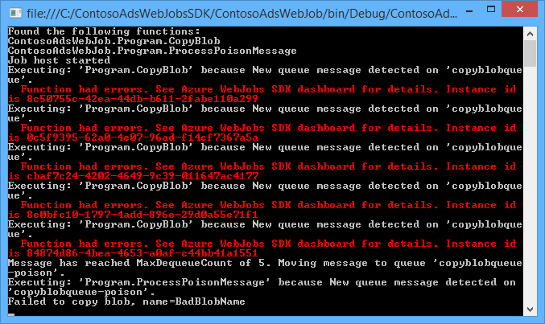
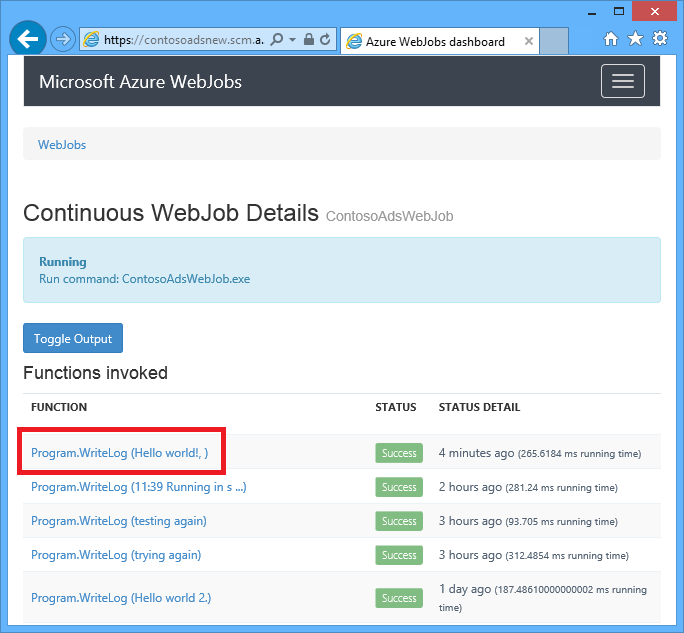
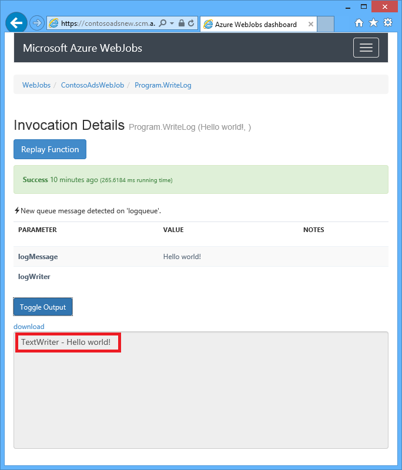
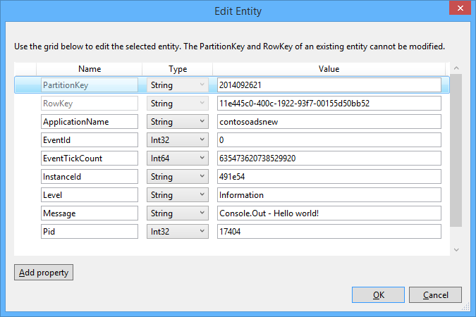

<properties linkid="" pageTitle="How to work with Azure queue storage using the WebJobs SDK" metaKeywords="WebJobs SDK Azure queue storage .NET C#" description="Learn how to work with Azure queue storage in the WebJobs SDK. Create and delete queues; insert, peek, get, and delete queue messages, and more." metaCanonical="" disqusComments="1" umbracoNaviHide="1" services="web-sites,storage" documentationCenter=".NET" title="How to work with Azure queue storage using the WebJobs SDK" authors="tdykstra" />

<tags ms.service="web-sites" ms.workload="web" ms.tgt_pltfrm="na" ms.devlang="dotnet" ms.topic="article" ms.date="=10/13/2014" ms.author="tdykstra" />

# How to work with Azure queue storage using the WebJobs SDK

This guide shows how to write C# code for common scenarios using the
Azure queue storage service and the Azure WebJobs SDK, version 1.0.0.

The guide assumes you already know [what the Webjobs SDK is](../websites-webjobs-sdk-storage-queues) and [how to perform basic tasks](../websites-dotnet-webjobs-sdk-get-started/), such as install the WebJobs SDK NuGet package, create an Azure storage account, and create connection strings for the WebJobs SDK that point to your storage account.

Most of the code snippets only show functions, not the code that creates the `JobHost` object as in this example:

		static void Main(string[] args)
		{
		    JobHost host = new JobHost();
		    host.RunAndBlock();
		}
		
<h2>Table of contents</h2>

-   [How to trigger a function when a queue message is received](#trigger)
	- String queue messages
	- POCO object queue messages
	- Async functions
	- Polling algorithm
	- Parallel execution
	- Get queue or queue message metadata
	- Graceful shutdown
-   [How to create a queue message while processing a queue message](#createqueue)
	- String queue messages
	- POCO object queue messages
	- Create multiple messages
	- Use Queue attributes in the body of a function
-   [How to read and write blobs while processing a queue message](#blobs)
	- String queue messages
	- POCO object queue messages
	- Use Blob attributes in the body of a function
-   [How to handle poison messages](#poison)
	- Automatic poison message handling
	- Manual poison message handling
-   [How to set configuration options](#config)
	- Set SDK connection strings in code
	- Configure QueueTrigger settings
	- Get queue names from configuration
-   [How to trigger a function manually](#manual)
-   [How to write logs](#logs)
-   [Next steps](#nextsteps)

##  How to trigger a function when a queue message is received

To write a function that the SDK calls when a queue message is received, use the `QueueTrigger` attribute with a string or POCO parameter depending on what you expect to get in the message. The attribute constructor takes a string parameter that specifies the name of the queue to poll. You can also [set the queue name dynamically](#config).

If your website runs on multiple VMs, the WebJob will run on each machine, and each machine will wait for triggers and attempt to run functions. In some scenarios this can lead to some functions processing the same data twice, so functions should be idempotent (written so that calling them repeatedly with the same input data doesn't produce duplicate results).  

### String queue messages

In the following example, the queue contains a string message, so `QueueTrigger` is applied to a string parameter named `logMessage` which contains the content of the queue message. The function writes an INFO message to the [application log](#logs).
 

		public static void ProcessQueueMessage([QueueTrigger("logqueue")] string logMessage)
		{
		    Console.Out.WriteLine(logMessage);
		}

Besides `string`, the parameter may be a byte array, a `CloudQueueMessage` object, or a POCO object that you define.

### POCO object queue messages

In the following example, the queue message contains JSON for a `BlobInformation` object which includes a `BlobName` property. The SDK automatically deserializes the object.

		public static void WriteLogPOCO([QueueTrigger("logqueue")] BlobInformation blobInfo)
		{
		    Console.WriteLine("Queue message refers to blob: " + blobInfo.BlobName);
		}

The following example shows how to create a POCO queue message without using the WebJobs SDK, that the SDK can parse. The SDK uses the [Newtonsoft.Json NuGet package](http://www.nuget.org/packages/Newtonsoft.Json) to serialize and deserialize messages.

		BlobInformation blobInfo = new BlobInformation() { BlobName = "log.txt" };
		var queueMessage = new CloudQueueMessage(JsonConvert.SerializeObject(blobInfo));
		logQueue.AddMessage(queueMessage);

### Async functions

The following async function writes an ERROR message to the [application log](#logs).

		public async static Task ProcessQueueMessageAsync([QueueTrigger("logqueue")] string logMessage)
		{
		    await Console.Error.WriteLineAsync(logMessage);
		}

Async functions may take a cancellation token, as shown in the following example which copies a blob. (For an explanation of the `queueTrigger` placeholder, see the [Blobs](#blobs) section.)

		public async static Task ProcessQueueMessageAsyncCancellationToken(
		    [QueueTrigger("blobcopyqueue")] string blobName, 
		    [Blob("textblobs/{queueTrigger}",FileAccess.Read)] Stream blobInput,
		    [Blob("textblobs/{queueTrigger}-new",FileAccess.Write)] Stream blobOutput,
		    CancellationToken token)
		{
		    await blobInput.CopyToAsync(blobOutput, 4096, token);
		}

### Polling algorithm

The SDK implements a random exponential back-off algorithm to reduce the effect of idle-queue polling on storage transaction costs.  When a message is found, the SDK waits two seconds and then checks for another message; when no message is found it waits longer before trying again. After subsequent failed attempts to get a queue message, the wait time increases until it reaches the maximum wait time, which defaults to one minute. [The maximum wait time is configurable](#config).

### Parallel execution

If you have multiple functions listening on different queues, the SDK will call them in parallel when messages are received simultaneously. 

The same is true when multiple messages are received for a single queue. By default, the SDK gets a batch of 16 queue messages at a time and executes the function that processes them in parallel. [The batch size is configurable](#config). When the number being processed gets down to half of the batch size, the SDK gets another batch and starts processing those messages. Therefore the maximum number of concurrent messages being processed per function is one and a half times the batch size. This limit applies separately to each function that has a `QueueTrigger` attribute. If you don't want parallel execution for messages received on one queue, set the batch size to 1.

### Get queue or queue message metadata

You can get the following message properties by adding parameters to the method signature:

* `DateTimeOffset` expirationTime
* `DateTimeOffset` insertionTime
* `DateTimeOffset` nextVisibleTime
* `string` id
* `string` popReceipt
* `int` dequeueCount

If you want to work directly with the Azure storage API, you can also add a `CloudStorageAccount` parameter.

The following example writes all of this metadata to an INFO application log.

		public static void WriteLog([QueueTrigger("logqueue")] string logMessage,
		    DateTimeOffset expirationTime,
		    DateTimeOffset insertionTime,
		    DateTimeOffset nextVisibleTime,
		    string id,
		    string popReceipt,
		    int dequeueCount)
		{
		    Console.Out.WriteLine(
		        "message={0} expirationTime={1} insertionTime={2} nextVisibleTime={3} " +
		        "id={4} popReceipt={5} dequeueCount={6}",
		        logMessage, expirationTime, insertionTime, 
		        nextVisibleTime,id,popReceipt,
		        dequeueCount);
		}

### Graceful shutdown

A function that runs in a continuous WebJob can accept a `CancellationToken` parameter which enables the operating system to notify the function when the WebJob is about to be terminated. You can use this notification to make sure the function doesn't terminate unexpectedly in a way that leaves data in an inconsistent state.

The following example shows how to check for impending WebJob termination in a function.

	public static void GracefulShutdownDemo(
	            [QueueTrigger("inputqueue")] string inputText,
	            CancellationToken token)
	{
	    for (int i = 0; i < 100; i++)
	    {
	        if (token.IsCancellationRequested)
	        {
	            Console.Out.WriteLine("Function was cancelled at iteration {0}", i);
	            break;
	        }
	        Thread.Sleep(1000);
	        Console.Out.WriteLine("Normal processing for queue message={0}", inputText);
	    }
	}

**Note:** The Dashboard might not correctly show the status and output of functions that have been shut down.
 
For more information, see [WebJobs Graceful Shutdown](http://blog.amitapple.com/post/2014/05/webjobs-graceful-shutdown/#.VCt1GXl0wpR).   

##  How to create a queue message while processing a queue message

To write a function that creates a new queue message, use the `Queue` attribute on an output string or POCO parameter. Like `QueueTrigger`, you pass in the queue name as a string or you can [set the queue name dynamically](#config).

### String queue messages

The following example creates a new queue message in the queue named "outputqueue" with the same content as the queue message received in the queue named "inputqueue".

		public static void CreateQueueMessage(
		    [QueueTrigger("inputqueue")] string queueMessage,
		    [Queue("outputqueue")] out string outputQueueMessage )
		{
		    outputQueueMessage = queueMessage;
		}

If the output parameter type is any of the following types, and the object is not null when the function ends, the SDK creates a queue message :

* `string` 
* `byte[]`
* A serializable POCO type that you define
* `CloudQueueMessage`

To create multiple messages, see **Create multiple messages** later in this section.

You can also use `CloudQueue` as the output parameter type if you want to send messages manually.

### POCO object queue messages

To create a queue message that contains a POCO object rather than a string, pass the POCO type as an output parameter to the `Queue` attribute constructor. 

		public static void CreateQueueMessage(
		    [QueueTrigger("inputqueue")] BlobInformation blobInfoInput,
		    [Queue("outputqueue")] out BlobInformation blobInfoOutput )
		{
		    blobInfoOutput = blobInfoInput;
		}

The SDK automatically serializes the object to JSON. A queue message is always created, even if the object is null.

### Create multiple messages

To create multiple messages, make the parameter type for the output queue `ICollector<T>` or `IAsyncCollector`, as shown in the following example.

		public static void CreateQueueMessages(
		    [QueueTrigger("inputqueue")] string queueMessage,
		    [Queue("outputqueue")] ICollector<string> outputQueueMessage)
		{
		    Console.WriteLine("Creating 2 messages in outputqueue");
		    outputQueueMessage.Add(queueMessage + "1");
		    outputQueueMessage.Add(queueMessage + "2");
		}

### Use Queue attributes in the body of a function

If you need to do some work in your function before using the `Queue` attribute to create a queue message, you can use the `IBinder` interface to get a `CloudQueue` object that enables you to work with a queue directly. 

The following example takes an input queue message and creates a new message with the same content in an output queue. The output queue name is set by code in the body of the function.

		public static void CreateQueueMessage(
		    [QueueTrigger("inputqueue")] string queueMessage,
		    IBinder binder)
		{
		    string outputQueueName = "outputqueue" + DateTime.Now.Month.ToString();
		    QueueAttribute queueAttribute = new QueueAttribute(outputQueueName);
		    CloudQueue outputQueue = binder.Bind<CloudQueue>(queueAttribute);
		    outputQueue.AddMessage(new CloudQueueMessage(queueMessage));
		}

##  How to read and write blobs while processing a queue message

The `Blob` attribute enables you to read and write blobs. Some of the types it can be used with include `Stream`, `TextReader`, `TextWriter`, and `CloudBlockBlob` . The `Blob` attribute constructor takes a `blobPath` parameter that specifies the container and blob name, and with `Stream` objects another parameter specifies the `FileAccess` mode as read, write, or read/write.  

### String queue messages

For a queue message that contains a string, `queueTrigger` is a placeholder you can use in the `Blob` attribute's `blobPath` parameter that contains the contents of the message. 

The following example uses `Stream` objects to read and write blobs. The queue message provides the name of a blob located in the textblobs container. A copy of the blob with "-new" appended to the name is created in the same container. 

		public static void ProcessQueueMessage(
		    [QueueTrigger("blobcopyqueue")] string blobName, 
		    [Blob("textblobs/{queueTrigger}",FileAccess.Read)] Stream blobInput,
		    [Blob("textblobs/{queueTrigger}-new",FileAccess.Write)] Stream blobOutput)
		{
		    blobInput.CopyTo(blobOutput, 4096);
		}

The following example uses a `CloudBlockBlob` object to delete a blob.

		public static void DeleteBlob(
		    [QueueTrigger("deleteblobqueue")] string blobName,
		    [Blob("textblobs/{queueTrigger}")] CloudBlockBlob blobToDelete)
		{
		    blobToDelete.Delete();
		}

### POCO object queue messages

For POCO objects stored as JSON in the queue message, you can use placeholders that name properties of the object in the `Queue` attribute's `blobPath` parameter. You can also use [queue metadata property names](#queuemetadata) as placeholders. 

The following example copies a blob to a new blob with a different extension, using properties of the `BlobInformation` object to specify the names of the input and output blobs. 
 
		public static void CopyBlobPOCO(
		    [QueueTrigger("copyblobqueue")] BlobInformation blobInfo,
		    [Blob("textblobs/{BlobName}", FileAccess.Read)] Stream blobInput,
		    [Blob("textblobs/{BlobNameWithoutExtension}.txt", FileAccess.Write)] Stream blobOutput)
		{
		    blobInput.CopyTo(blobOutput, 4096);
		}

The following example shows how to create a POCO queue message without using the WebJobs SDK, that the SDK can parse. The SDK uses the [Newtonsoft.Json NuGet package](http://www.nuget.org/packages/Newtonsoft.Json) to serialize and deserialize messages.

		BlobInformation blobInfo = new BlobInformation() { BlobName = "boot.log", BlobNameWithoutExtension = "boot" };
		var queueMessage = new CloudQueueMessage(JsonConvert.SerializeObject(blobInfo));
		logQueue.AddMessage(queueMessage);

### a id="blobbody"></a>Use Blob attributes in the body of a function

If you need to do some work in your function before binding a blob to an object, you can use the `IBinder` interface.

The following example shows how to use the `IBinder` interface to create a new blob. The container, name, and content of the blob are all specified in the body of the method.
		
		public static void CreateBlob(
		    [QueueTrigger("inputqueue")] string queueMessage,
		    IBinder binder)
		{
		    string ticks = DateTime.Now.Ticks.ToString();
		    BlobAttribute attribute = new BlobAttribute(@"textblobs/" + ticks, FileAccess.Write);
		    using (TextWriter newBlob = binder.Bind<TextWriter>(attribute))
		    {
		        newBlob.WriteLine("queue message: " + queueMessage + " ticks: " + ticks);
		    }
		    
		}

##  How to handle poison messages

Messages whose content causes a function to fail are called *poison messages*. When the function fails, the queue message is not deleted and eventually is picked up again, causing the cycle to be repeated. The SDK can automatically interrupt the cycle after a limited number of iterations, or you can do it manually.

### Automatic poison message handling

The SDK will call a function up to 5 times to process a queue message. If the fifth try fails, the message is moved to a poison queue. [The maximum number of retries is configurable](#config). 

The poison queue is named *{originalqueuename}*-poison. You can write a function to process messages from the poison queue by logging them or sending a notification that manual attention is needed. 

In the following example the `CopyBlob` function will fail when a queue message contains the name of a blob that doesn't exist. When that happens, the message is moved from the copyblobqueue queue to the copyblobqueue-poison queue. The `ProcessPoisonMessage` then logs the poison message.

		public static void CopyBlob(
		    [QueueTrigger("copyblobqueue")] string blobName,
		    [Blob("textblobs/{queueTrigger}", FileAccess.Read)] Stream blobInput,
		    [Blob("textblobs/{queueTrigger}-new", FileAccess.Write)] Stream blobOutput)
		{
		    blobInput.CopyTo(blobOutput, 4096);
		}
		
		public static void ProcessPoisonMessage(
		    [QueueTrigger("copyblobqueue-poison")] string blobName)
		{
		    Console.Out.WriteLine("Failed to copy blob, name=" + blobName);
		}

The following illustration shows console output from these functions when a poison message is processed.

#### Manual poison message handling

You can get the number of times a message has been picked up for processing by adding an `int` parameter named `dequeueCount` to your function. You can then check the dequeue count in function code and perform your own poison message handling when the number exceeds a threshold, as shown in the following example.

		public static void CopyBlob(
		    [QueueTrigger("copyblobqueue")] string blobName, int dequeueCount,
		    [Blob("textblobs/{queueTrigger}", FileAccess.Read)] Stream blobInput,
		    [Blob("textblobs/{queueTrigger}-new", FileAccess.Write)] Stream blobOutput)
		{
		    if (dequeueCount > 5)
		    {
		        Console.WriteLine("Failed to copy blob, name=" + blobName);
		    }
		    else
		    {
		    blobInput.CopyTo(blobOutput, 4096);
		    }
		}

For this code to work as expected, you would need to increase the maximum number of retries for automatic poison handling or the dequeue count in this example would never exceed 5.

##  How to set configuration options

You can use the `JobHostConfiguration` type to set the following configuration options:

* Set the SDK connection strings in code.
* Configure `QueueTrigger` settings such as maximum dequeue count.
* Get queue names from configuration.

### Set SDK connection strings in code

Setting the SDK connection strings in code enables you to use your own connection string names in configuration files or environment variables, as shown in the following example.

		static void Main(string[] args)
		{
		    var _storageConn = ConfigurationManager
		        .ConnectionStrings["MyStorageConnection"].ConnectionString;
		
		    var _dashboardConn = ConfigurationManager
		        .ConnectionStrings["MyDashboardConnection"].ConnectionString;
		
		    var _serviceBusConn = ConfigurationManager
		        .ConnectionStrings["MyServiceBusConnection"].ConnectionString;
		
		    JobHostConfiguration config = new JobHostConfiguration();
		    config.StorageConnectionString = _storageConn;
		    config.DashboardConnectionString = _dashboardConn;
		    config.ServiceBusConnectionString = _serviceBusConn;
		    JobHost host = new JobHost(config);
		    host.RunAndBlock();
		}

### Configure QueueTrigger settings

You can configure the following `QueueTrigger` settings:

- The maximum number of queue messages that are picked up simultaneously to be executed in parallel (default is 16).
- The maximum number of retries before a queue message is sent to a poison queue (default is 5).
- The maximum wait time before polling again when a queue is empty (default is 1 minute).

The following example shows how to configure these settings:

		static void Main(string[] args)
		{
		    JobHostConfiguration config = new JobHostConfiguration();
		    config.Queues.BatchSize = 8;
		    config.Queues.MaxDequeueCount = 4;
		    config.Queues.MaxPollingInterval = TimeSpan.FromMinutes(10);
		    JobHost host = new JobHost(config);
		    host.RunAndBlock();
		}

### Get queue names from configuration

The `JobHostConfiguration` type enables you to pass in a `NameResolver` object that provides the queue name to the SDK for the `QueueTrigger` and `Queue` attributes.

For example, suppose you want to use a queue named logqueuetest in the test environment and one named logqueueprod in production. Instead of a hard-coded queue name, you want to specify the name of an entry in the `appSettings` collection that would have the actual queue name. If the `appSettings` key is logqueue, your function could look like the following example.

		public static void WriteLog([QueueTrigger("%logqueue%")] string logMessage)
		{
		    Console.WriteLine(logMessage);
		}

Your `NameResolver` class could then get the queue name from `appSettings` as shown in the following example:

		public class QueueNameResolver : INameResolver
		{
		    public string Resolve(string name)
		    {
		        return ConfigurationManager.AppSettings[name].ToString();
		    }
		}

You pass the `NameResolver` class in to the `JobHost` object as shown in the following example.

		static void Main(string[] args)
		{
		    JobHostConfiguration config = new JobHostConfiguration();
		    config.NameResolver = new QueueNameResolver();
		    JobHost host = new JobHost(config);
		    host.RunAndBlock();
		}
 

### How to trigger a function manually

To trigger a function manually, use the `Call` or `CallAsync` method on the `JobHost` object and the `NoAutomaticTrigger` attribute on the function, as shown in the following example. 

		public class Program
		{
		    static void Main(string[] args)
		    {
		        JobHost host = new JobHost();
		        host.Call(typeof(Program).GetMethod("CreateQueueMessage"), new { value = "Hello world!" });
		    }
		
		    [NoAutomaticTrigger]
		    public static void CreateQueueMessage(
		        TextWriter log, 
		        string value, 
		        [Queue("outputqueue")] out string message)
		    {
		        message = value;
		        log.WriteLine("Creating queue message: ", message);
		    }
		}

## How to write logs

How you write logs depends on where you want to read them:

* To write logs that appear in the WebJobs dashboard page linked to a particular function invocation, use a `TextWriter` object that you obtain from a parameter in your method signature.
* To write [application tracing logs](../articles/web-sites-dotnet-troubleshoot-visual-studio/#logsoverview) that appear in the website log files, Azure tables, or Azure blobs depending on how you configure your Azure Website, use `Console.Out` (creates logs marked as INFO) and `Console.Error` (creates logs marked as ERROR).
 
Scheduled WebJobs handle the output from `Console.Out` and `Console.Error` differently than continuous WebJobs:

* For continuous WebJobs, the output is routed to files, tables or blobs as specified by website configuration.
* For scheduled WebJobs, the output is routed to a log file that is specific to each run of the WebJob. The file is accessible in the Azure portal and is stored at data/jobs/triggered/*{webjobName}*/*{runId}* in the website file system. 

The following example shows several ways to write logs:

		public static void WriteLog(
		    [QueueTrigger("logqueue")] string logMessage,
		    TextWriter logWriter)
		{
		    Console.WriteLine("Console.Write - " + logMessage);
		    Console.Out.WriteLine("Console.Out - " + logMessage);
		    Console.Error.WriteLine("Console.Error - " + logMessage);
		    logWriter.WriteLine("TextWriter - " + logMessage);
		}

In the WebJobs SDK dashboard, the output from the `TextWriter` object shows up when you go to the page for a particular function invocation and click `Toggle Output`:

In a continuous WebJob the other three logs show up in /data/jobs/continuous/*{webjobname}*/job_log.txt in the website file system.

		[09/26/2014 21:01:13 > 491e54: INFO] Console.Write - Hello world!
		[09/26/2014 21:01:13 > 491e54: ERR ] Console.Error - Hello world!
		[09/26/2014 21:01:13 > 491e54: INFO] Console.Out - Hello world!

In an Azure blob the application logs look like this:

		2014-09-26T21:01:13,Information,contosoadsnew,491e54,635473620738373502,0,17404,17,Console.Write - Hello world!,
		2014-09-26T21:01:13,Error,contosoadsnew,491e54,635473620738373502,0,17404,19,Console.Error - Hello world!,
		2014-09-26T21:01:13,Information,contosoadsnew,491e54,635473620738529920,0,17404,17,Console.Out - Hello world!,

And in an Azure table the `Console.Out` and `Console.Error` logs look like this:

##  Next steps

This topic has provided code samples that show how to handle common scenarios for working with Azure queues. For more information about how to use Azure WebJobs and the WebJobs SDK, see [Azure WebJobs Recommended Resources](http://go.microsoft.com/fwlink/?linkid=390226)
