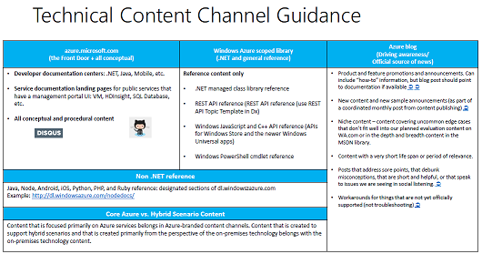

<properties title="" pageTitle="Azure technical content channel guidance" description="Describes the Microsoft content channels that employees, partners, and community contributors should use for publishing Azure technical content." metaKeywords="" services="" solutions="" documentationCenter="" authors="tysonn" videoId="" scriptId="" manager="carolz" />

<tags ms.service="contributor-guide" ms.devlang="" ms.topic="article" ms.tgt_pltfrm="" ms.workload="" ms.date="01/06/2015" ms.author="tysonn" />

#Azure technical content channel guidance

##aka: What goes where?
Generally speaking, core technical content for Microsoft Azure belongs in the Azure Documentation Center ([http://azure.microsoft.com/documentation](http://azure.microsoft.com/documentation)) or in the Azure scoped library ([http://msdn.microsoft.com/library/azure/](http://msdn.microsoft.com/library/azure/)) . Click the image to open the PDF that contains details for our technical content channel guidance: 

The following channels are not part of the standard Azure technical content experience: 

- **TechNet Library**: TechNet does not offer an Azure branded experience. All content for all audiences goes in the branded, scoped Azure library hosted on MSDN.
- **TechNet Wiki**: The wiki does not offer an Azure branded experience. The community and internal partners can contribute to Azure technical content through the Discus comment stream and by contributing to articles through GitHub.
- **Standard MSDN library view**: Standard view does not offer an Azure branded experience.
- **TechNet TechCenters**: Our "centers" are published to azure.microsoft.com/documentation.
- **MSDN DevCenters**: Our "centers" are published to azure.microsoft.com/documentation.
- **E-book, CSI e-book gallery**: Due to static nature of content, do not deliver content in e-book form. The vast majority of content should be published through azure.microsoft.com or to the Azure scoped library. 

