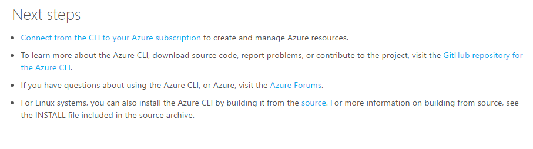

# Quality criteria for pull request review
These criteria are intended for authors who create and maintain technical articles and for pull request reviewers who review content pull requests. If your pull request does not qualify for [automatic merging](contributor-guide-pull-request-etiquette.md#in-a-hurry-submit-prs-that-can-be-accepted-automatically), it will be reviewed by a human pull request reviewer. Pull request reviewers generally review only what is new or changed. Pull request reviewers evaluate the changes in a pull request according to the blocking and non-blocking quality review items listed in this article.

## Blocking content quality items
The updates in the pull request must comply with the following criteria to be merged. Pull request reviewers provide feedback in pull request comments for these items and type `#hold-off` in the pull request to return it to you (the author) with feedback.

| Category | Quality review item |
| --- | --- |
| Prerequisites |The "ready-to-merge" label is assigned to the PR (use the #sign-off comment) and the validation status is "passed". |
| Prerequisites |Any pull request to the Live branch should be closed. The user should be redirected to the master branch. |
| Prerequisites |The pull request cannot be blocked by a merge conflict. If there is a merge conflict, refer the user to https://github.com/blog/2293-resolve-simple-merge-conflicts-on-github for instructions on how to use the GitHub UI to resolve merge conflicts. PR reviewers do not resolve conflicts. |
| Repo integrity |Pull request contains no obvious content regressions. |
| Repo integrity |No article-related files, images, or folders are being added to the root directory of the repo.|
| Repo integrity|Pull requests that change a configuration file in the root folder must be reviewed and merged by the repo administrator. |
| Repo integrity |Pull request does not include an embedded repo or any unusual, extraneous files. All file updates should be restricted to the articles and includes folders in the repo. Items to watch for: .DS_Store, desktop.ini, .gitignore, azure-docs-pr embedded in root folder.|
| Repo integrity |Pull request contains fewer than 100 changed files unless the PR intentionally is updating a release branch from master. (Really, a PR should contain far fewer than that, but after 100 changed files, GitHub doesn’t display the diffs). |
| Repo integrity |If articles are deleted in the pull request, the deletions must be by the listed author. If not by the listed author, the PR must contain a comment indicating the article deletions are intentional |
| Naming |File names for new files follow the [file naming guidelines](file-names-and-locations.md). |
| Naming |New folders introduced into the repo follow the [folder naming guidelines](file-names-and-locations.md#folder-names-in-the-repo). |
| Metadata | Metadata section is in the correct YAML format for OPS. |
| Metadata | The ms.date value cannot be set more than 5 days into the future. |
| Content |The article is a technical document, and therefore in the correct content channel. See the [what goes where guidance](content-channel-guidance.md). |
| Content |The subject matter in the technical document is appropriate for a technical article. See the [what goes where guidance](content-channel-guidance.md). |
|Content |Bylines are not permitted; if an article calls out the name of the author or any contributor in the text, that attribution needs to be removed. Articles published from the tech content repo are considered to be authored by "Microsoft". Contributors who have committed updates to the article are recognized automatically on the contributor bar of the published article.|
| Content |The article contains only one H1 heading. |
| Content |The article contains an introductory paragraph, and a procedural or conceptual body of content. The article needs to contain sufficient, complete content to stand on its own as an article. It should not be a small fragment of information. (Exception: A "Limits" topic if it is in the context of a large article that lists all of the limits of a service.) |
| Content |Elements that should be numbered lists are numbered, elements that should be unordered lists are bulleted. This is basic usability. |
| Content |Unusual or novel graphics, information architecture or structures, or obviously non-standard designs need to be vetted with the lead PR reviewer. Teams that are experimenting with new things need to have a problem/solution canvas or plan in place for evaluating experiments. |
| Content |If an article is being deleted, all crosslinks to that article must be deleted. Check the build report to ensure there are no articles that contain broken links to the article being deleted |
| Site/design functionality |Switchers are used only for switching across multiple versions of the same article. |
| Site/design functionality |The titles of switchered articles contain information that differentiates each article from the other articles in the switchered set. |
| Site/design functionality |Manually authored TOCs are not permitted. The article must rely on H2s for its on-page TOC. |
| Site/design functionality |If H2 headings are present, the article contains at least two H2 headings. Using one H2 heading creates a single-item article TOC. H2 headings must be used before H3 headings to ensure a TOC is created. |
| Site/design functionality | When a new article is added, the TOC is updated at the same time. |
| Markdown |HTML: Source content does not contain HTML at the block level – minor inline HTML is permitted – such as superscript, subscript, special characters, and other minor things that you can’t do with markdown. HTML tables are allowed ONLY if the table contains bulleted or numbered lists, but that is usually an indication the content needs to be simplified so the source can be coded in markdown. |
| Markdown |Custom markdown elements are used where appropriate. Ex: Notes are coded using the [!NOTE] extension, not as plain text. |
| SEO |The " &#124; Microsoft Docs" site identifier is required. We no longer use the " &#124; Microsoft Azure" site identifier |
| SEO |The *title* metadata value must include the word "Azure" (Intune, Operations Management Suite [OMS], and StorSimple articles are excepted) |
| SEO |The H1 title contains sufficient information to describe the content of the article, to differentiate it from other Azure articles, and to map to likely customer keywords. For example "Overview" as the H1 title is a fail. |
| Terminology |The use of the ARM acronym, V1, or V2 as references to the classic and Resource Manager deployment models is a blocking terminology item. |
| Images |Animated GIFs and PDN files are not accepted into the repo. |
| Images |Images have clear resolution, are free of misspelled words, and contain no private information |
| Localizability | Links to pages on azure.microsoft.com, TechNet, and MSDN are coded as locale agnostic. Do not include en-us, en-gb, en-in, or any other locale in links to these sites. |
| Staging |The article preview must be clean on staging. It cannot contain any obvious formatting issues:  - A numbered or bulleted list that appears as a paragraph - Code in a code block appearing partly in the code block and partly outside it - Numbered steps numbered incorrectly due to faulty indentation - Leftover merge conflict markers |

## Non-blocking content quality items
For these items, pull request reviewers provide feedback and instructions for the author to follow up with fixes in a later pull request. However, this feedback does not block the decision to merge. Authors should follow up within 3 business days with fixes.

| Category | Quality review item |
| --- | --- |
| Content |Articles should have a “Next steps” at the end with 1-3 relevant and compelling next steps. Brief text should be included that helps the customer understand why the next steps are relevant. (New articles only). Example: <https://docs.microsoft.com/en-us/cli/azure/install-azure-cli>  |
| Content |Spelling, grammar, and other writing issues - pull request reviewers may provide feedback on a few minor issues as non-blocking feedback. If there are more than a few editorial issues, reviewers log an edit request for the article for a post-publication edit. |
| Images |Images use the correct callout style and color, and screenshots use the correct border and placeholder style. [See the image guidance](create-images-markdown.md). |
| Images |Images include alt text. [See the image guidance](create-images-markdown.md). |
| Site/design functionality |The H2 headings, when rendered in the on-page TOC, should ideally wrap to no more than 2 lines. Longer headings make the article TOC harder to scan. |
| Style conventions |All titles and headings are sentence case, per Azure style. |
| Process |If the pull request could have easily been reconfigured to benefit from PRmerger automation, pull request reviewers provide feedback to the author about how to use branches so the changes could be merged automatically. See [the PR etiquette article](contributor-guide-pull-request-etiquette.md). |
| Process |When you delete or rename an article, make sure you follow the process. Pull request reviewers should add the following comment and link in a comment:  *Please verify you followed the process in the contributors’ guide for deleting articles: [https://github.com/Azure/azure-docs-pr/blob/master/contributor-guide/retire-or-rename-an-article.md](retire-or-rename-an-article.md)*

## Related
* [Pull request etiquette and best practices for Microsoft contributors](contributor-guide-pull-request-etiquette.md)
* [Pull request comment automation](contributor-guide-pull-request-comments.md)
