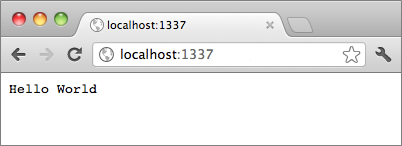

<properties
    pageTitle="Create images in markdown"
    description="Explains how to create images in markdown according to guidelines set for the Azure repositories."
    services=""
    solutions=""
    documentationCenter=""
    authors="kenhoff"
    manager="ilanas"
    editor="tysonn"/>

<tags
    ms.service="contributor-guide"
    ms.devlang=""
    ms.topic="article"
    ms.tgt_pltfrm=""
    ms.workload=""
    ms.date="06/25/2015"
    ms.author="kenhoff" />

# Create images in markdown

## Image folder creation and link syntax

For a new article, you'll need to create a folder in the following location:

    /articles/<service-directory>/media/<article-name>/

For example:

    /articles/app-service/media/app-service-enterprise-multichannel-apps/

After you create the folder and added images to it, use the following syntax to create images in your article:

```

```
Example:

See [the markdown template](../markdown%20templates/markdown-template-for-new-articles.md) for an example.  The image reference links in this markdown template are designed to be at the bottom of the template.

## Guidelines specific to azure.microsoft.com

Screenshots are currently encouraged if it's not possible to include repro steps. Do write your content so that the content can stand without the screenshots if necessary.

Use the following guidelines when creating and including art files:
- Do not share art files across documents. Copy the file you need and add it to the media folder for your specific topic. Sharing between files is discouraged because  it is easier to remove deprecated content and images which keeps the repo clean.

- File formats: Use .png files - they are higher quality and maintain their quality during the localization process. Other file formats do not maintain their quality as well. The .jpeg format is permitted, but not preferred.  No animated GIF files.

- Use red squares of the default width provided in Paint (5 px) to call attention to particular elements in screenshots.  

    Example:

    

- When it makes sense, feel free to crop images so the UI elements will be displayed in full size. Make sure that the context is clear to users, though.

- Avoid whitespace on edges of screenshots. If you crop a screenshot in a way that leaves white background at the edges, add a single pixel gray border around the image.  If using Paint, use the lighter gray in the default color pallete (0xC3C3C3). If using some other graphic app, the RGB color is R195, G195, 195. You can easily add a gray border around an image in Visio--to do this, select the image, select Line, and ensure the the correct color is set, and then change the line weight to 1 1/2 pt.  Screenshots should have a 1-pixel-wide gray border so that white areas of the screenshot do not blur into the web page.

    Example:

    
    
    For a tool to help automate the process of adding the required border to images, see [AddACOMBorder tool - How to automate the process of adding the required 1 pixel grey border to ACOM images](https://github.com/Azure/Azure-CSI-Content-Tools/tree/master/Tools/AddACOMImageBorder).

- Conceptual images with whitespace do not need a gray border.  

    Example:

    

- Try not to make an image too wide.  Images will be automatically resized if they are too wide. However, the resizing sometimes causes fuzziness, so we recommend that you limit the width of your images to 780 px, and manually resize images before submission if necessary.

- Show command outputs in screenshots.  If your article includes steps where the user is working within a shell, it's useful to show command output in screenshots. In this case, restricting your shell width to about 72 characters generally ensures that your image will remain within the 780 px width guideline. Before taking a screenshot of output, resize the window so that just the relevant command and output is shown (optionally with a blank line on either side).

- Take whole screenshots of windows when possible. When taking a screenshot of a browser window, resize your browser window to 780 px wide or less, and keep the height of the browser window as short as possible such that your application fits within the window.

    Example:

    

- Use caution with what information is revealed in screenshots.  Do not reveal internal company information or personal information.

- In conceptual art or diagrams, use the official icons in the Cloud and Enterprise symbol and icon set. A public set is available at http://aka.ms/CnESymbols.

- Replace personal or private information in screenshots with placeholder text enclosed in angle brackets. This includes user names, subscription IDs, and other related info. Personal names can be replaced with an [approved fictious name](https://aka.ms/ficticiousnames)(Employee-only link). Do not use the crayon or marker tip in Paint to obscure or blur personal or private information.

  The following image has been correctly updated to replace the actual **subscription ID** with placeholder information:

  

### Contributors' Guide Links

- [Overview article](./../README.md)
- [Index of guidance articles](./contributor-guide-index.md)
