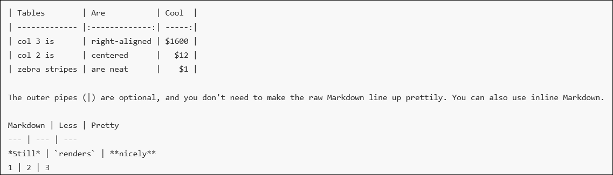
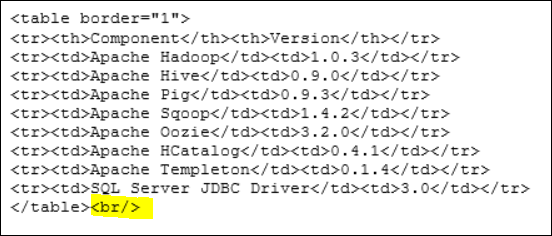

<properties title="" pageTitle="Create tables in markdown" description="Explains how to code tables in markdown." metaKeywords="" services="" solutions="" documentationCenter="" authors="tysonn" videoId="" scriptId="" manager="carolz" />

<tags ms.service="contributor-guide" ms.devlang="" ms.topic="article" ms.tgt_pltfrm="" ms.workload="" ms.date="12/26/2014" ms.author="tysonn" />

#Best practices for creating tables in markdown

The most simple way to create a table is to use pipes and lines to create a markdown table.

 
 
You can justify the columns with colons:

    |-----:| - this is right aligned
    |:-----| -  this is left aligned
    |:-----:| - this is centered

If you use HTML tables and your markdown is not rendering between the two tables, you need to add a closing BR tag after the closing TABLE tag.

For more information about how to create tables in markdown, see:
- https://github.com/adam-p/markdown-here/wiki/Markdown-Cheatsheet#wiki-tables
- http://michelf.ca/projects/php-markdown/extra/#table
