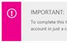
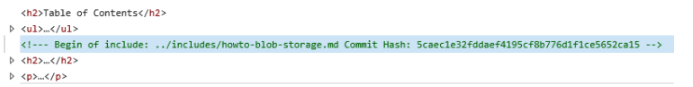
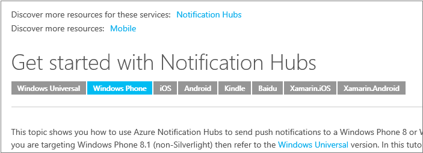
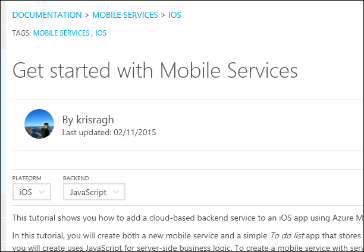

<properties
    title="required"
    pageTitle="Custom markdown extensions used in our technical articles"
    description="Lists the custom markdown extensions that enable embedded videos, notes and tips, reusable content, and other item in azure.microsoft.com technical articles."
    services=""
    solutions=""
    documentationCenter=""
    authors="tysonn"
    manager="carolz"
    editor=""/>

<tags
    ms.service="contributor-guide"
    ms.devlang=""
    ms.topic="article"
    ms.tgt_pltfrm=""
    ms.workload=""
    ms.date="01/22/2015"
    ms.author="tysonn"/>

## Markdown for Azure.microsoft.com

For general markdown tips, see [Markdown Basics](https://help.github.com/articles/markdown-basics/) and our [markdown cheatsheet](./media/documents/markdown-cheatsheet.pdf?raw=true). If you need to create article crosslinks in markdown, see the [linking guidance] (./create-links-markdown.md#markdown-syntax-for-acom-relative-links.md/).

Azure.microsoft.com supports [fenced code blocks](https://help.github.com/articles/github-flavored-markdown/#fenced-code-blocks) and [syntax highlighting](https://help.github.com/articles/github-flavored-markdown/#syntax-highlighting). However, ACOM supports only one syntax highlighting color scheme, regardless of the language you specify in a code block.

## Custom markdown extensions used in our technical articles

Our articles use GitHub flavored markdown for most article formatting - paragraphs, links, lists, headings, etc. But we use custom markdown extensions where we need richer formatting in the rendered pages on azure.microsoft.com. Here's the extensions we are currently using:

+ [Notes and tips]
+ [Includes]
+ [Embedded videos]
+ [Technology and platform selectors]

## Notes and tips

You can choose from 4 types of notes and tips:

- AZURE.NOTE
- AZURE.WARNING
- AZURE.TIP
- AZURE.IMPORTANT

###Usage
In general, use notes and tips sparingly throughout your articles. When you do use them, choose the appropriate type of note or tip:

- Use AZURE.NOTE to highlight neutral or positive information that emphasizes or supplements key points of the main text. A note supplies information that applies only in special cases.

  

- Use AZURE.WARNING to alert the user to a condition that might cause a problem in the future. For example, selecting a certain option or making a certain choice might permanently lock you into a particular scenario.

  

- Use AZURE.TIP to help your users apply the techniques and procedures described in the text to their specific needs. A tip might also suggest alternative methods that may not be obvious. Tips, however, are not essential to the basic understanding of the text.

  

- Use AZURE.IMPORTANT to provide information that is essential to the completion of a task.

  

While these notes and tips support code blocks, images, lists, and links, try to keep your notes and tips simple and straightforward. If you find yourself creating complex notes with lots of formatting, that might be a sign you just need another section in the main text of the article. And, too many notes in an article can be distracting and hard to scan or read.

###Sample markdown

The samples all show an AZURE.NOTE. To use a TIP, WARNING, or IMPORTANT, replace "NOTE" in the markdown:

    > [AZURE.TIP]

    > [AZURE.WARNING]

    > [AZURE.IMPORTANT]

Single paragraph:

    > [AZURE.NOTE] To complete this tutorial, you must have an active Microsoft Azure account. If you don't have an account, you can create a free trial account in just a couple of minutes.

Multiparagraph:

    > [AZURE.NOTE] To complete this tutorial, you must have an active Microsoft Azure account.
    >
    > If you don't have an account, you can [create a free trial account](http://www.windowsazure.com/pricing/free-trial/) in just a couple of minutes.

## Includes

Reusable text fragments in our GitHub repository are called "includes". When you have text that needs to be used in multiple articles, you include a reference to the text fragments in the markdown files. The text fragment (the include) itself is a simple markdown (.md) file. It can contain any valid markdown, including text, links, and images. All include markdown files must be in [the /includes directory](https://github.com/Azure/azure-content/tree/master/includes) in the root of the repository. When the article is published, the include text is seamlessly integrated into the published topic.

- We use a specific syntax to reference an include.

- Media files you put in an include must be created in a media folder specific to the include. Media folders for includes belong in [the azure-content/includes/media folder](https://github.com/Azure/azure-content/tree/master/includes/media). The media directory should not contain any images in its root. If the include does not have images, then a corresponding media directory is not required.

###Usage

- Use includes wherever you need the same text to appear in multiple articles.
- Includes are meant to be used for significant amounts of content - a paragraph or two, a shared procedure, or a shared section. Do not use them for anything smaller than a sentence; they are not for product names or incomplete sentences.
- Don't embed includes within other includes. Bad things happen in the publishing system!
- Don't share media between files. Use a separate file with a unique name for each include and article. Store the media file in the media folder associated with the include.
- Don't use an includes as the only content of an article.  Includes are meant to be supplemental to the content in the rest of the article.
- Because all includes must be in the /includes directory, the path to an include from an article is always

    ../includes

- Do NOT repeat a link or image filename reference in both the article and the include. Add "-include" to the link reference or media filename to avoid repeating the reference:

 **Link reference**

 Change: odata.org
 To: odata.org-include

 **Image reference**

 Change: table.png
 To: table-include.png

###Sample markdown
The syntax for adding an include to a documentation article is:

    [AZURE.INCLUDE [include-short-name](../includes/include-file-name.md)]

Example

    [AZURE.INCLUDE [howto-blob-storage](../includes/howto-blob-storage.md)]

The first part of the include is the include name without the path and without the .md extension. The second part is the relative path to the include in the /includes directory, with the .md extension.

###Rendering

In the rendered GitHub page, the include will render as follows:

 [AZURE.INCLUDE howto-blob-storage]

In the rendered HTML on azure.microsoft.com, the HTML from the includes is merged into the rest of the document's HTML. However, the HTML will contain an HTML comment with the original include markdown filename and the GitHub commit hash. This comment is included for troubleshooting purposes so that the source content can easily be identified and found in GitHub:

  

## Embedded videos

Our technical articles support embeddeded videos in technical articles as long as the videos are on Microsoft's [Channel 9](http://channel9.msdn.com/) site. The videos from Channel 9 must be integrated with [the azure.microsoft.com Video Center](http://azure.microsoft.com/documentation/videos/home/). We currently do not support embedded YouTube videos; if you're a community contributor, you are welcome to link to YouTube if the video you want to feature is posted there. Microsoft contributors should use Channel 9 and the Video Center.

### Usage

- Make sure that the video is on the Video Center.

- Copy the video ID from the friendly URL of the video on Channel 9 or from the Azure Video Center. For example, the video ID for the video at [http://azure.microsoft.com/documentation/videos/azure-scheduler-unusual-schedules/](http://azure.microsoft.com/documentation/videos/azure-scheduler-unusual-schedules/) is **azure-scheduler-unusual-schedules**.

### Syntax

    > [AZURE.VIDEO video-id-string]

### Rendering

On GitHub: [https://github.com/Azure/azure-content-pr/blob/master/articles/web-sites-backup.md](https://github.com/Azure/azure-content-pr/blob/master/articles/web-sites-backup.md)

Published article: [http://azure.microsoft.com/documentation/articles/web-sites-backup/](http://azure.microsoft.com/documentation/articles/web-sites-backup/)

## Technology and platform selectors

Use technology and platform switchers in technical articles when you author multiple flavors of the same article to address differences in implementation across technologies or platforms. This is typically most applicable to our mobile platform content for developers. There are currently two different types of selectors, [simple selectors](#simple-selectors) and [two-way selectors](#two-way-selectors).

Because the same selector markdown goes in each topic in the selection, we recommend placing the selector for your topic in an include, then referencing that include in all of your topics that use the same selector.

###Simple selectors

Simple (one-way) selectors render as a set of option buttons right below the title. Use these buttons when customers need to choose from topics in a single platform or technology set, such as .NET, Node.js, and Java.  Use the custom markdown extension for any selectors - do not use HTML for selectors.  

See [Get started with Notification Hubs](http://azure.microsoft.com/documentation/articles/notification-hubs-windows-phone-get-started/) to see how the author created 8 versions of the same article, but used selectors to enable navigation across them all.

####Syntax

    > [AZURE.SELECTOR]
    - [Link #1 Label](link #1 url)
    - [Link #2 Label](link #2 url)

Example:

    > [AZURE.SELECTOR]
    - [Universal Windows](../articles/notification-hubs-windows-store-dotnet-get-started/)
    - [Windows Phone](../articles/notification-hubs-windows-phone-get-started/)
    - [iOS](../articles/notification-hubs-ios-get-started/)
    - [Android](../articles/notification-hubs-android-get-started/)
    - [Kindle](../articles/notification-hubs-kindle-get-started/)
    - [Baidu](../articles/notification-hubs-baidu-get-started/)
    - [Xamarin.iOS](../articles/partner-xamarin-notification-hubs-ios-get-started/)
    - [Xamarin.Android](../articles/partner-xamarin-notification-hubs-android-get-started/)

#### Rendering

The image above shows the rendering on azure.microsoft.com. On the rendered GitHub pages, the selectors render as a bulleted list of links.

###Two-way selectors

Two-way selectors lets users select a topics from a two way matrix. This is essential when an Azure technology, such as Mobile Services, supports multiple backend platforms as well as multiple clients. Keep in mind the following:

- While it was designed as `(Platform | Backend)`, the dropwdown text can now be customized.
- You do not need a list item for every point in your matrix, but do only have an item where a topic URL exists and is not a duplicate.
- The link can be any URL, although it is generally another GitHub topic.

See [Get started with Mobile Services](http://azure.microsoft.com/en-us/documentation/articles/mobile-services-ios-get-started/) to see how the author created 15 versions of the same article (9 mobile client platforms and 2 backend platforms), but used selectors to enable navigation across them all. Note that 3 articles don't have both backend versions.

####Syntax

	> [AZURE.SELECTOR-LIST (Dropdown1 | Dropdown2 )]
	- [(Dropdown1Text1 | Dropdown2Text1 )](../articles/dropdown1-text1-dropdown2-text1.md)
	- [(Dropdown1Text1 | Dropdown2Text2 )](../articles/dropdown1-text1-dropdown2-text1.md)
	- [(Dropdown1Text2 | Dropdown2Text3 )](../articles/dropdown1-text1-dropdown2-text1.md)
	- [(Dropdown1Text3 | Dropdown2Text4 )](../articles/dropdown1-text1-dropdown2-text1.md)

Example:

	> [AZURE.SELECTOR-LIST (Platform | Backend )]
	- [(iOS | .NET)](./mobile-services-dotnet-backend-ios-get-started-push.md)
	- [(iOS | JavaScript)](./mobile-services-javascript-backend-ios-get-started-push.md)
	- [(Windows universal C# | .NET)](./mobile-services-dotnet-backend-windows-universal-dotnet-get-started-push.md)
	- [(Windows universal C# | Javascript)](./mobile-services-javascript-backend-windows-universal-dotnet-get-started-push.md)
	- [(Windows Phone | .NET)](./mobile-services-dotnet-backend-windows-phone-get-started-push.md)
	- [(Windows Phone | Javascript)](./mobile-services-javascript-backend-windows-phone-get-started-push.md)
	- [(Android | .NET)](./mobile-services-dotnet-backend-android-get-started-push.md)
	- [(Android | Javascript)](./mobile-services-javascript-backend-android-get-started-push.md)
	- [(Xamarin iOS | Javascript)](./partner-xamarin-mobile-services-ios-get-started-push.md)
	- [(Xamarin Android | Javascript)](./partner-xamarin-mobile-services-android-get-started-push.md)

#### Rendering

The image above shows the rendering on azure.microsoft.com. On the rendered GitHub pages, the selectors render as a bulleted list of links.

<!--Anchors-->
[Notes and tips]: #notes-and-tips
[Includes]: #includes
[Embedded videos]: #embedded-videos
[Technology and platform selectors]: #technology-and-platform-selectors

###Contributors' Guide Links

- [Overview article](./../README.md)
- [Index of guidance articles](./contributor-guide-index.md)
