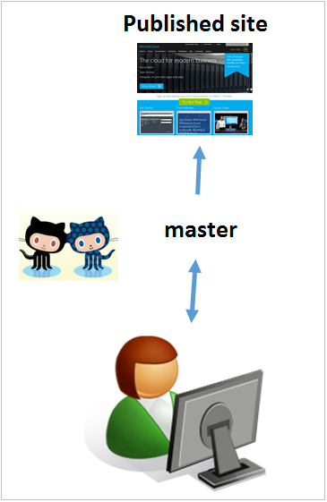

<properties pageTitle="Git commands for creating a new article or updating an existing article" description="Steps for working with the Azure technical content GitHub repositories." metaKeywords="" services="" solutions="" documentationCenter="" authors="tysonn" videoId="" scriptId="" manager="carolz" />

<tags ms.service="contributor-guide" ms.devlang="" ms.topic="article" ms.tgt_pltfrm="" ms.workload="" ms.date="01/16/2015" ms.author="tysonn" />

# Git commands for creating a new article or updating an existing article
Follow the steps in this article to create a local working branch on your computer so that you can create a new article for the technical documentation section of azure.microsoft.com or update an existing article.

1. Start Git Bash (or the command-line tool you use for Git).

 [AZURE.TIP] If you are working in the public repository, change azure-content-pr to azure-content in all the commands.

2. Change to azure-content-pr:

        cd azure-content-pr
3. Check out the master branch:

        git checkout master

4. Create a fresh local working branch derived from the master branch:

        git pull upstream master:<working branch>

5. Move into the new working branch:

        git checkout <working branch>

6. Let your fork know you created the local working branch:

        git push origin <working branch>

7. Create your new article or make changes to an existing article. Use Windows Explorer to open and create new markdown files, and use Atom (http://atom.io) as your markdown editor. After you created or modified your article and images, go to the next step.

8. Add and commit the changes you made:

        git add .
        git commit –m "<comment>"
        
   Or, to add only the specific files you modified:

        git add <file path>
        git commit –m "<comment>"

9. Periodically, update your local working branch with changes from upstream:

        git pull upstream master

10. Daily at least, push the changes to your fork on GitHub for safe keeping:

        git push origin <working branch>

12. Create a pull request from your fork to the master branch when you are ready for your content contribution to be reviewed.

13. The pull request acceptor reviews your pull request, provides feedback, and/or accepts your pull request. 

14. Verify your published article or changes at

 http://azure.microsoft.com/documentation/articles/*name-of-your-article-without-the-MD-extension*

## Notes:

- At this time, technical articles are published once daily around 10 AM Pacific Standard Time (PST), Monday-Friday. Remember, your pull request has to be accepted before changes are included in the next scheduled publishing run.
- If you are an employee working in the private repository, all pull requests are subject to validation rules that need to be addressed before the pull request can be accepted. 
- In the private repo, the changes you submit are automatically staged, and a staging link is written to the pull request. Please review your staged content and sign off in the pull request comments to indicate the changes are ready to be pushed live. If you don't want the pull request to be accepted - if you are just staging the changes - add that note to the pull request.

