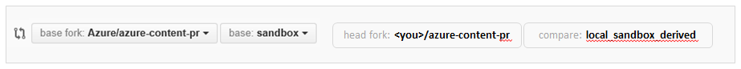

<properties pageTitle="Git commands for staging an new or updated article" description="Steps for previewing new and updated articles." metaKeywords="" services="" solutions="" documentationCenter="" authors="tysonn" videoId="" scriptId="" manager="carolz" />

<tags ms.service="contributor-guide" ms.devlang="" ms.topic="article" ms.tgt_pltfrm="" ms.workload="" ms.date="01/16/2015" ms.author="tysonn" />

# Git commands for staging an article on the internal preview site

Staging is now automated for private repository pull requests. See [Git commands for creating a new article or updating an existing article](git-commands-for-master.md)

<!--
Follow the steps in this article to stage content to the internal staging site prior to releasing the article to the public site.

[AZURE.IMPORTANT] The preview site is available for internal Microsoft contributors only. If you're an internal contributor, see the internal wiki to get the URL of the preview site.

1. Start Git Bash.

2. Change to azure-content-pr:

        cd azure-content-pr

3. Check out the sandbox branch:

        git checkout sandbox
        
   Note: If you just cloned, you probably only have the master branch on your computer. You can run 'git branch' to see the     list of branches on your local computer. If sandbox is missing, run:
   
        git pull upstream sandbox:sandbox
        git checkout sandbox
        git pull upstream sandbox

4. If you get a merge conflict for files that aren’t yours, use these commands to copy the version of the conflicted file from the server to your local branch, resolving the conflict:

        git checkout upstream/sandbox articles/<filename.md>
        git commit –m "resolving merge conflict"

5. Move the file or files you want to stage from the local master-derived branch to the local sandbox-derived branch you are working in:

        git checkout <master-derived-local-branch> articles/<article_name.md>

 To move the media:

        git checkout <master-derived-local-branch> articles/media/<folder_name>

6. Commit the files in sandbox:

        git commit –m "<moved files to sandbox for staging>"

7. Push the changes to your fork on GitHub:

        git push origin sandbox

8. Create a pull request from your fork to the core repo, from your local sandbox-derived branch to the main sandbox branch:

 

9. The pull request acceptor accepts the pull request.

10. Review your content on the staging site. If you are happy with the staged content, go back to master and follow the steps to push your final version to your fork, and then file a pull request. Articles are staged three times a day, around 10 AM, 2 PM, and 5 PM PST.

 Don’t edit your article while working in a sandbox-derived branch. If you discover issues you need to fix after you stage, change back to your master-derived working branch, make the changes there, and then restage. Moving content to sandbox should always be a one-way trip.-->

