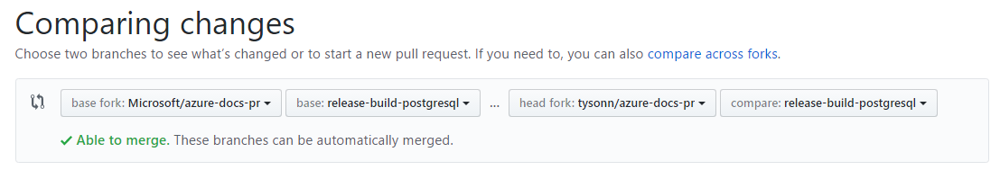

# Working with release branches

When you are working with a release branch, the best way to create a local working branch from the release branch is to use this command syntax:

    git checkout -b <local working branch name> upstream/<upstream branch name>

This creates the local branch directly from the upstream branch, so you can avoid any local merging.

Then, to keep your local copy of the release branch up to date with the upstream version, run:

    git pull upstream <release-branch-name>
    
To create a copy of the release branch in your online fork, run:

    git push origin <release-branch-name>

The publishing team runs automation that automatically updates release branches with updates from the master branch on a daily basis.

When you are ready to merge your changes, you create a pull request from the release branch in your fork to the upstream release branch. The PR should be set up as shown in the screen shot.

**TIP:** If you receive a *fatal: Cannot update paths and switch to branch 'release-branch' at the same time* error when issuing the `checkout` command, execute `git fetch upstream`, then the checkout command. The `fetch` grabs all the new remote-tracking branches (such as the release branch you want to work with) and tags without merging those changes into your own branches.

## Be careful about switching between branches and creating branches

The whole point of release branches is to allow you to segregate content for release on a specific future day. Lack of care in creating branches locally and in switching branches can result in content confusion!

- If you are in the master branch, and you have added or committed new changes and content, and you then use one of the following commands to create a new local branch, the new branch will contain your added and committed changes because these commands create the new branch from the current branch:

  git checkout -B <newbranchname>
  git pull upstream master:<localworkingbranch>

- Before you switch between branches, always type `git status` to see if you have unadded or uncommitted changes. If you have outstanding changes in a branch, and you switch branches, your uncommitted changes float with you and will be committed in whichever branch you happen to next run the `commit` command. 

## How to see the list of new files in the release branch

When you know that your release branch is up to date with master, you can create a pull request from the release branch to the master branch. The list of files that appear in the diff should be the new content for the release.
