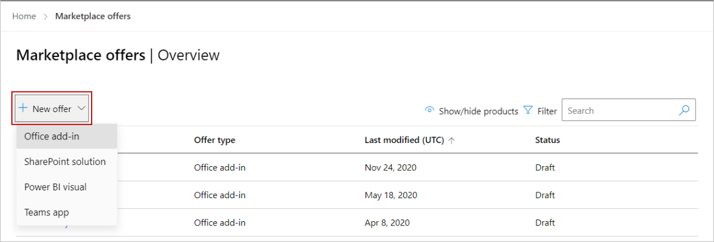
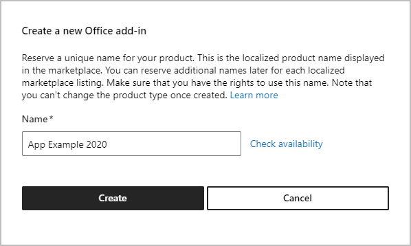
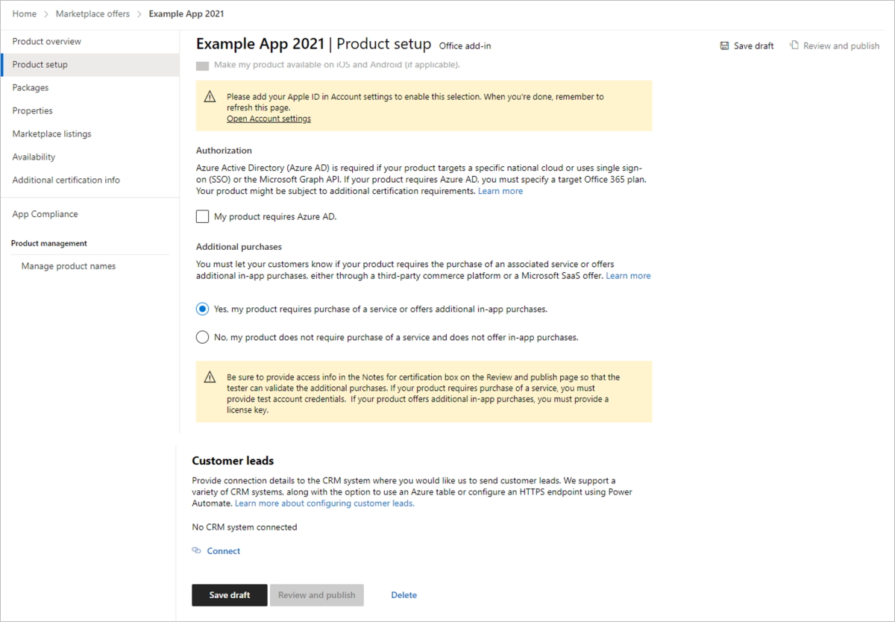
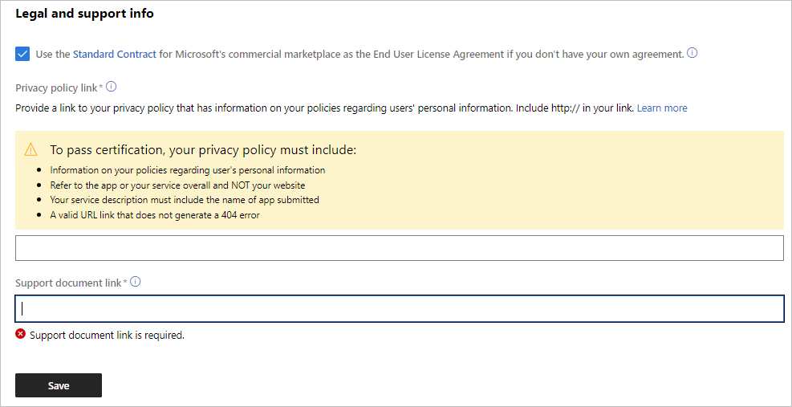

# Store step-by-step submission guide

This article is a step-by-step guide that will detail how to submit your app to Microsoft 365 Stores.

>[!TIP]
>We recommend that you read our [pre-submission checklist](./checklist.md) before reading this store submission guide so you have all information you need to submit your app.

## Step 1: Select the type of app you are submitting

#### [Preview interface](#tab/new-web-form)

1. Sign in to [Partner Center](https://partner.microsoft.com/dashboard/home). You can use the same username and password you use to manage Office Store products.

1. Select the **Marketplace offers** tile.

    :::image type="content" source="images/workspaces/marketplace-offers-tile.png" alt-text="Illustrates the product GUID in the URL for an Office app.":::

1. Select **+ New offer** and then select the type of app you want to submit. The example screenshots in this article show an Office Add-in, but the steps apply to Teams apps, SharePoint solutions, and so on.

    

#### [Current interface](#tab/old-web-form)

From the **Overview** tab in Microsoft Partner Center, select **Create a new** and then select the type of app you want to submit. The example screenshots in this article show an Office Add-in, but the steps apply to Teams apps, SharePoint solutions, and so on.

---

## Step 2: Name your app

#### [Preview interface](#tab/new-web-form)

1. In the dialog box that appears, enter a name for your app.

1. Select **Check availability** to verify that the name you chose is available.

1. Select **Create**.

#### [Current interface](#tab/old-web-form)

You’ll be prompted to enter a name for your app.

---

## Step 3: Tell us about your Product Setup

#### [Preview interface](#tab/new-web-form)

1. When filling out the **Product setup** page, keep answer the following questions:

    - **Will your app be listed in the Apple Store?**
    If so, include your Apple ID. You'll see a warning that reminds you to enter this information on screen.
    - **Does your app use Azure Active Directory or SSO (Azure AD/SSO)?**
    If so, select the box that asks about this.
    - **Does your app require additional purchases?**
    If so, select the box that asks about this. You will see a warning that reminds you to fill in the notes box on the review and publish page in a later step with your test credentials so a tester can verify this.
    - **Do you want to connect with your lead management CRM system?**
    If so, connect this system using the Connect link.

1. Select **Save draft** before continuing to the next page: Packages.

The following screenshot shows two yellow warning boxes that remind you to fill in your Apple ID and provide test credentials.

#### [Current interface](#tab/old-web-form)

- **Will your app be listed in the Apple Store?**
    If so, include your Apple ID. You'll see a warning that reminds you to enter this information on screen.
- **Does your app use Azure Active Directory or SSO (Azure AD/SSO)?**
    If so, select the box that asks about this.
- **Does your app require additional purchases?**
    If so, select the box that asks about this. You will see a warning that reminds you to fill in the notes box on the review and publish page in a later step with your test credentials so a tester can verify this.
- **Do you want to connect with your lead management CRM system?**
    If so, connect this system using the Connect link.

The following screenshot shows two yellow warning boxes that remind you to fill in your Apple ID and provide test credentials.

---

## Step 4: Upload your manifest for package testing

#### [Preview interface](#tab/new-web-form)

You will need to upload your manifest file to the grey box on the **Packages** page.

Remember to pre-test your package to prevent any unexpected failures in this step. Get information on all [the pre-testing manifest tools](/office/dev/add-ins/testing/troubleshoot-manifest#:~:text=%20To%20use%20a%20command-line%20XML%20schema%20validation,and%20replace%20XML_FILE%20with%20the%20path...%20More%20).

When your manifest is uploaded and is correct, you will receive a confirmation and see that manifest checks have passed and that the **Status** column shows **Complete**.

#### [Current interface](#tab/old-web-form)

You will need to upload your manifest file to the grey box on this page.

Remember to pre-test your package to prevent any unexpected failures in this step. Get information on all [the pre-testing manifest tools](/office/dev/add-ins/testing/troubleshoot-manifest#:~:text=%20To%20use%20a%20command-line%20XML%20schema%20validation,and%20replace%20XML_FILE%20with%20the%20path...%20More%20).

When your manifest is uploaded and is correct, you will receive a confirmation and see that manifest checks have passed.

---

## Step 5: Define the metadata that will categorize your app in the store

#### [Preview interface](#tab/new-web-form)

1. On the **Properties** page, select at least one and up to three categories to help your customers find your product in the marketplace.
1. You can optionally select up to two industries. If your product is not specific to an industry, do not select one.
1. Under **Legal and support info**, do one of the following:
    - Choose the **Standard Contract** check box. If you choose to use Microsoft's standard end user license agreement (EULA), you will need to select **Accept** in the confirmation dialog box that appears to confirm that you do not want to use your own agreement, as this cannot be reversed once your app is published.
    - In the **End User License Agreement (EULA) link** box, enter the link to your EULA (starting with https). 

    
    ***Figure 1 Choose an end user license agreement***

1. In the **Privacy policy link** box, enter a link (starting with https) to your organization's privacy policy. You're responsible to ensure your app complies with privacy laws and regulations, and for providing a valid privacy policy.

1. In the **Support document link** box, enter a link (starting with https) that customers will use if they have issues with your product.

    The yellow warning seen in the following screenshot reminds you that notes for certification are required.

    
    ***Figure 2 Privacy policy and Support document link boxes***

    Figure 2 shows that to pass certification, your privacy policy must include:

    - Information on your policies regarding user's personal information.
    - Refer to the app or your service overall and NOT your website.
    - Your service description must include the name of app submitted.
    - A valid URL link that does not generate a 404 error.

    > [!NOTE]
    > A Terms of Use Policy is not considered a privacy policy. You must include a privacy policy that is separate from your Terms of Use policy.

1. Select **Save** before continuing to the next page: Marketplace listings.

#### [Current interface](#tab/old-web-form)

In this step, you will add secure URL links to your support policies, privacy policies, and End User License Agreements (EULA). For more information on what your policies should look like, see [our submission checklist](./checklist.md).

The yellow warning seen in the following screenshots remind you that notes for certification are required.

The following image shows that to pass certification, your privacy policy must include:

- Information on your policies regarding user's personal information.
- Refer to the app or your service overall and NOT your website.
- Your service description must include the name of app submitted.
- A valid URL link that does not generate a 404 error.

A Terms of Use Policy is not considered a privacy policy. You must include a privacy policy that is separate from your Terms of Use policy.

You will also need to include a EULA. If you provide your own EULA, the link you provide must be an https:// address. If you choose to use Microsoft's standard end user license agreement (EULA), you will need to confirm that you do not want to use your own agreement, as this cannot be reversed once your app is published.

If you don't specify a support document link, you will be prompted to enter one.

---

## Step 6: Define your languages in Marketplace Listings

1. To create a store entry, on the **Marketplace listings** page select **Manage additional languages**.
1. In the dialog box that appears, select the languages your app will be in.
1. Select **Update**.

1. To create a store entry, on the **Marketplace listings** page select **Manage additional languages**.
1. In the dialog box that appears, select the languages your app will be in.
1. Select **Update**.

## Step 7: For each language your app is available in, create your detailed store listing

Your store listing is configured on the **Marketplace listings** page, and should include a summary, description, search keywords, icons, screenshots, and an optional video. For details, see [our submission checklist](./checklist.md).

Within the language option, you'll find where you can fill in your app's store listing information, such as your app description and images.

To get started, select the language you want to configure under the **Language** column.

## Step 8: Decide on your availability date

On the **Availability** page, schedule when your app will be available. Note it typically takes 4 to 6 weeks to complete an app submission and get it approved. On average, most apps require multiple submissions to pass our validation process, so follow our checklist carefully to reduce this time.  

## Step 9:  Make sure you add your critical testing instructions

#### [Preview interface](#tab/new-web-form)

This final critical step requires you to include notes for certification. Provide any instructions for the reviewer who will be testing your app, including test accounts, license keys, and testing credentials.

If you indicated in a previous step that your app requires additional purchases, make sure you provide any information such as license keys that a review might need to evaluate your app.

When you are ready to publish your app, in the upper-right of the page, select **Review and publish**.

The following image shows the **Notes for certification** box where you must provide information.

In addition to _Notes for certification_, you can optionally provide additional detailed instructions for the reviewers by uploading a PDF file to the **Additional certification info** page. This option provides the following benefits:

- Enables you to include images to improve the clarity of the instructions
- The PDF file is uploaded, saved, and persisted for subsequent submissions.

The following image shows where you can optionally upload a PDF file of instructions for reviewers.

>[!TIP]
> Do not include an email address of a company employee who can provide sign-in information. Our reviewers will **not be able to email you for sign-in information**. Applications that do not list clear instructions in the certification notes will automatically fail the submission process.

#### [Current interface](#tab/old-web-form)

This final critical step requires you to include notes for certification. Provide any instructions for the reviewer who will be testing your app, including test accounts, license keys, and testing credentials.

If you indicated in a previous step that your app requires additional purchases, make sure you provide any information such as license keys that a review might need to evaluate your app.

The following image shows the **Notes for certification** box where you must provide information.

In addition to _Notes for certification_, you can optionally provide additional detailed instructions for the reviewers by uploading a PDF file to the **Additional certification info** page. This option provides the following benefits:

- Enables you to include images to improve the clarity of the instructions
- The PDF file is uploaded, saved, and persisted for subsequent submissions.

The following image shows where you can optionally upload a PDF file of instructions for reviewers.

:::image type="content" source="./images/add-in-submission-guide/additional-cert-info.png" alt-text="Illustrates the Additional Certification Info page in Parter Center.":::

>[!TIP]
> Do not include an email address of a company employee who can provide sign-in information. Our reviewers will **not be able to email you for sign-in information**. Applications that do not list clear instructions in the certification notes will automatically fail the submission process.

---

## Step 10: Use the following checklist to avoid the top five common errors that produce 80% of review rejections

Use our **[pre-submission checklist](./checklist.md)** to address all the things on this list.

- Did you include Terms of Use links?
- Did you include Privacy Policy links?
- Did you including Testing instructions for the Reviewer?
- Did you indicate Service or Account disclosures?
- Did you indicate any Additional Charge Disclosures for required paid services?

Once you have answered those questions for yourself, select the submit button on your app for review and approval.

## Step 11: Congratulations, you are done submitting!

Expect a response within 3 to 4 business days from our reviewers if there are any issues related to your submission.
