# Store step-by-step submission guide

This article is a step-by-step guide that will detail how to submit your app to Microsoft 365 Stores.

>[!TIP]
>We recommend reading our [pre-submission checklist](./checklist.md) before reading this store submission guide, so you have all information ready to go for submission.

## Step 1: Select the type of app you are submitting

From the Overview tab in the Microsoft Partner Center, select **Create a new** and select the type of app you're submitting. The example screenshots in this article show an Office Add-in, but the steps apply to Teams apps, SharePoint solutions, etc.

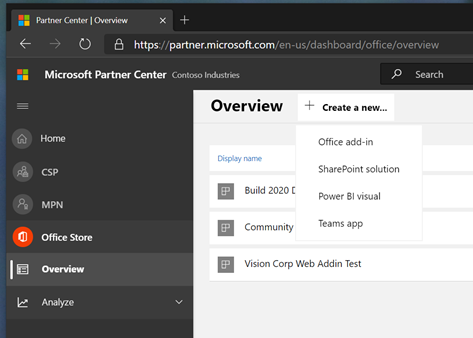

## Step 2: Name your app

You’ll be prompted to enter a name for your app.

## Step 3: Tell us about your Product Setup

- **Will your app be listed in the Apple Store?**
    If so, include your Apple ID. You'll see a warning that reminds you to enter this information on screen.
- **Does your app use Azure Active Directory or SSO (Azure AD/SSO)?**
    If so, select the box that asks about this.
- **Does your app require additional purchases?**
    If so, select the box that asks about this. You will see a warning that reminds you to fill in the notes box on the review and publish page in a later step with your test credentials so a tester can verify this.
- **Do you want to connect with your lead management CRM system?**
    If so, connect this system using the Connect link.

The following screenshot shows the two yellow warning boxes appear, reminding you to fill in your Apple ID and about providing your test credentials in a separate step.

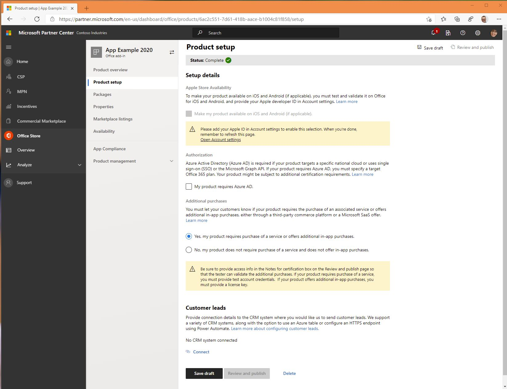

## Step 4: Upload your manifest for package testing

You will need to upload your manifest file to the grey box on this page, as shown in the following screenshot.

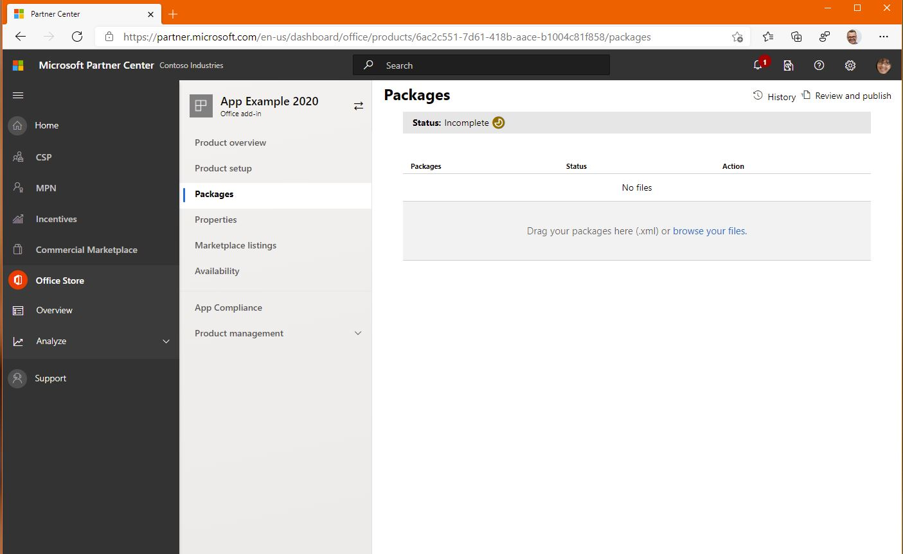

Remember to pre-test your package to prevent any unexpected failures in this step. Get information on all [the pre-testing manifest tools](/office/dev/add-ins/testing/troubleshoot-manifest#:~:text=%20To%20use%20a%20command-line%20XML%20schema%20validation,and%20replace%20XML_FILE%20with%20the%20path...%20More%20).

When your manifest is uploaded and is correct, you will receive a confirmation and see that manifest checks have passed, as shown in the following screenshot.

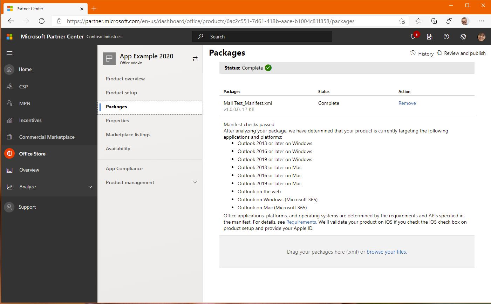

## Step 5: Define the metadata that will categorize your app in the store

In this step, you will add secure URL links to your support policies, privacy policies, and End User License Agreements (EULA). For more information on what your policies should look like, see [our submission checklist](./checklist.md).

You can see in the following screenshots that there is a yellow warning to remind you that notes for certification are required.

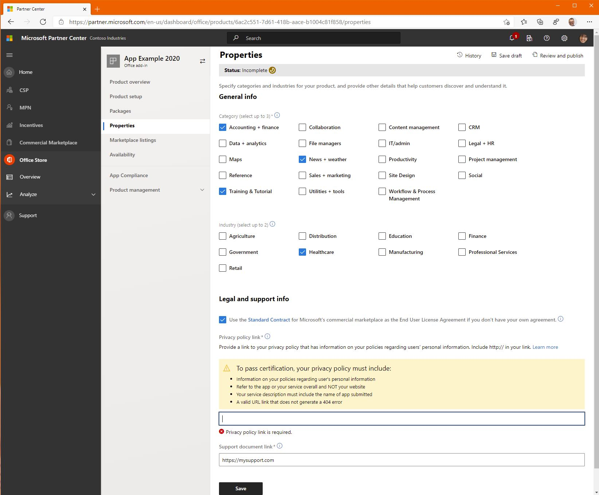

The following image shows that to pass certification, your privacy policy must include:

- Information on your policies regarding user's personal information.
- Refer to the app or your service overall and NOT your website.
- Your service description must include the name of app submitted.
- A valid URL link that does not generate a 404 error.

Note that a Terms of Use Policy is not considered a privacy policy. You must include a privacy policy that is separate from your Terms of Use policy.

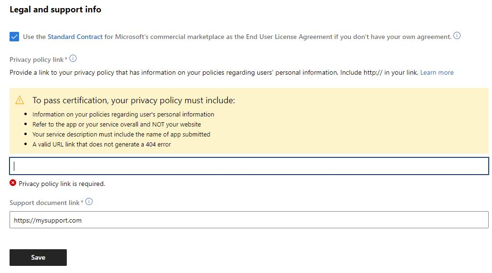

You will also need to include a EULA. If you provide your own EULA, the link you provide must be an https:// address. If you choose to use Microsoft's standard EULA agreement, you will need to confirm that you do not want to use your own agreement, as this cannot be reversed once your app is published.

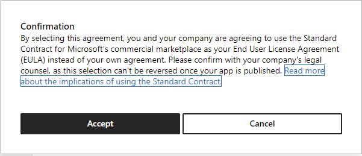

If you don't specify a support document link, you will be prompted to enter one.

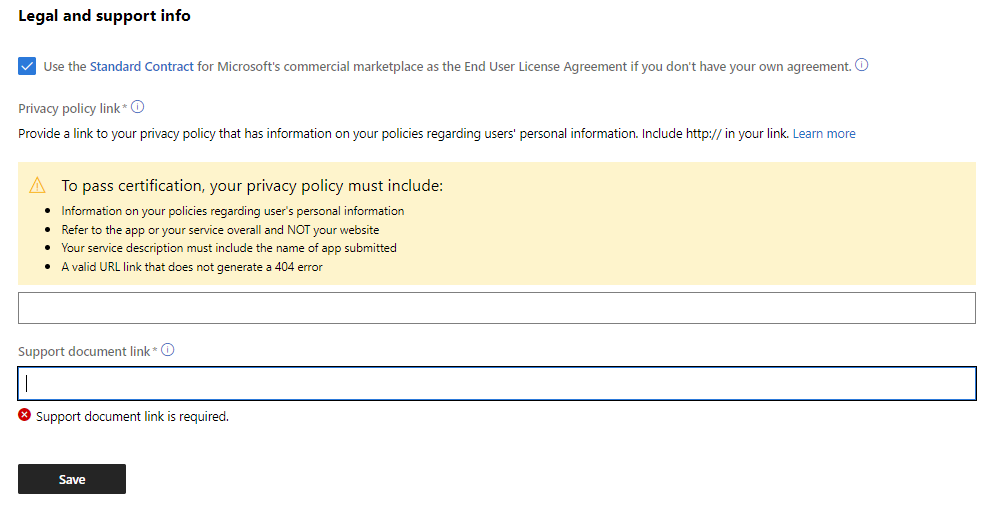

## Step 6: Define your languages in Marketplace Listings

This step can be confusing. Click on manage additional languages to begin. Then pick the language your app will be in to create a store entry.

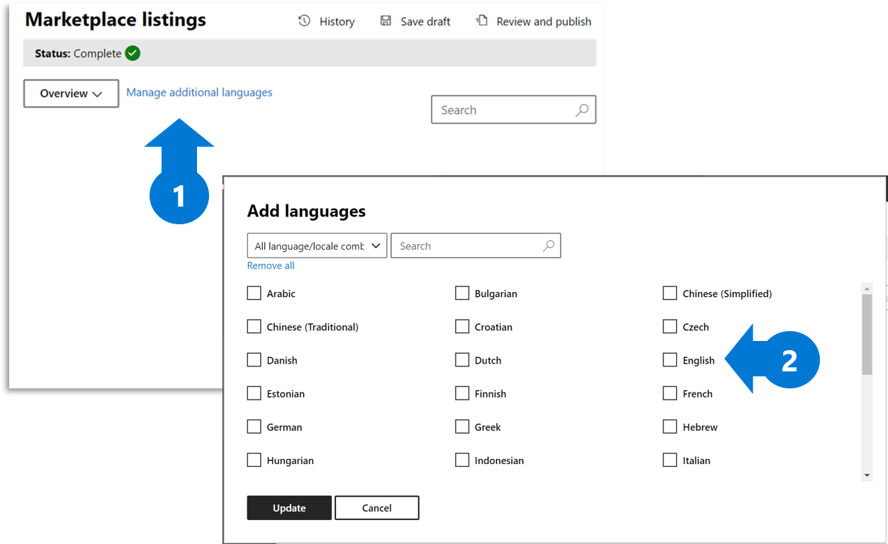

## Step 7: For each language your app is available in, create your detailed store listing

Your store listing should include copy, icons, videos, and screenshots. For details, see [our submission checklist](./checklist.md).

Within the language option, you'll find where you can fill in your app's store listing information, such as your app description and images.

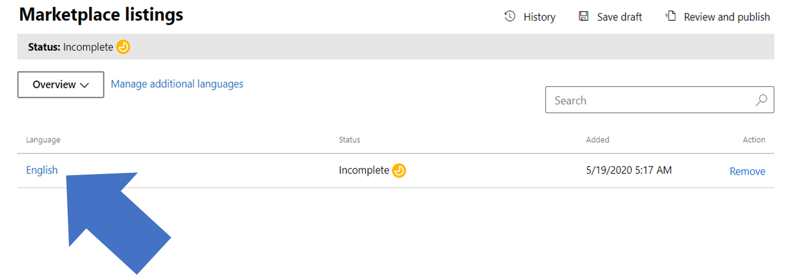

## Step 8: Decide on your availability date

You can schedule when your app will be available. Note it typically takes 4 to 6 weeks to complete an app submission and get it approved. On average, most apps require multiple submissions to pass our validation process, so follow our checklist carefully to reduce this time.  

## Step 9:  Make sure you add your critical testing instructions

This final critical step requires you include notes for certification. Provide any instructions for the reviewer who will be testing your app, including test accounts, license keys, and testing credentials.

If you indicated in a previous step that your app requires additional purchases, make sure you provide any information such as license keys that a review might need to evaluate your app.

The following image shows the Notes for certification box where you must provide information.

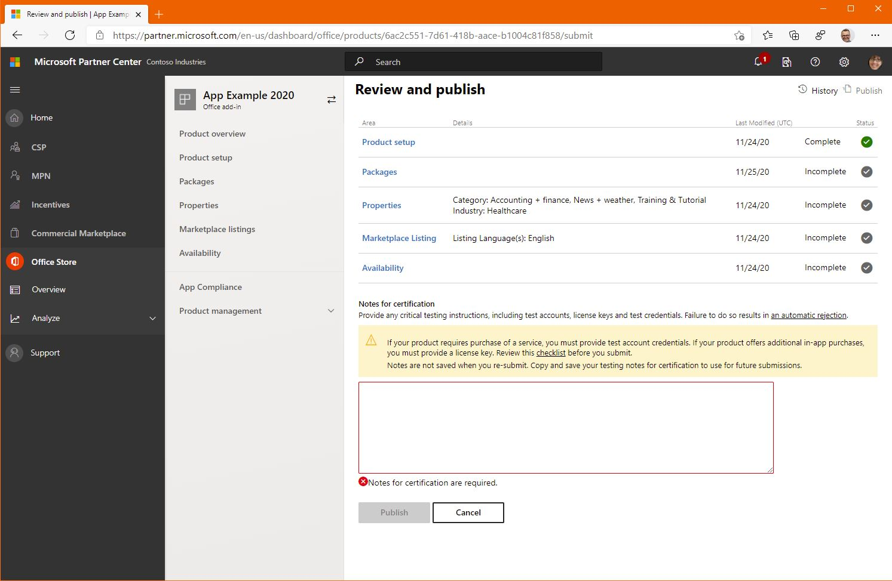

>[!TIP]
> Do not include an email address of a company employee who can provide log-in information. Our reviewers will **not be able to email you for log-in information**. Applications that do not list clear instructions in the certification notes will fail the submission process automatically.

## Step 10: Use the following checklist to avoid the top 5 common errors that produce 80% of review rejections

You can use our **[pre-submission checklist](./checklist.md)** to address all the things on this list.

- Did you include Terms of Use links?
- Did you include Privacy Policy links?
- Did you including Testing instructions for the Reviewer?
- Did you indicate Service or Account disclosures?
- Did you indicate any Additional Charge Disclosures for required paid services?

Once you have answered those questions for yourself, hit the submit button on your app for review and approval.

## Step 11: Congratulations, you are done submitting!

You can expect a response within 3 to 4 business days from our reviewers if there are any issues related to your submission.
