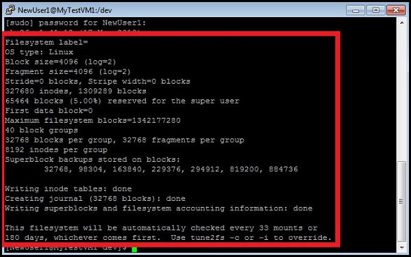

#Create a Virtual Machine Running Linux 

Creating a virtual machine that is running the Linux operating system is easy when you use the Image Gallery in the Azure Management Portal. This guide assumes that you have no prior experience using Azure. You can create a virtual machine running the Linux operating system in the cloud that you can access and customize.

> [WACOM.NOTE] You don't need any experience with Azure VMs to finish this tutorial. However, you do need an Azure account. You can create a free trial account in just a couple of minutes. For details, see [Create an Azure account](http://www.windowsazure.com/en-us/develop/php/tutorials/create-a-windows-azure-account/). 

You will learn:

- [About virtual machines in Azure] []
- [How to create the virtual machine] []
- [How to log on to the virtual machine after you create it] []
- [How to attach a data disk to the new virtual machine] []

**Note**: This tutorial creates a virtual machine that is not connected to a virtual network. If you want a virtual machine to use a virtual network, you must specify the virtual network when you create the virtual machine. For more information about virtual networks, see [Azure Virtual Network Overview](http://go.microsoft.com/fwlink/p/?LinkID=294063).

## About virtual machines in Azure ##

A virtual machine in Azure is a server in the cloud that you can control and manage. After you create a virtual machine in Azure, you can delete and re-create it whenever you need to, and you can access the virtual machine just as you do with a server in your office. Virtual hard disk (VHD) files are used to create a virtual machine. The following types of VHDs are used for a virtual machine:

- **Image** - A VHD that is used as a template to create a new virtual machine. An image is a template because it doesn't have specific settings like a running virtual machine, such as the computer name and user account settings. If you create a virtual machine using an image, an operating system disk is automatically created for the new virtual machine.
- **Disk** - A disk is a VHD that you can boot and mount as a running version of an operating system. After an image is provisioned, it becomes a disk. A disk is always created when you use an image to create a virtual machine. Any VHD that is attached to virtualized hardware and that is running as part of a service is a disk

The following options are available for using images to create a virtual machine:

- Create a virtual machine by using an image that is provided in the Image Gallery of the Azure Management Portal.
- Create and upload a .vhd file that contains an image to Azure, and then create a virtual machine using the image. For more information about creating and uploading a custom image, see [Creating and Uploading a Virtual Hard Disk that Contains the Linux Operating System](/en-us/manage/linux/common-tasks/upload-a-vhd/).

Each virtual machine resides in a cloud service, either by itself, or grouped with other virtual machines. You can place virtual machines in the same cloud service to enable the virtual machines to communicate with each other, to load-balance network traffic among virtual machines, and to maintain high availability of the machines. For more information about cloud services and virtual machines, see the "Execution Models" section in [Introducing Azure](http://go.microsoft.com/fwlink/p/?LinkId=311926).

## How to create the virtual machine ##

You use the **From Gallery** method to create a custom virtual machine in the Management Portal. This method provides more options for configuring the virtual machine when you create it, such as the connected resources, the DNS name, and the network connectivity if needed.

1. Sign in to the Azure [Management Portal](http://manage.windowsazure.com).
On the command bar, click **New**.

2. Click **Virtual Machine**, and then click **From Gallery**.

3. From **Choose an Image**, select an image from one of the lists. (The available images may differ depending on the subscription you're using.) Click the arrow to continue.

4. If multiple versions of the image are available, in **Version Release Date**, pick the version you want to use.

5. In **Virtual Machine Name**, type the name that you want to use. For this virtual machine, type **MyTestVM1**.

6. In **Size**, select the size that you want to use for the virtual machine. The size that you choose depends on the number of cores that are needed for your application.  For this virtual machine, choose the smallest available size.

7. In **New User Name**, type the name of the account that you will use to administer the virtual machine. You cannot use root for the user name. For this virtual machine, type **NewUser1**.

8. Under Authentication, check **Provide a Password**. Then, provide the required information and click the arrow to continue.

9. You can place virtual machines together in the cloud service, but for this tutorial, you're only creating a single virtual machine. To do this, select **Create a new cloud service**.

10. In **Cloud Service DNS Name**, type a name that uses between 3 and 24 lowercase letters and numbers. This name becomes part of the URI that is used to contact the virtual machine through the cloud service. For this virtual machine, type **MyService1**.

11. In **Region/Affinity Group/Virtual Network**, select where you want to locate the virtual machine.

12. You can select a storage account where the VHD file is stored. For this tutorial, accept the default setting of **Use an Automatically Generated Storage Account**.

13. Under **Availability Set**, for the purposes of this tutorial use the default setting of **None**. Click the check mark to create the virtual machine, and then click the arrow to continue.

14.  Under **VM Agent**, decide whether to install the VM Agent. This agent provides the environment for you to install extensions that can help you interact with the virtual machine. For details, see [Manage Extensions](http://go.microsoft.com/FWLink/p/?LinkID=390493). 

15. Under **Endpoints**, review the endpoint that's automatically created to allow Secure Shell (SSH) connections to the virtual machine. (Endpoints allow resources on the Internet or other virtual networks to communicate with a virtual machine.) You can add more endpoints now, or create them later. For instructions on creating them later, see [How to Set Up Endpoints to a Virtual Machine](http://azure.microsoft.com/en-us/documentation/articles/virtual-machines-set-up-endpoints/).
  
After the virtual machine and cloud service are created, the Management Portal lists the new virtual machine under **Virtual Machines** and lists the cloud service under **Cloud Services**. Both the virtual machine and the cloud service are started automatically.

## How to log on to the virtual machine after you create it ##

To manage the settings of the virtual machine and the applications that run on the machine, you can use an SSH client. To do this, you must install an SSH client on your computer that you want to use to access the virtual machine. There are many SSH client programs that you can choose from. The following are possible choices:

- If you are using a computer that is running a Windows operating system, you might want to use an SSH client such as PuTTY. For more information, see [PuTTY Download](http://www.chiark.greenend.org.uk/~sgtatham/putty/download.html).
- If you are using a computer that is running a Linux operating system, you might want to use an SSH client such as OpenSSH. For more information, see [OpenSSH](http://www.openssh.org/).

This tutorial shows you how to use the PuTTY program to access the virtual machine.

1. Find the **Host Name** and **Port information** from the Management Portal. You can find the information that you need from the dashboard of the virtual machine. Click the virtual machine name and look for the **SSH Details** in the **Quick Glance** section of the dashboard.

	

2. Open the PuTTY program.

3. Enter the **Host Name** and the **Port information** that you collected from the dashboard, and then click **Open**.

	

4. Log on to the virtual machine using the NewUser1 account that you specified when the machine was created.

	

	You can now work with the virtual machine just as you would with any other server.

## How to attach a data disk to the new virtual machine ##

Your application may need to store data. To set this up, you attach a data disk to the virtual machine that you previously created. The easiest way to do this is to attach an empty data disk to the machine.

**Note: Data Disk vs. Resource Disk**  
Data Disks reside on Azure Storage and can be used for persistent storage of files and application data.

Each virtual machine created also has a temporary local *Resource Disk* attached. Because data on a resource disk may not be durable across reboots, it is often used by applications and processes running in the virtual machine for transient and temporary storage of data. It is also used to store page or swap files for the operating system.

On Linux, the Resource Disk is typically managed by the Azure Linux Agent and automatically mounted to **/mnt/resource** (or **/mnt** on Ubuntu images). Note that the resource disk is a *temporary* disk, and might be emptied when the VM is deprovisioned. On the other hand, on Linux the data disk might be named by the kernel as `/dev/sdc`, and users will need to partition, format and mount that resource. Please see the [Azure Linux Agent User Guide](http://www.windowsazure.com/en-us/manage/linux/how-to-guides/linux-agent-guide/) for more information.

1. If you have not already done so, sign in to the Azure Management Portal.

2. Click **Virtual Machines**, and then select the **MyTestVM1** virtual machine that you previously created.

3. On the command bar, click **Attach**, and then click **Attach Empty Disk**.
	
	The **Attach Empty Disk** dialog box appears.

	

4. The **Virtual Machine Name**, **Storage Location**, and **File Name** are already defined for you. All you have to do is enter the size that you want for the disk. Type **5** in the **Size** field.

	**Note:** All disks are created from a VHD file in Azure storage. You can provide a name for the VHD file that is added to storage, but the name of the disk is automatically generated.

5. Click the check mark to attach the data disk to the virtual machine.

6. You can verify that the data disk is successfully attached to the virtual machine by looking at the dashboard. Click the name of the virtual machine to display the dashboard.

	The number of disks is now 2 for the virtual machine and the disk that you attached is listed in the **Disks** table.

	

The data disk that you just attached to the virtual machine is offline and not initialized after you add it. You must log on to the machine and initialize the disk to use it for storing data.

1. Connect to the virtual machine by using the steps listed above in **How to log on to the virtual machine after you create it**.

2. In the SSH window, type the following command, and then enter the account password:

	`sudo grep SCSI /var/log/messages`

	You can find the identifier of the last data disk that was added in the messages that are displayed.

	

3. In the SSH window, type the following command to create a new device, and then enter the account password:

	`sudo fdisk /dev/sdc`

	>[WACOM.NOTE] In this example you may need to use `sudo -i` on some distributions if /sbin or /usr/sbin are not in your `$PATH`.

4. Type **n** to create a new partition.

	

5. Type **p** to make the partition the primary partition, type **1** to make it the first partition, and then type enter to accept the default value for the cylinder.

	

6. Type **p** to see the details about the disk that is being partitioned.

	

7. Type **w** to write the settings for the disk.

	

8. You must create the file system on the new partition. As an example, type the following command to create the file system, and then enter the account password:

	`sudo mkfs -t ext4 /dev/sdc1`

	

	>[WACOM.NOTE] Note that on SUSE Linux Enterprise 11 systems provide only read-only access for ext4 file systems.  For these systems it is recommended to format the new file system as ext3 rather than ext4.

9. Next you must have a directory available to mount the new file system. As an example, type the following command to make a new directory for mounting the drive, and then enter the account password:

	`sudo mkdir /datadrive`

10. Type the following command to mount the drive:

	`sudo mount /dev/sdc1 /datadrive`

	The data disk is now ready to use as **/datadrive**.

11. Add the new drive to /etc/fstab:

	To ensure the drive is re-mounted automatically after a reboot it must be added to the /etc/fstab file. In addition, it is highly recommended that the UUID (Universally Unique IDentifier) is used in /etc/fstab to refer to the drive rather than just the device name (i.e. /dev/sdc1). To find the UUID of the new drive you can use the **blkid** utility:
	
		`sudo -i blkid`

	The output will look similar to the following:

		`/dev/sda1: UUID="11111111-1b1b-1c1c-1d1d-1e1e1e1e1e1e" TYPE="ext4"`
		`/dev/sdb1: UUID="22222222-2b2b-2c2c-2d2d-2e2e2e2e2e2e" TYPE="ext4"`
		`/dev/sdc1: UUID="33333333-3b3b-3c3c-3d3d-3e3e3e3e3e3e" TYPE="ext4"`

	>[WACOM.NOTE] blkid may not require sudo access in all cases, however, it may be easier to run with `sudo -i` on some distributions if /sbin or /usr/sbin are not in your `$PATH`.

	**Caution:** Improperly editing the /etc/fstab file could result in an unbootable system. If unsure, please refer to the distribution's documentation for information on how to properly edit this file. It is also recommended that a backup of the /etc/fstab file is created before editing.

	Using a text editor, enter the information about the new file system at the end of the /etc/fstab file.  In this example we will use the UUID value for the new **/dev/sdc1** device that was created in the previous steps, and the mountpoint **/datadrive**:

		`UUID=33333333-3b3b-3c3c-3d3d-3e3e3e3e3e3e   /datadrive   ext4   defaults   1   2`

	Or, on systems based on SUSE Linux you may need to use a slightly different format:

		`/dev/disk/by-uuid/33333333-3b3b-3c3c-3d3d-3e3e3e3e3e3e   /   ext3   defaults   1   2`

	If additional data drives or partitions are created you will need to enter them into /etc/fstab separately as well.

	You can now test that the file system is mounted properly by simply unmounting and then re-mounting the file system, i.e. using the example mount point `/datadrive` created in the earlier steps: 

		`sudo umount /datadrive`
		`sudo mount /datadrive`

	If the second command produces an error, check the /etc/fstab file for correct syntax.

	>[WACOM.NOTE] Subsequently removing a data disk without editing fstab could cause the VM to fail to boot. If this is a common occurrence, then most distributions provide either the `nofail` and/or `nobootwait` fstab options that will allow a system to boot even if the disk is not present. Please consult your distribution's documentation for more information on these parameters.

##Next Steps 

To learn more about Linux on Azure, see the following articles:

- [Introduction to Linux on Azure](http://www.windowsazure.com/en-us/documentation/articles/introduction-linux/)

- [How to use the Azure Command-Line Tools for Mac and Linux](http://www.windowsazure.com/en-us/documentation/articles/xplat-cli/)

- [About Azure VM configuration settings](http://msdn.microsoft.com/library/azure/dn763935.aspx)

[Next Steps]: #next
[About virtual machines in Azure]: #virtualmachine
[How to create the virtual machine]: #custommachine
[How to log on to the virtual machine after you create it]: #logon
[How to attach a data disk to the new virtual machine]: #attachdisk
