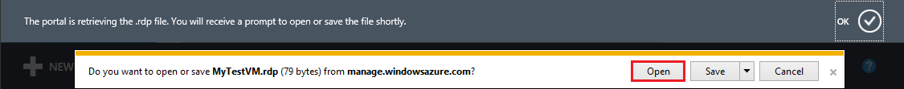
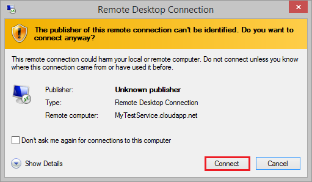
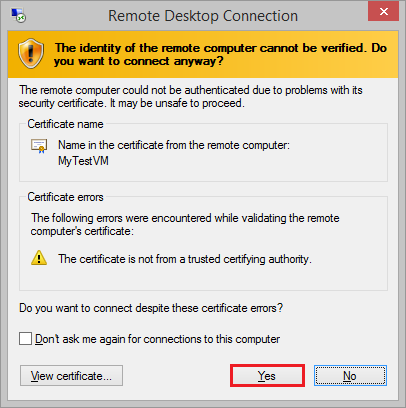
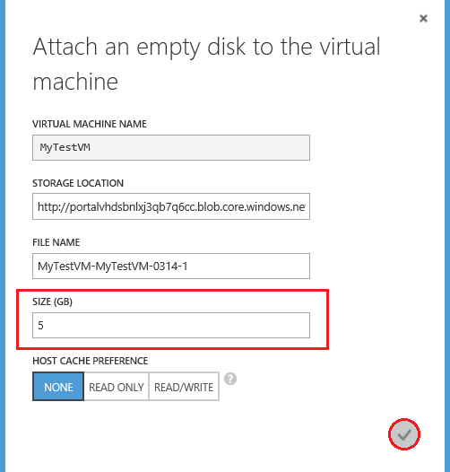

<properties title="Create a Virtual Machine Running Windows Server" pageTitle="How to create a Virtual Machine Running Windows Server" description="Describes how to create a Windows virtual machine, add a data disk, and log on remotely" metaKeywords="" services="virtual machines" solutions="" documentationCenter="" authors="kathydav" videoId="" scriptId="" />

# Create a Virtual Machine Running Windows Server #

This tutorial shows you how easy it is to create an Azure virtual machine running Windows Server, using the Image Gallery in the Windows Azure Management Portal. The Image Gallery offers a variety of images, including Windows operating systems, Linux-based operating systems, and application images. 

> [AZURE.NOTE] You don't need any experience with Azure VMs to finish this tutorial. However, you do need an Azure account. You can create a free trial account in just a couple of minutes. For details, see [Create an Azure account](http://www.windowsazure.com/develop/php/tutorials/create-a-windows-azure-account/). 

This tutorial shows you:

- [How to create the virtual machine](#createvirtualmachine)
- [How to log on to the virtual machine after you create it](#logon)
- [How to attach a data disk to the new virtual machine](#attachdisk)

If you'd like to know more, see [Virtual Machines](http://go.microsoft.com/fwlink/p/?LinkID=271224).

##How to create the virtual machine##

This section shows you how to use the **From Gallery** option in the Management Portal to create the virtual machine. This option provides more configuration choices than the **Quick Create** option. For example, if you want to join a virtual machine to a virtual network, you'll need to use the **From Gallery** option.

[AZURE.INCLUDE [virtual-machines-create-WindowsVM](../includes/virtual-machines-create-WindowsVM.md)]

## How to log on to the virtual machine after you create it ##

This section shows you how to log on to the virtual machine so you can manage its settings and the applications that you'll run on it.

1. Sign in to the Azure [Management Portal](http://manage.windowsazure.com).

2. Click **Virtual Machines**, and then select the **MyTestVM** virtual machine.

	

3. On the command bar, click **Connect**.

	
	
4. Click **Open** to use the remote desktop protocol file that was automatically created for the virtual machine.

	
	
5. Click **Connect**.

	

6. In the password box, type the user name and password that you specified when you created the virtual machine, and then click **OK**.

7. Click **Yes** to verify the identity of the virtual machine.

	

	You can now work with the virtual machine just like you would a server in your office.

## How to attach a data disk to the new virtual machine ##

This section shows you how to attach an empty data disk to the virtual machine. See the [Attach a Data Disk Tutorial] (../articles/storage-windows-attach-disk.md) for more information on attaching empty disks as well as how to attach existing disks.

1. Sign in to the Azure [Management Portal](http://manage.windowsazure.com).

2. Click **Virtual Machines**, and then select the **MyTestVM** virtual machine.

	
	
3. You may be taken to the Quick Start page first. If so, select **Dashboard** from the top.

	

4. On the command bar, click **Attach**, and then click **Attach Empty Disk** when it pops up.

		

5. The **Virtual Machine Name**, **Storage Location**, **File Name**, and **Host Cache Preference** are already defined for you. All you have to do is enter the size that you want for the disk. Type **5** in the **Size** field. Then click the check mark to attach the empty disk to the virtual machine.

		
	
	>[AZURE.NOTE] All disks are created from a VHD file in Windows Azure storage. Under **File Name**, you can provide the name for the VHD file that is added to storage, but Azure generates the name of the disk automatically.

6. Return to the dashboard to verify that the empty data disk was successfully attached to the virtual machine. It will be listed as a second disk in the **Disks** list along with the OS Disk.

	

	After you attach the data disk to the virtual machine, the disk is offline and not initialized. Before you can use it to store data, you'll need to log on to the virtual machine and initialize the disk.

7. Connect to the virtual machine by using the steps in the previous section, [How to log on to the virtual machine after you create it] (#logon).

8. After you log on to the virtual machine, open **Server Manager**. In the left pane, select **File and Storage Services**.

	

9. Select **Disks** from the expanded menu.

		
	
10. In the **Disks** section, there are three disks in the list: disk 0, disk 1, and disk 2. Disk 0 is the OS disk, disk 1 is a temporary resource disk (which should not be used for data storage), and disk 2 is the data disk you have attached to the virtual machine. Note that the data disk has a capacity of 5 GB as specified earlier. Right-click disk 2 and then select **Initialize**.

	

11. Click **Yes** to start the initialization process.

	

12. Right-click disk 2 again and select **New Volume**. 

	

13. Complete the wizard using the default values provided. Once the wizard is finished, a new volume will be listed in the **Volumes** section. 

	

	The disk is now online and ready to use with a new drive letter. 
	
##Next Steps 

To learn more about configuring Windows virtual machines on Azure, see the following articles:

[How to Connect Virtual Machines in a Cloud Service](../articles/cloud-services-connect-virtual-machine.md)

[How to Create and Upload your own Virtual Hard Disk containing the Windows Server Operating System](../articles/virtual-machines-create-upload-vhd-windows-server.md)

[Attach Data Disks to a Virtual Machine](../articles/storage-windows-attach-disk.md)

[Manage the Availability of Virtual Machines](../articles/manage-availability-virtual-machines.md)

[About virtual machines in Azure]: #virtualmachine
[How to create the virtual machine]: #custommachine
[How to log on to the virtual machine after you create it]: #logon
[How to attach a data disk to the new virtual machine]: #attachdisk
[How to set up communication with the virtual machine]: #endpoints

