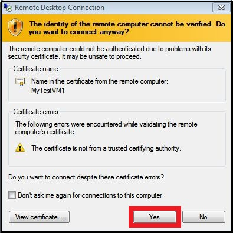

# Create a Virtual Machine Running Windows Server #

It's easy to create a virtual machine that is running the Windows Server operating system when you use the Image Gallery in the Azure Management Portal. This tutorial teaches you how to create a virtual machine running Windows Server in the cloud that you can then access and customize. You don't need prior experience with Azure to use this tutorial. 

You will learn:

- [About virtual machines in Azure] []
- [How to create the virtual machine] []
- [How to log on to the virtual machine after you create it] []
- [How to attach a data disk to the new virtual machine] []

**Note:** This tutorial creates a virtual machine that is not connected to a virtual network.  If you want a virtual machine to use a virtual network, you must specify the virtual network when you create the virtual machine. For more information about virtual networks, see [Azure Virtual Network Overview](http://go.microsoft.com/fwlink/p/?LinkID=294063).

##About virtual machines in Azure ##

A virtual machine in Azure is a server in the cloud that you can control and manage. After you create a virtual machine in Azure, you can delete and re-create it whenever you need to, and you can access the virtual machine just like any other server. To learn more, see [Virtual Machines](http://go.microsoft.com/fwlink/p/?LinkID=271224).

##How to create the virtual machine##

This tutorial shows you how to use the **From Gallery** method in the Management Portal to create a custom virtual machine. This method provides more options than the **Quick Create** method does for configuring a virtual machine when you create it.

1. Sign in to your subscription to use the Azure [Management Portal](http://manage.windowsazure.com). If you don't have a subscription, you can sign up for a [free trial](http://go.microsoft.com/fwlink/p/?LinkID=23435).

2. On the command bar, click **New**.

3. Click **Virtual Machine**, and then click **From Gallery**.
	
4. From **Choose an Image**, select **Windows Server 2012 R2 Datacenter**. (The available images may differ depending on the subscription you're using.) Click the arrow to continue.
	
5. If multiple versions of the image are available, in **Version Release Date**, pick the version you want to use.

6. In **Virtual Machine Name**, type the name that you want to use for the virtual machine. For this virtual machine, type **MyTestVM1**.

7. In **Size**, select the size of the virtual machine. The size you should select depends on the number of cores required to run your application. For this virtual machine, choose the smallest available size.

8. In **New User Name**, type a name for the administrative account that you want to use to manage the server. For this virtual machine, type **MyTestVM1Admin**.

9. In **New Password**, type a strong password for the administrative account on the virtual machine. In **Confirm Password**, retype the password. Click the arrow to continue.

10. You can place virtual machines together in a cloud service to provide robust applications, but for this tutorial, you only create a single virtual machine. To do this, select **Create a new cloud service**.

11. In **Cloud Service DNS Name**, type a name that uses between 3 and 24 lowercase letters and numbers. This name becomes part of the URI that is used to contact the virtual machine through the cloud service. For this virtual machine, type **MyService1**.

12. In **Region/Affinity Group/Virtual Network**, select where you want to locate the virtual machine.

13. To store the VHD that the virtual machine will use, accept the default setting of **Use an Automatically Generated Storage Account**.

14. Under **Availability Set**, for the purposes of this tutorial use the default setting of **None**. Click the arrow to continue.

15.  Under **VM Agent**, decide whether to install the VM Agent. This agent provides the environment for you to install extensions that can help you interact with the virtual machine. For details, see [Using Extensions](http://go.microsoft.com/FWLink/p/?LinkID=394093). **Important**: The VM Agent can be installed only when you create the virtual machine. 
 
16. Under **Endpoints**, review the new endpoints that will be created to allow connections to the virtual machine, such as through Remote Desktop
and Windows PowerShell remoting. You also can add endpoints now, or create them later. For instructions on creating them later, see [How to Set Up Communication with a Virtual Machine](http://www.windowsazure.com/en-us/manage/linux/how-to-guides/setup-endpoints/).

17. Click the check mark to create the virtual machine.
    
	After the virtual machine and cloud service are created, the Management Portal lists the new virtual machine under **Virtual Machines** and lists the cloud service under **Cloud Services**. Both the virtual machine and the cloud service are started automatically.

## How to log on to the virtual machine after you create it ##

You can log on to the virtual machine that you created to manage both its settings and the applications that are running on it.

1. Sign in to the Azure [Management Portal](http://manage.windowsazure.com).

2. Click **Virtual Machines**, and then select the **MyTestVM1** virtual machine.

3. On the command bar, click **Connect**.

4. Click **Open** to use the remote desktop protocol file that was automatically created for the virtual machine.

5. Click **Connect**.

	

6. In the password box, type the user name and password that you specified when you created the virtual machine, and then click **OK**.

7. Click **Yes** to verify the identity of the virtual machine.

	

	You can now work with the virtual machine just like you would a server in your office.

## How to attach a data disk to the new virtual machine ##

Your application might need to store data. To set this up, attach a data disk to the virtual machine. The easiest way to do this is to attach an empty data disk to the virtual machine.

1. Sign in to the Azure [Management Portal](http://manage.windowsazure.com).

2. Click **Virtual Machines**, and then select the **MyTestVM1** virtual machine.

3. On the command bar, click **Attach**, and then click **Attach Empty Disk**.

	The **Attach Empty Disk** dialog box appears.

	> [WACOM.NOTE] The Quick Start page might be displayed instead of the dashboard and command bar. If this happens, click **Dashboard** from the top.

4. The **Virtual Machine Name**, **Storage Location**, **File Name**, and **Host Cache Preference** are already defined for you. All you have to do is enter the size that you want for the disk. Type **5** in the **Size** field.

	**Note:** All disks are created from a VHD file in Azure storage. You can provide a name for the VHD file that is added to storage, but Azure generates the name of the disk automatically.

5. Click the check mark to attach the data disk to the virtual machine.

6. Click the name of the virtual machine. This displays the dashboard so you can verify that the data disk was successfully attached to the virtual machine.

	The virtual machine now has 2 disks. The disk that you attached is listed in the **Disks** table.

	

	After you attach the data disk to the virtual machine, the disk is offline and not initialized. Before you can use it to store data, you'll need to log on to the virtual machine and initialize the disk.

7. Connect to the virtual machine by using the steps in the previous section, **How to log on to the virtual machine after you create it**.

8. After you log on to the virtual machine, open **Server Manager**. In the left pane, expand **Storage**, and then click **Disk Management**.

	

9. Right-click **Disk 2**, and then click **Initialize Disk**.

	

10. Click **OK** to start the initialization process.

11. Right-click the space allocation area for Disk 2, click **New Simple Volume**, and then finish the wizard with the default values.

	

	The disk is now online and ready to use with a new drive letter.

	

##Next Steps 

To learn more about configuring Windows virtual machines on Azure, see the following articles:

-[How to Connect Virtual Machines in a Cloud Service](http://www.windowsazure.com/en-us/documentation/articles/cloud-services-connect-virtual-machine/)

-[Manage the Availability of Virtual Machines](http://www.windowsazure.com/en-us/documentation/articles/manage-availability-virtual-machines/)

[About virtual machines in Azure]: #virtualmachine
[How to create the virtual machine]: #custommachine
[How to log on to the virtual machine after you create it]: #logon
[How to attach a data disk to the new virtual machine]: #attachdisk
[How to set up communication with the virtual machine]: #endpoints
