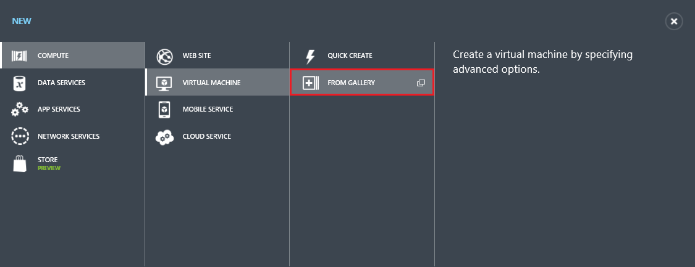

# Create a Virtual Machine Running Windows Server #

This tutorial will show you how quick and easy it is to create a virtual machine running Windows Server in the cloud using Windows Azure. We will use the Image Gallery in the Windows Azure Management Portal, which contains a variety of images including Windows-based operating systems, Linux-based operating systems, application images, and more. You do not need prior experience with Windows Azure to use this tutorial. 

You will learn:

- [How to create the virtual machine](#createvirtualmachine)
- [How to log on to the virtual machine after you create it](#logon)
- [How to attach a data disk to the new virtual machine](#attachdisk)

If you'd like to know more, see [Virtual Machines](http://go.microsoft.com/fwlink/p/?LinkID=271224).

##How to create the virtual machine##

This section will show you how to use the **From Gallery** method in the Management Portal to create a custom virtual machine. This method provides more options than the **Quick Create** method does for configuring the virtual machine when you create it.

1. Sign in to the Windows Azure [Management Portal](http://manage.windowsazure.com). Check out the [Free Trial](http://www.windowsazure.com/en-us/pricing/free-trial/) offer if you do not have a subscription yet.

2. On the command bar at the bottom of the screen, click **New**.

	

3. Under **Compute**, click **Virtual Machine**, and then click **From Gallery**.

	
	
4. The first configuration screen lets you **Choose an Image** for your virtual machine from one of the lists in the Image Gallery. (The available images may differ depending on the subscription you're using.) For this tutorial, we will select **Windows Server 2012 R2 Datacenter**. Click the arrow to continue.

	

5. The second configuration screen lets you specify **attributes of the virtual machine** itself. For this tutorial, fill in the fields as shown in the image below. Once this screen is complete, click the arrow to continue.

	

	>[WACOM.NOTE]**New User Name** refers to the administrative account that will be used to manage the server. You will need to create your own unique password for this account.

6. The third configuration screen lets you specify attributes for **resources connected to the virtual machine** such as the cloud service and the storage account. For this tutorial, fill in the fields as shown in the image below. Once this screen is complete, click the arrow to continue. 

	

	Note that the **Cloud Service DNS Name** is the global DNS name that becomes part of the URI that is used to contact the virtual machine. You will need to create your own cloud service name since cloud service names must be globally unique. We will use MyTestService in this tutorial. Cloud services are important for more complex scenarios using [multiple virtual machines](http://www.windowsazure.com/en-us/documentation/articles/cloud-services-connect-virtual-machine/).
 
	For **Region/Affinity Group/Virtual Network**, we will use East US, but you can use a region that is more appropriate to your location. You can also choose to specify a virtual network instead. 
	>[WACOM.NOTE]
 If you want a virtual machine to use a virtual network, you must specify the virtual network when you create the virtual machine. For more information, see [Azure Virtual Network Overview](http://go.microsoft.com/fwlink/p/?LinkID=294063).

7. The fourth configuration screen lets you configure the **VM Agent and endpoints**. For this tutorial, do not make any changes to this screen. Click the check mark to create the virtual machine.

	

	>[WACOM.NOTE] The VM agent provides the environment for you to install extensions that can help you interact with the virtual machine. For details, see [Using Extensions](http://go.microsoft.com/FWLink/p/?LinkID=390493). For details about configuring endpoints, see [How to Set Up Endpoints to a Virtual Machine](http://www.windowsazure.com/en-us/documentation/articles/virtual-machines-set-up-endpoints/). 
    
8. After the virtual machine is created, the Management Portal lists the new virtual machine under **Virtual Machines**. The corresponding cloud service and storage account are also created under their respective sections. Both the virtual machine and cloud service are started automatically and will show **Running** as their status once the creation is complete. 

	

## How to log on to the virtual machine after you create it ##

This section will show you how to log on to the virtual machine that you created to manage both its settings and the applications that are running on it.

1. Sign in to the Azure [Management Portal](http://manage.windowsazure.com).

2. Click **Virtual Machines**, and then select the **MyTestVM** virtual machine.

	

3. On the command bar, click **Connect**.

	
	
4. Click **Open** to use the remote desktop protocol file that was automatically created for the virtual machine.

	
	
5. Click **Connect**.

	

6. In the password box, type the user name and password that you specified when you created the virtual machine, and then click **OK**.

7. Click **Yes** to verify the identity of the virtual machine.

	

	You can now work with the virtual machine just like you would a server in your office.

## How to attach a data disk to the new virtual machine ##

This section will show you how to attach an empty data disk to the virtual machine. See the [Attach a Data Disk Tutorial] (http://www.windowsazure.com/en-us/documentation/articles/storage-windows-attach-disk/) for more information on attaching empty disks as well as how to attach existing disks.

1. Sign in to the Azure [Management Portal](http://manage.windowsazure.com).

2. Click **Virtual Machines**, and then select the **MyTestVM** virtual machine.

	
	
3. You may be taken to the Quick Start page first. If so, select **Dashboard** from the top.

	

4. On the command bar, click **Attach**, and then click **Attach Empty Disk** when it pops up.

		

5. The **Virtual Machine Name**, **Storage Location**, **File Name**, and **Host Cache Preference** are already defined for you. All you have to do is enter the size that you want for the disk. Type **5** in the **Size** field. Then click the check mark to attach the empty disk to the virtual machine.

		
	
	.[WACOM.NOTE] All disks are created from a VHD file in Windows Azure storage. Under **File Name**, you can provide the name for the VHD file that is added to storage, but Azure generates the name of the disk automatically.

6. Return to the dashboard to verify that the empty data disk was successfully attached to the virtual machine. It will be listed as a second disk in the **Disks** list along with the OS Disk.

	

	After you attach the data disk to the virtual machine, the disk is offline and not initialized. Before you can use it to store data, you'll need to log on to the virtual machine and initialize the disk.

7. Connect to the virtual machine by using the steps in the previous section, [How to log on to the virtual machine after you create it] (#logon).

8. After you log on to the virtual machine, open **Server Manager**. In the left pane, select **File and Storage Services**.

	

9. Select **Disks** from the expanded menu.

		
	
10. In the **Disks** section, there are three disks in the list: disk 0, disk 1, and disk 2. Disk 0 is the OS disk, disk 1 is a temporary resource disk (which should not be used for data storage), and disk 2 is the data disk you have attached to the virtual machine. Note that the data disk has a capacity of 5 GB as specified earlier. Right-click disk 2 and then select **Initialize**.

	

11. Click **Yes** to start the initialization process.

	

12. Right-click disk 2 again and select **New Volume**. 

	

13. Complete the wizard using the default values provided. Once the wizard is finished, a new volume will be listed in the **Volumes** section. 

	

	The disk is now online and ready to use with a new drive letter. 
	
##Next Steps 

To learn more about configuring Windows virtual machines on Azure, see the following articles:

[How to Connect Virtual Machines in a Cloud Service](http://www.windowsazure.com/en-us/documentation/articles/cloud-services-connect-virtual-machine/)

[How to Create and Upload your own Virtual Hard Disk containing the Windows Server Operating System](http://www.windowsazure.com/en-us/documentation/articles/virtual-machines-create-upload-vhd-windows-server/)

[Attach Data Disks to a Virtual Machine](http://www.windowsazure.com/en-us/documentation/articles/storage-windows-attach-disk/)

[Manage the Availability of Virtual Machines](http://www.windowsazure.com/en-us/documentation/articles/manage-availability-virtual-machines/)

[About virtual machines in Azure]: #virtualmachine
[How to create the virtual machine]: #custommachine
[How to log on to the virtual machine after you create it]: #logon
[How to attach a data disk to the new virtual machine]: #attachdisk
[How to set up communication with the virtual machine]: #endpoints

