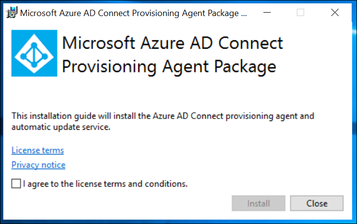
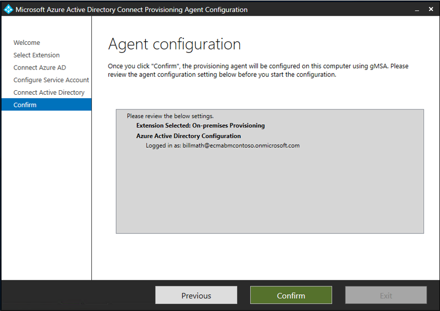
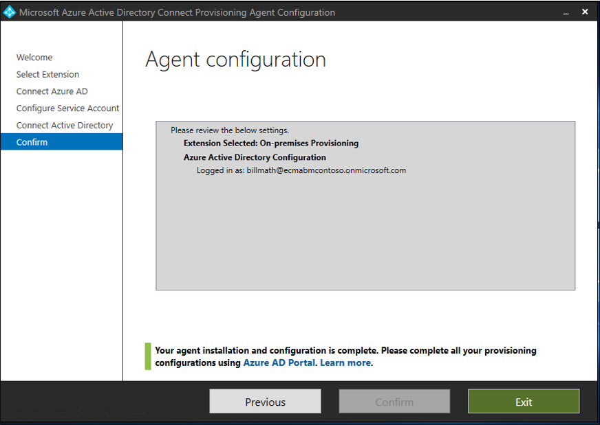

This document describes the steps you need to perform to automatically provision and deprovision users from Azure Active Directory (Azure AD) into an LDAP directory. The document focuses on AD LDS, but you can provision into any of the supported LDAP directories mentioned below. Please note that provisioning users into Active Directory Domain Services through this solution is not supported. 
 
For important details on what this service does, how it works, and frequently asked questions, see [Automate user provisioning and deprovisioning to SaaS applications with Azure Active Directory](../articles/active-directory/app-provisioning/user-provisioning.md).

## Prerequisites for provisioning users into an LDAP directory

>[!IMPORTANT]
> The on-premises provisioning preview is currently in an invitation-only preview. To request access to the capability, use the [access request form](https://aka.ms/onpremprovisioningpublicpreviewaccess). We'll open the preview to more customers and connectors over the next few months as we prepare for general availability. Please note that provisioning users into Active Directory Domain Services is not supported through this preview. 


### On-premises prerequisites

 - A target system, such as a Active Directory Lightweight Services (AD LDS), in which users can be created, updated, and deleted. This AD LDS instance should not be used to provision users into Azure AD as you may create a loop with Azure AD Connect. 
 - A Windows Server 2016 or later computer with an internet-accessible TCP/IP address, connectivity to the target system, and with outbound connectivity to login.microsoftonline.com. An example is a Windows Server 2016 virtual machine hosted in Azure IaaS or behind a proxy. The server should have at least 3 GB of RAM.
 - A computer with .NET Framework 4.7.1.
 - Optional:  Although it is not required, it is recommended to download [Microsoft Edge for Windows Server](https://www.microsoft.com/en-us/edge?r=1) and use it in-place of Internet Explorer.

Depending on the options you select, some of the wizard screens might not be available and the information might be slightly different. For purposes of this configuration, the user object type is used. Use the following information to guide you in your configuration. 

#### Supported systems
* OpenLDAP
* Microsoft Active Directory Lightweight Directory Services
* 389 Directory Server
* pache Directory Server
* IBM Tivoli DS
* Isode Directory
* NetIQ eDirectory
* Novell eDirectory
* Open DJ
* Open DS
* Open LDAP (openldap.org)
* Oracle (previously Sun) Directory Server Enterprise Edition
* RadiantOne Virtual Directory Server (VDS)
* Sun One Directory Server

### Cloud requirements

 - An Azure AD tenant with Azure AD Premium P1 or Premium P2 (or EMS E3 or E5). 
 
    [!INCLUDE [active-directory-p1-license.md](active-directory-p1-license.md)]
 - The Hybrid Administrator role for configuring the provisioning agent and the Application Administrator or Cloud Administrator roles for configuring provisioning in the Azure portal.

## Prepare the LDAP directory
The following information is provided to help create a test AD LDS environment.  This setup uses PowerShell and the ADAMInstall.exe with an answers file.  This document does not cover in-depth information on AD LDS.  For more information see [Active Directory Lightweight Directory Services](https://docs.microsoft.com/previous-versions/windows/it-pro/windows-server-2012-r2-and-2012/hh831593(v=ws.11)). 

If you already have AD LDS setup in a test environment you can skip the following sections and move to installing the ECMA Host connector section.

### Create an SSL certificate, a test directory and install AD LDS.
Use the PowerShell script from [Appendix A](#appendix-a---install-ad-lds-powershell-script).  The script does the following:
  - Creates a self-signed certificate that will be used by the LDAP connector
  - Creates a directory for the feature install log
  - Exports the certificate in the personal store to the directory
  - Imports the certificate to the truste root of the local machine
  - Installs the AD LDS role on our virtual machine 

On the Windows Server virtual machine you are using to test the LDAP connector run the script using Windows PowerShell with administrative priviledges.  

### Create an instance of AD LDS
Now that the role has been installed, you need to create an instance of AD LDS.  To do this, you can use the answer file provided below.  This will install the instance quietly without using the UI.

Copy the contents of [Appendix B](#appendix-b---answer-file) in to notepad and save it as **answer.txt** in **"C:\Windows\ADAM"**.

Now open a cmd prompt with administrative priviledges and run the following:

```
C:\Windows\ADAM> ADAMInstall.exe /answer:answer.txt
```

### Create containers and a service account for AD LDS.
The use the PowerShell script from [Appendix C](#appendix-c---populate-ad-lds-powershell-script).  The script does the following:
  - Creates a container for the service account that will be used with the LDAP connector
  - Creates a container for the cloud users.  This is where users will be provisioned to.
  - Creates the servcie account in AD LDS
  - Enables the serice account
  - Adds the service account to the AD LDS Administrators role

On the Windows Server virtual machine you are using to test the LDAP connector run the script using Windows PowerShell with administrative priviledges.  

## Grant the NETWORK SERVICE read permissions to the SSL cert
In order to enable SSL to work, you need to grant the NETWORK SERVICE read permissions to our newly created certificate.  To do this, use the following steps.

 1. Navigate to **C:\Program Data\Microsoft\Crypto\Keys**.
 2. Right-click on the system file located here.  It will be a guid.  This is the container that is storing our certificate.
 3. Select properties.
 4. At the top, select the **Security** tab.
 5. Select **Edit**.
 6. Click **Add**.
 7. In the box, enter **Network Service** and select **Check Names**.
 8. Select **NETWORK SERVICE** from the list and click **OK**.
 9. Click **Ok**.
 10. Ensure the Network service account has read and read & execute permissions and click **Apply** and **OK**.

## Verify SSL connectivity with AD LDS
Now that we have configured the certificate and granted the network service account permssions, test the connectivity to verify that it is working.
 1. Open Server Manager and select AD LDS on the left
 2. Right-click your instance of AD LDS and select ldp.exe from the pop-up.
   </br>
 3. At the top of ldp.exe, select **Connection** and **Connect**.
 4. Enter the following and click **OK**.
   - Server:  APP3
   - Port: 636
   - Place a check in SSL
   </br>
 5.  You should see a response similar to the screenshot below.
   </br>
 6.  At the top, under **Connection** select **Bind**.
 7. Leave the defaults and click **OK**.
   </br>
 8. You should now, successfully bind to the instance.
   </br>


## Download, install and configure the Azure AD Connect Provisioning Agent Package

 1. Sign in to the Azure portal.
 2. Go to **Enterprise applications** > **Add a new application**.
 3. Search for the **On-premises ECMA app** application, and add it to your tenant image.
 4. Select the **on-premises ECMA app** that was added.
 5. Under **Getting Started**, on the **3. Provision user accounts** box, select **Get started**.
 6. At the top, from the drop-down, change provisioning to **automatic**.  This will bring up **on-premises connectivity** below.
 7. Under **On-Premises Connectivity** download the agent installer.
 8. Run the Azure AD Connect provisioning installer **AADConnectProvisioningAgentSetup.msi**.
 9. On the **Microsoft Azure AD Connect Provisioning Agent Package** screen, accept the licensing terms, and select **Install**.
     </br>
 10. After this operation finishes, the configuration wizard starts. Select **Next**.
     </br>
 11. On the **Select Extension** screen, select **On-premises application provisioning (Azure AD to application)**. Select **Next**.
     </br>
 12. Use your global administrator account to sign in to Azure AD.
     </br>
 13. On the **Agent configuration** screen, select **Confirm**.
     </br>
 14. After the installation is complete, you should see a message at the bottom of the wizard. Select **Exit**.
     </br>
 15. Go to back to the Azure portal under the **On-premises ECMA app** application, and back to **Edit Provisioning**.
 16. On the **Provisioning** page, change the mode to **Automatic**.
     </br>
 17. On the **On-Premises Connectivity** section, select the agent that you just deployed and select **Assign Agent(s)**.
     </br>
     >[!NOTE]
     >After you add the agent, wait 10 minutes for the registration to complete. The connectivity test won't work until the registration completes.
     >
     >Alternatively, you can force the agent registration to complete by restarting the provisioning agent on your server. Go to your server, search for **services** in the Windows search bar, identify the **Azure AD Connect Provisioning Agent Service**, right-click the service, and restart.

 ## Configure the Azure AD ECMA Connector Host certificate
 1. On the desktop, select the ECMA shortcut.
 2. After the ECMA Connector Host Configuration starts, leave the default port **8585** and select **Generate** to generate a certificate. The autogenerated certificate will be self-signed as part of the trusted root. The SAN matches the host name.
     
 3. Select **Save**.


## Create a generic LDAP connector
 1. Select the ECMA Connector Host shortcut on the desktop.
 2. Select **New Connector**.
     </br>
 3. On the **Properties** page, fill in the boxes with the values specified in the table that follows the image and select **Next**.
     

     |Property|Value|
     |-----|-----|
     |Name|LDAP|
     |Autosync timer (minutes)|120|
     |Secret Token|Enter your own key here. It should be 12 characters minimum.|
     |Extension DLL|For a generic LDAP connector, select **Microsoft.IAM.Connector.GenericLdap.dll**.|
4. On the **Connectivity** page, fill in the boxes with the values specified in the table that follows the image and select **Next**.
     </br>
     
     |Property|Value|
     |-----|-----|
     |Host|APP3|
     |Port|636|
     |Connection Timeout|180|
     |Binding|SSL|
     |User Name|A user account with permissions to bind to the ldap directory|
     |Password|The password of the user name specified|
     
 5. On the **Schema 1** page, fill in the boxes with the values specified in the table that follows the image and select **Next**.
     </br>

     |Property|Value|
     |-----|-----|
     |Object type detection method|Fixed Value|
     |Fixed value list/Table/View/SP|User|
 6. On the **Schema 2** page, fill in the boxes with the values specified in the table that follows the image and select **Next**.
     </br>
 
     |Property|Value|
     |-----|-----|
     |User:Attribute Detection|Table|
     |User:Table/View/SP|Employees|
 7. On the **Schema 3** page, fill in the boxes with the values specified in the table that follows the image and select **Next**.
     

     |Property|Description|
     |-----|-----|
     |Select Anchor for :User|User:ContosoLogin|
     |Select DN attribute for User|AzureID|
8. On the **Schema 4** page, leave the defaults and select **Next**.
     </br>
 9. On the **Global** page, fill in the boxes and select **Next**. Use the table that follows the image for guidance on the individual boxes.
     </br>
     
     |Property|Description|
     |-----|-----|
     |Data Source Date Time Format|yyyy-MM-dd HH:mm:ss|
 10. On the **Partitions** page, select **Next**.
     </br>
 11. On the **Run Profiles** page, keep the **Export** checkbox selected. Select the **Full import** checkbox and select **Next**.
     </br>
     
     |Property|Description|
     |-----|-----|
     |Export|Run profile that will export data to SQL. This run profile is required.|
     |Full import|Run profile that will import all data from SQL sources specified earlier.|
     |Delta import|Run profile that will import only changes from SQL since the last full or delta import.|
 12. On the **Export** page, fill in the boxes and select **Next**. Use the table that follows the image for guidance on the individual boxes. 
     </br>
     
     |Property|Description|
     |-----|-----|
     |Operation Method|Table|
     |Table/View/SP|Employees|
 13. On the **Full Import** page, fill in the boxes and select **Next**. Use the table that follows the image for guidance on the individual boxes. 
     </br>
     
     |Property|Description|
     |-----|-----|
     |Operation Method|Table|
     |Table/View/SP|Employees|
 14. On the **Object Types** page, fill in the boxes and select **Next**. Use the table that follows the image for guidance on the individual boxes.   
      - **Anchor**: This attribute should be unique in the target system. The Azure AD provisioning service will query the ECMA host by using this attribute after the initial cycle. This anchor value should be the same as the anchor value in schema 3.
      - **Query Attribute**: Used by the ECMA host to query the in-memory cache. This attribute should be unique.
      - **DN**: The **Autogenerated** option should be selected in most cases. If it isn't selected, ensure that the DN attribute is mapped to an attribute in Azure AD that stores the DN in this format: CN = anchorValue, Object = objectType.  For additional information on anchors and the DN see [About anchor attributes and distinguished names](../articles/active-directory/app-provisioning/on-premises-application-provisioning-architecture.md#about-anchor-attributes-and-distinguished-names).
     </br>
     
     |Property|Description|
     |-----|-----|
     |Target object|User|
     |Anchor|ContosoLogin|
     |Query Attribute|AzureID|
     |DN|AzureID|
     |Autogenerated|Checked|      
 15. The ECMA host discovers the attributes supported by the target system. You can choose which of those attributes you want to expose to Azure AD. These attributes can then be configured in the Azure portal for provisioning.On the **Select Attributes** page, add all the attributes in the dropdown list and select **Next**. 
     </br>
      The **Attribute** dropdown list shows any attribute that was discovered in the target system and *wasn't* chosen on the previous **Select Attributes** page. 
 
 16. On the **Deprovisioning** page, under **Disable flow**, select **Delete**. Please note that attributes selected on the previous page won't be available to select on the Deprovisioning page. Select **Finish**.
     </br>


## Appendix A - Install AD LDS Powershell script
Powershell script to automate the installation of Active Directory Lightweight Directory Services.


```powershell
# Filename:    1_SetupADLDS.ps1
# Description: Creates a certificate that will be used for SSL and installs Active Directory Lighetweight Directory Services.
#
# DISCLAIMER:
# Copyright (c) Microsoft Corporation. All rights reserved. This 
# script is made available to you without any express, implied or 
# statutory warranty, not even the implied warranty of 
# merchantability or fitness for a particular purpose, or the 
# warranty of title or non-infringement. The entire risk of the 
# use or the results from the use of this script remains with you.
#
#
#
#
#Declare variables
$DNSName = 'APP3'
$CertLocation = 'cert:\LocalMachine\MY'
$logpath = "c:\" 
$dirname = "test"
$dirtype = "directory"
$featureLogPath = "c:\test\featurelog.txt" 

#Create a new self-signed certificate
New-SelfSignedCertificate -DnsName $DNSName -CertStoreLocation $CertLocation

#Create directory
New-Item -Path $logpath -Name $dirname -ItemType $dirtype

#Export the certifcate from the local machine personal store
Get-ChildItem -Path cert:\LocalMachine\my | Export-Certificate -FilePath c:\test\allcerts.sst -Type SST

#Import the certificate in to the trusted root
Import-Certificate -FilePath "C:\test\allcerts.sst" -CertStoreLocation cert:\LocalMachine\Root


#Install AD LDS
start-job -Name addFeature -ScriptBlock { 
Add-WindowsFeature -Name "ADLDS" -IncludeAllSubFeature -IncludeManagementTools 
 } 
Wait-Job -Name addFeature 
Get-WindowsFeature | Where installed >>$featureLogPath


 ```

## Appendix B - Answer file
This file is used to automate and create an instance of AD LDS.

>[!IMPORTANT]
> This script uses the local administrator for the AD LDS service account and has its password hard-coded in the answers.  This is for **testing only** and should never be used in a production environment.

```
 [ADAMInstall]
 InstallType=Unique
 InstanceName=AD-APP-LDAP
 LocalLDAPPortToListenOn=51300
 LocalSSLPortToListenOn=51301
 NewApplicationPartitionToCreate=CN=App,DC=contoso,DC=lab
 DataFilesPath=C:\Program Files\Microsoft ADAM\AD-APP-LDAP\data
 LogFilesPath=C:\Program Files\Microsoft ADAM\AD-APP-LDAP\data
 ServiceAccount=APP3\Administrator
 ServicePassword=Pa$$Word1
 AddPermissionsToServiceAccount=Yes
 Administrator=APP3\Administrator
 ImportLDIFFiles="MS-User.LDF"
 SourceUserName=APP3\Administrator
 SourcePassword=Pa$$Word1
 ```
## Appendix C - Populate AD LDS Powershell script
Powershell script to populate AD LDS with containers and a service account.


```powershell
# Filename:    2_PopulateADLDS.ps1
# Description: Populates our AD LDS environment with 2 containers and a service account

# DISCLAIMER:
# Copyright (c) Microsoft Corporation. All rights reserved. This 
# script is made available to you without any express, implied or 
# statutory warranty, not even the implied warranty of 
# merchantability or fitness for a particular purpose, or the 
# warranty of title or non-infringement. The entire risk of the 
# use or the results from the use of this script remains with you.
#
#
#
#
# Create service accounts container
New-ADObject -Name "ServiceAccounts" -Type "container" -Path "CN=App,DC=contoso,DC=lab" -Server "APP3:389"
Write-Output "Creating ServiceAccounts container"

# Create cloud users container
New-ADObject -Name "CloudUsers" -Type "container" -Path "CN=App,DC=contoso,DC=lab" -Server "APP3:389"
Write-Output "Creating CloudUsers container"

# Create a new service account
New-ADUser -name "svcAccountLDAP" -accountpassword  (ConvertTo-SecureString -AsPlainText "abc123*2k" -Force) -Displayname "LDAP Service Account" -server 'APP3:389' -path "CN=ServiceAccounts,CN=App,DC=contoso,DC=lab"
Write-Output "Creating service account"

# Enable the new service account
Enable-ADAccount -Identity "CN=svcAccountLDAP,CN=ServiceAccounts,CN=App,DC=contoso,DC=lab" -Server "APP3:389"
Write-Output "Enabling service account"

# Add the service account to the Administrators role
Get-ADGroup -Server "APP3:389" -SearchBase "CN=Administrators,CN=Roles,CN=App,DC=contoso,DC=lab" -Filter "name -like 'Administrators'" | Add-ADGroupMember -Members "CN=svcAccountLDAP,CN=ServiceAccounts,CN=App,DC=contoso,DC=lab"
Write-Output "Adding service accounnt to Administrators role"


 ```
