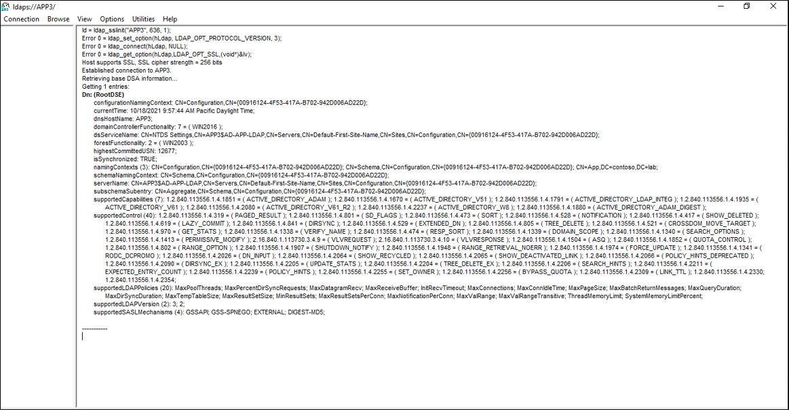
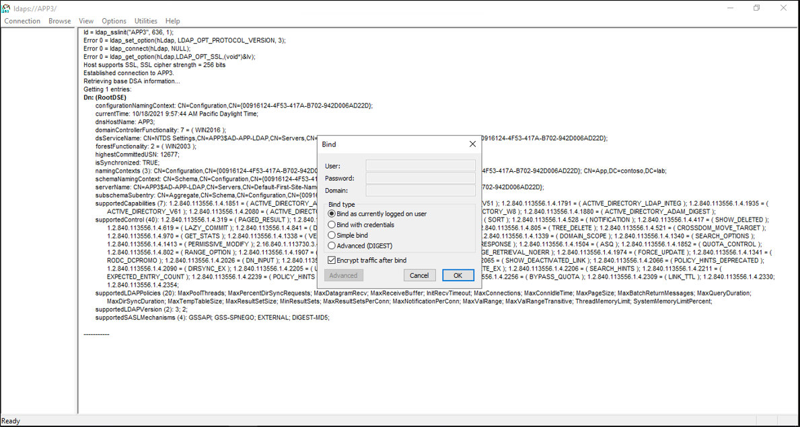
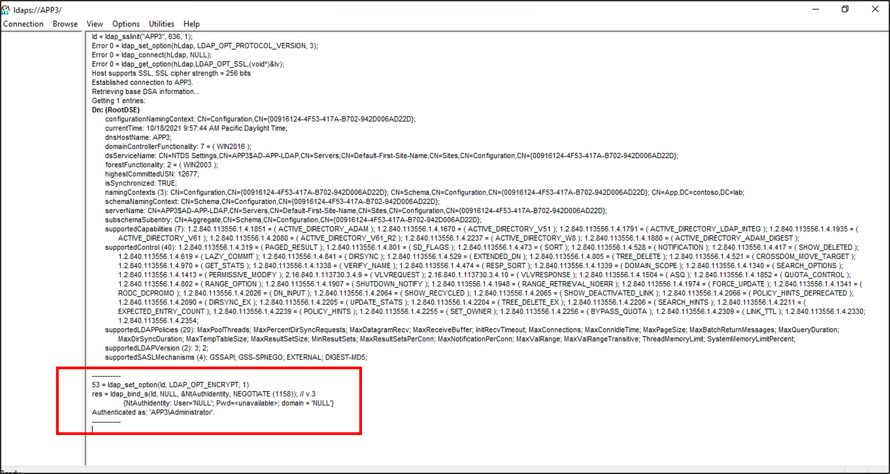

This document describes the steps you need to perform to automatically provision and deprovision users from Azure Active Directory (Azure AD) into an LDAP directory. The document includes a sample for how you can provision users into AD LDS, but you can provision into any of the supported LDAP directories mentioned below. Provisioning users into Active Directory Domain Services through this solution is not supported.
 
For important details on what this service does, how it works, and frequently asked questions, see [Automate user provisioning and deprovisioning to SaaS applications with Azure Active Directory](../articles/active-directory/app-provisioning/user-provisioning.md) and [on-premises application provisioning architecture](../articles/active-directory/app-provisioning/on-premises-application-provisioning-architecture.md). The following video provides an overview of on-premises provisioning.


> [!VIDEO https://www.youtube.com/embed/QdfdpaFolys]

## Prerequisites for provisioning users into an LDAP directory

### On-premises prerequisites

 - A target directory, such as Active Directory Lightweight Services (AD LDS), in which users can be created, updated, and deleted. This directory instance should not be a directory that is also used to provision users into Azure AD, because having both scenarios may create a loop with Azure AD Connect.
 - A computer with at least 3 GB of RAM, to host a provisioning agent. The computer should have Windows Server 2016 or a later version of Windows Server, with connectivity to the target directory, and with outbound connectivity to login.microsoftonline.com, [other Microsoft Online Services](/microsoft-365/enterprise/urls-and-ip-address-ranges?view=o365-worldwide) and [Azure](../articles/azure-portal/azure-portal-safelist-urls.md?tabs=public-cloud) domains. An example is a Windows Server 2016 virtual machine hosted in Azure IaaS or behind a proxy.
 - The .NET Framework 4.7.2 needs to be installed.
 - Optional:  Although it is not required, it is recommended to download [Microsoft Edge for Windows Server](https://www.microsoft.com/en-us/edge?r=1) and use it in-place of Internet Explorer.

Depending on the options you select, some of the wizard screens might not be available and the information might be slightly different. For purposes of this configuration, the user object type is used. Use the following information to guide you in your configuration. 

#### Supported LDAP directory server

The Connector relies upon various techniques to detect and identify the LDAP server. The Connector uses the Root DSE, vendor name/version, and it inspects the schema to find unique objects and attributes known to exist in certain LDAP servers.

* OpenLDAP
* Microsoft Active Directory Lightweight Directory Services
* 389 Directory Server
* Apache Directory Server
* IBM Tivoli DS
* Isode Directory
* NetIQ eDirectory
* Novell eDirectory
* Open DJ
* Open DS
* Oracle (previously Sun ONE) Directory Server Enterprise Edition
* RadiantOne Virtual Directory Server (VDS)

For more information, see the [Generic LDAP Connector reference](/microsoft-identity-manager/reference/microsoft-identity-manager-2016-connector-genericldap).

### Cloud requirements

 - An Azure AD tenant with Azure AD Premium P1 or Premium P2 (or EMS E3 or E5). 
 
    [!INCLUDE [active-directory-p1-license.md](active-directory-p1-license.md)]
 - The Hybrid Identity Administrator role for configuring the provisioning agent and the Application Administrator or Cloud Application Administrator roles for configuring provisioning in the Azure portal.

### More recommendations and limitations
The following bullet points are more recommendations and limitations.
- It is not recommended to use the same agent for cloud sync and on-premises app provisioning.  Microsoft recommends using a separate agent for cloud sync and one for on-premises app provisioning.
- For AD LDS currently, users cannot be provisioned with passwords.  So you will need to either disable the password policy for AD LDS or provision the users in disabled state.
- Provisioning users from Azure Active Directory to Active Directory Domains Services is not supported.
- Provisioning users from LDAP to Azure AD is not supported.

## Prepare the LDAP directory

If you do not already have a directory server, the following information is provided to help create a test AD LDS environment.  This setup uses PowerShell and the ADAMInstall.exe with an answers file.  This document does not cover in-depth information on AD LDS.  For more information, see [Active Directory Lightweight Directory Services](/previous-versions/windows/it-pro/windows-server-2012-r2-and-2012/hh831593(v=ws.11)).

If you already have AD LDS or another directory server set up in a test environment, you can skip the following sections, for installing and configuring the ECMA connector host.

### Create an SSL certificate, a test directory and install AD LDS.
Use the PowerShell script from [Appendix A](#appendix-a---install-ad-lds-powershell-script).  The script performs the following actions:
  - Creates a self-signed certificate that will be used by the LDAP connector
  - Creates a directory for the feature install log
  - Exports the certificate in the personal store to the directory
  - Imports the certificate to the trusted root of the local machine
  - Installs the AD LDS role on our virtual machine 

On the Windows Server virtual machine where you are using to test the LDAP connector, edit the script to match your computer name, and then run the script using Windows PowerShell with administrative privileges.

### Create an instance of AD LDS
Now that the role has been installed, you need to create an instance of AD LDS.  To create an instance, you can use the answer file provided below.  This file will install the instance quietly without using the UI.

Copy the contents of [Appendix B](#appendix-b---answer-file) in to notepad and save it as **answer.txt** in **"C:\Windows\ADAM"**.

Now open a cmd prompt with administrative privileges and run the following executable:

```
C:\Windows\ADAM> ADAMInstall.exe /answer:answer.txt
```

### Create containers and a service account for AD LDS
The use the PowerShell script from [Appendix C](#appendix-c---populate-ad-lds-powershell-script).  The script performs the following actions:
  - Creates a container for the service account that will be used with the LDAP connector
  - Creates a container for the cloud users.  This container is where users will be provisioned to.
  - Creates the serve account in AD LDS
  - Enables the service account
  - Adds the service account to the AD LDS Administrators role

On the Windows Server virtual machine, you are using to test the LDAP connector run the script using Windows PowerShell with administrative privileges.  

### Grant the NETWORK SERVICE read permissions to the SSL cert
In order to enable SSL to work, you need to grant the NETWORK SERVICE read permissions to our newly created certificate.  To grant permissions, use the following steps.

 1. Navigate to **C:\Program Data\Microsoft\Crypto\Keys**.
 2. Right-click on the system file located here.  It will be a guid.  This container is storing our certificate.
    a. Select properties.
    b. At the top, select the **Security** tab.
    c. Select **Edit**.
    d. Click **Add**.
    e. In the box, enter **Network Service** and select **Check Names**.
    f. Select **NETWORK SERVICE** from the list and click **OK**.
    g. Click **Ok**.
    h. Ensure the Network service account has read and read & execute permissions and click **Apply** and **OK**.

### Verify SSL connectivity with AD LDS
Now that we have configured the certificate and granted the network service account permissions, test the connectivity to verify that it is working.
 1. Open Server Manager and select AD LDS on the left
 2. Right-click your instance of AD LDS and select ldp.exe from the pop-up.
   [](media/active-directory-app-provisioning-ldap/ldp-1.png#lightbox)</br>
 3. At the top of ldp.exe, select **Connection** and **Connect**.
 4. Enter the following information and click **OK**.
    - Server:  APP3
    - Port: 636
    - Place a check in the SSL box
   [</br>
 5.  You should see a response similar to the screenshot below.
   ](media/active-directory-app-provisioning-ldap/ldp-3.png#lightbox)</br>
 6.  At the top, under **Connection** select **Bind**.
 7. Leave the defaults and click **OK**.
   [](media/active-directory-app-provisioning-ldap/ldp-4.png#lightbox)</br>
 8. You should now, successfully bind to the instance.
   [](media/active-directory-app-provisioning-ldap/ldp-5.png#lightbox)</br>

### Disable the local password policy
Currently, the LDAP connector provisions users with a blank password.  This provisioning will not satisfy the local password policy on our server so we are going to disable it for testing purposes.  To disable password complexity, on a non-domain-joined server, use the following steps.

>[!IMPORTANT]
>Because on-going password sync is not a feature of on-premises LDAP provisioning, Microsoft recommends that AD LDS is used specifically with federated applications, when used in conjunction with AD DS, or when updating existing users in an instance of AD LDS.

 1. On the server, click **Start**, **Run**, and then **gpedit.msc**
 2. On the **Local Group Policy editor**, navigate to Computer Configuration > Windows Settings > Security Settings > Account Policies > Password Policy
 3. On the right, double-click **Password must meet complexity requirements** and select **Disabled**.
  [](.\media\active-directory-app-provisioning-ldap\local-1.png#lightbox)</br>
 5. Click **Apply** and **Ok**
 6. Close the Local Group Policy editor
 

## Download, install, and configure the Azure AD Connect Provisioning Agent Package

1. [Download](https://aka.ms/OnPremProvisioningAgent) the provisioning agent and copy it onto the virtual machine or server that has connectivity to your LDAP directory.
     >[!NOTE]
     >Please use different provisioning agents for on-premises application provisioning and Azure AD Connect Cloud Sync / HR-driven provisioning. All three scenarios should not be managed on the same agent. 
 1. Open the provisioning agent installer, agree to the terms of service, and select **next**.
 1. Open the provisioning agent wizard, and select **On-premises provisioning** when prompted for the extension you want to enable.
 1. Provide credentials for an Azure AD administrator when you're prompted to authorize. The Hybrid Identity Administrator or Global Administrator role is required.
 1. Select **Confirm** to confirm the installation was successful.
 1. Sign in to the Azure portal.
 1. Go to **Enterprise applications** > **Add a new application**.
 1. Search for the **On-premises ECMA app** application, and add it to your tenant.
 1. Navigate to the provisioning page of your application.
 1. Select **Get started**.
 1. On the **Provisioning** page, change the mode to **Automatic**.
     </br>
 1. On the **On-Premises Connectivity** section, select the agent that you just deployed and select **Assign Agent(s)**.
 1. Keep this browser window open, as you complete the next step of configuration using the configuration wizard.

 ## Configure the Azure AD ECMA Connector Host certificate
 1. On the Windows Server where the provisioning agent is installed, launch the Microsoft ECMA2Host Configuration Wizard from the start menu.
 2. After the ECMA Connector Host Configuration starts, if this is the first time you have run the wizard, it will ask you to create a certificate. Leave the default port **8585** and select **Generate** to generate a certificate. The autogenerated certificate will be self-signed as part of the trusted root. The SAN matches the host name.
     [](.\media\active-directory-app-provisioning-sql\configure-1.png#lightbox)
 3. Select **Save**.


## Configure a generic LDAP connector


 1. If you have not already done so, launch the Microsoft ECMA2Host Configuration Wizard from the start menu.
 2. Select **New Connector**.
     [](.\media\active-directory-app-provisioning-sql\sql-3.png#lightbox)</br>
 3. On the **Properties** page, fill in the boxes with the values specified in the table that follows the image and select **Next**.
     [](.\media\active-directory-app-provisioning-ldap\create-1.png#lightbox)

     |Property|Value|
     |-----|-----|
     |Name|LDAP|
     |Autosync timer (minutes)|120|
     |Secret Token|Enter your own key here. It should be 12 characters minimum.|
     |Extension DLL|For the generic LDAP connector, select **Microsoft.IAM.Connector.GenericLdap.dll**.|
4. On the **Connectivity** page, you will configure how the ECMA Connector Host will communicate with your directory server. Fill in the boxes with the values specified in the table that follows the image and select **Next**.
     [](.\media\active-directory-app-provisioning-ldap\create-2.png#lightbox)</br>
     
     |Property|Description|
     |-----|-----|
     |Host|The host name where the LDAP server is located. This sample uses `APP3` as the example hostname.|
     |Port|The TCP port number.  For LDAP over SSL, use port 636.  For `Start TLS`, use port 389.|
     |Connection Timeout|180|
     |Binding|SSL|
     |User Name|How the ECMA Connector will authenticate itself to your directory server. In this sample, the example username is `CN=svcAccount,CN=ServiceAccounts,CN=App,DC=contoso,DC=lab`|
     |Password|The password of the user name specified|

     >[!NOTE]
     >If you experience and issue trying to connect, ensure that the service account in AD LDS or your other directory server is enabled.
     
 5. On the **Global** page, select **Next**.
 6. On the **Partitions** page, keep the default and select **Next**.
 7. On the **Run Profiles** page, keep the **Export** checkbox selected. Select the **Full import** checkbox and select **Next**.
     [](.\media\active-directory-app-provisioning-ldap\create-3.png#lightbox)</br>
     
     |Property|Description|
     |-----|-----|
     |Export|Run profile that will export data to your LDAP directory. This run profile is required.|
     |Full import|Run profile that will import all data from LDAP sources specified earlier.|
     |Delta import|Run profile that will import only changes from LDAP since the last full or delta import.|
 12. On the **Export** page, leave the defaults and click **Next**. 
 13. On the **Full Import** page,  leave the defaults and click **Next**. 
 14. On the **Object Types** page, fill in the boxes and select **Next**. 
      - **Target object**: This object is the target object in the LDAP directory.
      - **Anchor**: This values of attribute should be unique for each object in the target directory. The Azure AD provisioning service will query the ECMA connector host by using this attribute after the initial cycle. You must be using agent version 1.1.846.0 or above for ObjectGUID to work as the anchor.
      - **Query Attribute**: This attribute should be the same as the Anchor.
      - **DN**: The distinguishedName of the target object.
     
     |Property|Description|
     |-----|-----|
     |Target object|User|
     |Anchor|ObjectGUID|
     |Query Attribute|objectGUID|
     |DN|-dn-|
     |Autogenerated|unchecked|      
 15. The ECMA host discovers the attributes supported by the target directory. You can choose which of those attributes you want to expose to Azure AD. These attributes can then be configured in the Azure portal for provisioning.On the **Select Attributes** page, add all the attributes in the dropdown list, one at a time.
     [](.\media\active-directory-app-provisioning-ldap\create-5.png#lightbox)</br>
      The **Attribute** dropdown list shows any attribute that was discovered in the target directory and *wasn't* chosen on the previous **Select Attributes** page.  Once all the relevant attributes have been added, select **Next**.
 
 16. On the **Deprovisioning** page, under **Disable flow**, select **Delete**. The attributes selected on the previous page won't be available to select on the Deprovisioning page. Select **Finish**.

## Ensure ECMA2Host service is running
 1. On the server the running the Azure AD ECMA Connector Host, select **Start**.
 2. Enter **run** and enter **services.msc** in the box.
 3. In the **Services** list, ensure that **Microsoft ECMA2Host** is present and running. If not, select **Start**.
     [](.\media\active-directory-app-provisioning-sql\configure-2.png#lightbox)


## Test the application connection
 1. Return to the web browser window where you were configuring the application provisioning.
    >[!NOTE]
    >If the window had timed out, then you will need to re-select the agent.
     1. Sign in to the Azure portal.
     1. Go to **Enterprise applications** and the **On-premises ECMA app** application.
     1. Click on **Provisioning**.
     1. If **Get started** appears, then change the mode to **Automatic**,  on the **On-Premises Connectivity** section, select the agent that you just deployed and select **Assign Agent(s)**, and wait 10 minutes. Otherwise go to **Edit Provisioning**.
 2. Under the **Admin credentials** section, enter the following URL. Replace the `connectorName` portion with the name of the connector on the ECMA host. You can also replace `localhost` with the host name.

    |Property|Value|
    |-----|-----|
    |Tenant URL|https://localhost:8585/ecma2host_connectorName/scim|

 3. Enter the **Secret Token** value that you defined when you created the connector.
     >[!NOTE]
     >If you just assigned the agent to the application, please wait 10 minutes for the registration to complete. The connectivity test won't work until the registration completes. Forcing the agent registration to complete by restarting the provisioning agent on your server can speed up the registration process. Go to your server, search for **services** in the Windows search bar, identify the **Azure AD Connect Provisioning Agent Service**, right-click the service, and restart.
 4. Select **Test Connection**, and wait one minute.
     [](.\media\active-directory-app-provisioning-ldap\test-1.png#lightbox)
 5. After the connection test is successful and indicates that the supplied credentials are authorized to enable provisioning, select **Save**.</br>
     [](.\media\active-directory-app-provisioning-sql\configure-9.png#lightbox)

## Configure attribute mapping
 1. In the Azure AD portal, under **Enterprise applications**, select the **On-premises ECMA app** application, and then select the **Provisioning** page.
 2. Select **Edit provisioning**.
 3. Expand **Mappings** and select **Provision Azure Active Directory Users**.
 4. Select **Add New Mapping**.
 5. Specify the source and target attributes, and add all the mappings in the following table. Change the distinguished names in the second row to match that of the organizational unit or other container in your target directory. If you are not using AD LDS, then omit provisioning the `msDS-UserAccountDisabled` attribute. Learn more about attribute mapping [here](../articles/active-directory/app-provisioning/customize-application-attributes.md#understanding-attribute-mapping-properties).

     |Mapping type|Source attribute|Target attribute|Matching precedence|
     |-----|-----|-----|-----|
     |Direct|userPrincipalName|urn:ietf:params:scim:schemas:extension:ECMA2Host:2.0:User:userPrincipalName|1|
     |Expression|Join("", "CN=", Word([userPrincipalName], 1, "@"), ",CN=CloudUsers,CN=App,DC=Contoso,DC=lab")|urn:ietf:params:scim:schemas:extension:ECMA2Host:2.0:User:-dn-||
     |Direct|isSoftDeleted|urn:ietf:params:scim:schemas:extension:ECMA2Host:2.0:User:msDS-UserAccountDisabled||
     |Direct|displayName|urn:ietf:params:scim:schemas:extension:ECMA2Host:2.0:User:displayName||

 6. Select **Save**.

## Assign users to an application
Now that you have the Azure AD ECMA Connector Host talking with Azure AD, and the attribute mapping configured, you can move on to configuring who's in scope for provisioning. 

>[!IMPORTANT]
>If you were signed in using a Hybrid Identity Administrator role, you need to sign-out and sign-in with an account that has the Application Administrator, Cloud Application Administrator or Global Administrator role, for this section.  The Hybrid Identity Administrator role does not have permissions to assign users to applications.

If there are existing users in the LDAP directory, then you should create application role assignments for those existing users. To learn more about how to create application role assignments in bulk, see [governing an application's existing users in Azure AD](../articles/active-directory/governance/identity-governance-applications-existing-users.md).

Otherwise, if the LDAP directory is empty, then select a test user from Azure AD who will be provisioned to the application.

 1. In the Azure portal, select **Enterprise applications**.
 2. Select the **On-premises ECMA app** application.
 3. On the left, under **Manage**, select **Users and groups**.
 4. Select **Add user/group**.
     [](.\media\active-directory-app-provisioning-sql\app-2.png#lightbox)
5. Under **Users**, select **None Selected**.
     [](.\media\active-directory-app-provisioning-sql\app-3.png#lightbox)
 6. Select users from the right and select the **Select** button.</br>
     [](.\media\active-directory-app-provisioning-sql\app-4.png#lightbox)
 7. Now select **Assign**.
     [](.\media\active-directory-app-provisioning-sql\app-5.png#lightbox)


## Test provisioning
Now that your attributes are mapped and users are assigned, you can test on-demand provisioning with one of your users.
 
 1. In the Azure portal, select **Enterprise applications**.
 2. Select the **On-premises ECMA app** application.
 3. On the left, select **Provisioning**.
 4. Select **Provision on demand**.
 5. Search for one of your test users, and select **Provision**.
 [](.\media\active-directory-app-provisioning-ldap\test-2.png#lightbox)</br>
 6. After several seconds, then the message **Successfully created user in target system** will appear, with a list of the user attributes.

## Start provisioning users
 1. After on-demand provisioning is successful, change back to the provisioning configuration page. Ensure that the scope is set to only assigned users and groups, turn provisioning **On**, and select **Save**.
 
 2. Wait several minutes for provisioning to start. It might take up to 40 minutes. After the provisioning job has been completed, as described in the next section, if you are done testing with this application, you can change the provisioning status to **Off**, and select **Save**. This action stops the provisioning service from running in the future.

## Troubleshooting provisioning errors

If an error is shown, then select **View provisioning logs**.  Look in the log for a row in which the Status is **Failure**, and click on that row.

If the error message is **Failed to create User**, then check the attributes that are shown against the requirements of the directory schema.

For more information, change to the **Troubleshooting & Recommendations** tab.

## Check that users were successfully provisioned
After waiting, check your directory to ensure users are being provisioned.  The following instructions illustrate how to check AD LDS.

 1. Open Server Manager and select AD LDS on the left.
 2. Right-click your instance of AD LDS and select ldp.exe from the pop-up.
   [](media/active-directory-app-provisioning-ldap/ldp-1.png#lightbox)</br>
 3. At the top of ldp.exe, select **Connection** and **Connect**.
 4. Enter the following information and click **OK**.
   - Server:  APP3
   - Port: 636
   - Place a check in the SSL box
   [](media/active-directory-app-provisioning-ldap/ldp-2.png#lightbox)</br>
 5. At the top, under **Connection** select **Bind**.
 6. Leave the defaults and click **OK**.
 7. At the top, select **View** and **Tree**
 8. For the BaseDN enter **CN=App,DC=contoso,DC=lab** and click **OK**.
 9. On the left, expand the DN and click on **CN=CloudUsers,CN=App,DC=contoso,DC=lab**.  You should see your users who were provisioned from Azure AD.
  [](media/active-directory-app-provisioning-ldap/test-3.png#lightbox)</br>

## Appendix A - Install AD LDS PowerShell script
The following PowerShell script can be used to automate the installation of Active Directory Lightweight Directory Services. You'll need to edit the script to match your environment; in particular, change `APP3` to the hostname of your computer.


```powershell
# Filename:    1_SetupADLDS.ps1
# Description: Creates a certificate that will be used for SSL and installs Active Directory Lighetweight Directory Services.
#
# DISCLAIMER:
# Copyright (c) Microsoft Corporation. All rights reserved. This 
# script is made available to you without any express, implied or 
# statutory warranty, not even the implied warranty of 
# merchantability or fitness for a particular purpose, or the 
# warranty of title or non-infringement. The entire risk of the 
# use or the results from the use of this script remains with you.
#
#
#
#
#Declare variables
$DNSName = 'APP3'
$CertLocation = 'cert:\LocalMachine\MY'
$logpath = "c:\" 
$dirname = "test"
$dirtype = "directory"
$featureLogPath = "c:\test\featurelog.txt" 

#Create a new self-signed certificate
New-SelfSignedCertificate -DnsName $DNSName -CertStoreLocation $CertLocation

#Create directory
New-Item -Path $logpath -Name $dirname -ItemType $dirtype

#Export the certifcate from the local machine personal store
Get-ChildItem -Path cert:\LocalMachine\my | Export-Certificate -FilePath c:\test\allcerts.sst -Type SST

#Import the certificate in to the trusted root
Import-Certificate -FilePath "C:\test\allcerts.sst" -CertStoreLocation cert:\LocalMachine\Root


#Install AD LDS
start-job -Name addFeature -ScriptBlock { 
Add-WindowsFeature -Name "ADLDS" -IncludeAllSubFeature -IncludeManagementTools 
 } 
Wait-Job -Name addFeature 
Get-WindowsFeature | Where installed >>$featureLogPath


 ```

## Appendix B - Answer file
This file is used to automate and create an instance of AD LDS.  You will edit this file to match your environment; in particular, change `APP3` to the hostname of your server.

>[!IMPORTANT]
> This script uses the local administrator for the AD LDS service account and has its password hard-coded in the answers.  This action is for **testing only** and should never be used in a production environment.
>
> If you are installing AD LDS on a domain controller and not a member or standalone server, you will need to change the LocalLDAPPortToListenOn and LocalSSLPortToListonOn to something other than the well-known ports for LDAP and LDAP over SSL.  For example, LocalLDAPPortToListenOn=51300 and LocalSSLPortToListenOn=51301.

```
 [ADAMInstall]
 InstallType=Unique
 InstanceName=AD-APP-LDAP
 LocalLDAPPortToListenOn=389
 LocalSSLPortToListenOn=636
 NewApplicationPartitionToCreate=CN=App,DC=contoso,DC=lab
 DataFilesPath=C:\Program Files\Microsoft ADAM\AD-APP-LDAP\data
 LogFilesPath=C:\Program Files\Microsoft ADAM\AD-APP-LDAP\data
 ServiceAccount=APP3\Administrator
 ServicePassword=Pa$$Word1
 AddPermissionsToServiceAccount=Yes
 Administrator=APP3\Administrator
 ImportLDIFFiles="MS-User.LDF"
 SourceUserName=APP3\Administrator
 SourcePassword=Pa$$Word1
 ```
## Appendix C - Populate AD LDS PowerShell script
PowerShell script to populate AD LDS with containers and a service account.


```powershell
# Filename:    2_PopulateADLDS.ps1
# Description: Populates our AD LDS environment with 2 containers and a service account

# DISCLAIMER:
# Copyright (c) Microsoft Corporation. All rights reserved. This 
# script is made available to you without any express, implied or 
# statutory warranty, not even the implied warranty of 
# merchantability or fitness for a particular purpose, or the 
# warranty of title or non-infringement. The entire risk of the 
# use or the results from the use of this script remains with you.
#
#
#
#
# Create service accounts container
New-ADObject -Name "ServiceAccounts" -Type "container" -Path "CN=App,DC=contoso,DC=lab" -Server "APP3:389"
Write-Output "Creating ServiceAccounts container"

# Create cloud users container
New-ADObject -Name "CloudUsers" -Type "container" -Path "CN=App,DC=contoso,DC=lab" -Server "APP3:389"
Write-Output "Creating CloudUsers container"

# Create a new service account
New-ADUser -name "svcAccountLDAP" -accountpassword  (ConvertTo-SecureString -AsPlainText 'Pa$$1Word' -Force) -Displayname "LDAP Service Account" -server 'APP3:389' -path "CN=ServiceAccounts,CN=App,DC=contoso,DC=lab"
Write-Output "Creating service account"

# Enable the new service account
Enable-ADAccount -Identity "CN=svcAccount,CN=ServiceAccounts,CN=App,DC=contoso,DC=lab" -Server "APP3:389"
Write-Output "Enabling service account"

# Add the service account to the Administrators role
Get-ADGroup -Server "APP3:389" -SearchBase "CN=Administrators,CN=Roles,CN=App,DC=contoso,DC=lab" -Filter "name -like 'Administrators'" | Add-ADGroupMember -Members "CN=svcAccount,CN=ServiceAccounts,CN=App,DC=contoso,DC=lab"
Write-Output "Adding service accounnt to Administrators role"


 ```
