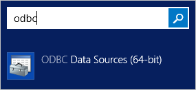
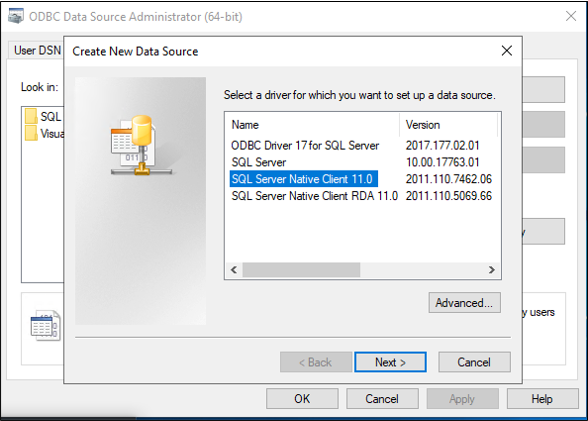
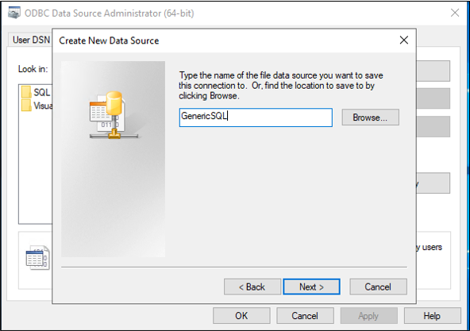
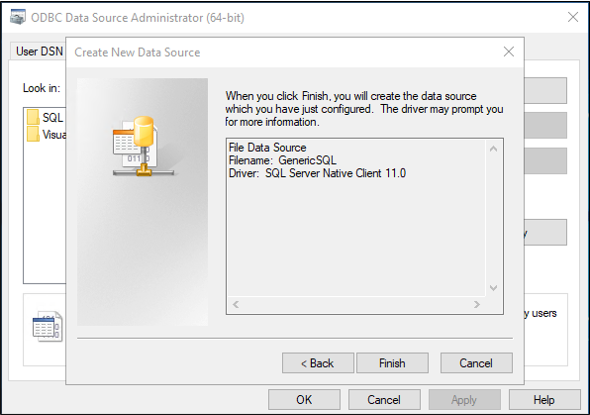
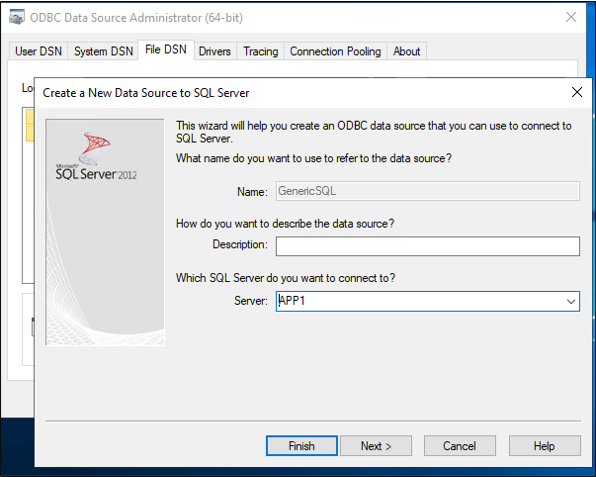
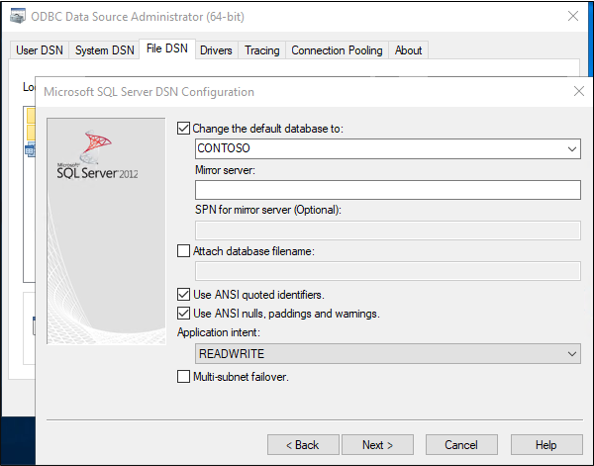
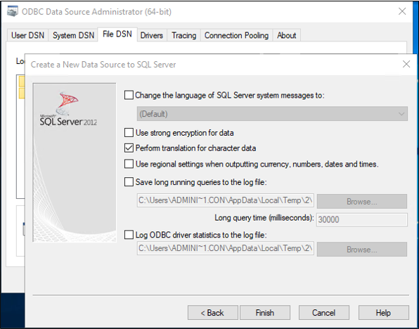
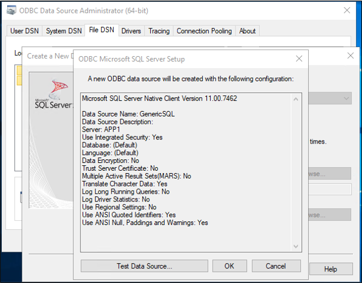

This document describes the steps you need to perform to automatically provision and deprovision users from Azure Active Directory (Azure AD) into a SQL database.  
 
For important details on what this service does, how it works, and frequently asked questions, see [Automate user provisioning and deprovisioning to SaaS applications with Azure Active Directory](../articles/active-directory/app-provisioning/user-provisioning.md) and [on-premises application provisioning architecture](../articles/active-directory/app-provisioning/on-premises-application-provisioning-architecture.md).

>[!IMPORTANT]
>The default verbosity of the logs is set to `Verbose`. If you are using the SQL connector without Windows Integrated Auth, please set the verbosity to `Error` as described [here](../articles/active-directory/app-provisioning/on-premises-ecma-troubleshoot.md#turn-on-verbose-logging).

## Prerequisites for provisioning to a SQL Database

### On-premises prerequisites

 - The application relies upon a SQL database, in which records for users can be created, updated, and deleted.
 - An ODBC driver for that SQL database.
 - A Windows Server 2016 or later computer with an internet-accessible TCP/IP address, connectivity to the target system, and with outbound connectivity to login.microsoftonline.com. An example is a Windows Server 2016 virtual machine hosted in Azure IaaS or behind a proxy. The server should have at least 3 GB of RAM and .NET Framework 4.7.1.

Configuration of the connection to the application's database is done via a wizard. Depending on the options you select, some of the wizard screens might not be available and the information might be slightly different. Use the following information to guide you in your configuration.

#### Supported systems
* Microsoft SQL Server and Azure SQL
* IBM DB2 10.x
* IBM DB2 9.x
* Oracle 10 and 11g
* Oracle 12c and 18c
* MySQL 5.x

Note: The table-based method of the generic SQL connector requires that column names are case-insensitive. MySQL is case-sensitive on Linux and Postgres is case-sensitive across platforms. As a result, they are not currently supported with table-based method and configuring provisioning users into those databases is outside the scope of this article.

### Cloud requirements

 - An Azure AD tenant with Azure AD Premium P1 or Premium P2 (or EMS E3 or E5). 
 
    [!INCLUDE [active-directory-p1-license.md](active-directory-p1-license.md)]
 - The Hybrid identity administrator role for configuring the provisioning agent and the Application Administrator or Cloud Administrator roles for configuring provisioning in the Azure portal.

## Prepare the sample database

In this article, you will configure the Azure AD SQL connector to interact with your application's relational database. Typically, applications manage access with a table in their SQL database, with one row in the table per user. For demonstration purposes, if you do not already have a database with a suitable table, then you should create one which Azure AD can be permitted to use.  If you're using SQL Server, then run the SQL script found in [Appendix A](#appendix-a). This script creates a sample database with the name CONTOSO, containing a single table `Employees`. This is the database table that you'll be provisioning users into.

 |Table Column|Source|
 |-----|-----|
 |ContosoLogin|Azure AD user principal name|
 |FirstName|Azure AD given name|
 |LastName|Azure AD surname|
 |Email|Exchange Online email address|
 |InternalGUID|Generated by the database itself|
 |AzureID|Azure AD object ID|
 |textID|Azure AD mail nickname|

## Determine how the Azure AD SQL Connector will interact with your database

If you have an already existing database for your application, then you will need to determine how Azure AD should interact with that database: direct interaction with tables and views, via stored procedures already present in the database, or via SQL statements you provide for query and updates.  This is because a more complex application might have in its database additional auxiliary tables, require paging for tables with thousands of users, or could require Azure AD to call a stored procedure that performs additional data processing, such as encryption, hashing or validity checks.

When you create the configuration for the connector to interact with an application's database, you will configure first an approach for how the connector host reads the schema of your database, and then configure the approach the connector should use on an ongoing basis, via run profiles. Each run profile specifies how the connector should generate SQL statements.  The choice of run profiles, and the method within a run profile, depends on what your database engine supports and the application requires.

- After configuration, when the provisioning service starts, it will automatically perform the interactions configured in the **Full Import** run profile.  In this run profile, the connector will read in all the records for users from the application's database, typically using a **SELECT** statement.  This run profile is necessary so that later, if Azure AD needs to make a change for a user, Azure AD will know to update an existing record for that user in the database, rather than create a new record for that user.

- Each time changes are made in Azure AD, such as to assign a new user to the application or update an existing user, the provisioning service will perform the SQL database interactions configured **Export** run profile. In the **Export** run profile, Azure AD will issue SQL statements to insert, update and delete records in the database, in order to bring the contents of the database in sync with Azure AD.

- If your database supports it, you can also optionally configure a **Delta Import** run profile. In this run profile, Azure AD will read in changes that were made in the database, other than by Azure AD, since the last full or delta import.  This run profile is optional since it requires the database to be structured to allow changes to be read.

In the configuration of each run profile of the connector, you will specify whether the Azure AD connector should generate its own SQL statements for a table or view, call your stored procedures, or use custom SQL queries you provide.  Typically you will use the same method for all run profiles in a connector.

- If you select the Table or View method for a run profile, then the Azure AD connector will generate the necessary SQL statements, *SELECT*, *INSERT*, *UPDATE* and *DELETE*, to interact with the table or view in the database.  This is the simplest approach, if your database has a single  table or an updatable view with few existing rows.
- If you select the Stored Procedure method, then your database will need to have four stored procedures: read a page of users, add a user, update a user and delete a user, you will configure the Azure AD connector with the names and parameters of those stored procedures to call.  This approach requires more configuration in your SQL database and would typically only be needed if your application requires additional processing for each change to a user, of for paging through large result sets.
- If you select the SQL Query method, then you will type in the specific SQL statements you want the connector to issue during a run profile.  You'll configure the connector with the parameters that the connector should populate in your SQL statements, such as to page through result sets during an import, or to set the attributes of a new user being created during an export.

This article illustrates how to use the table method to interact with the sample database table `Employees`, in the **Export** and **Full Import** run profiles. To learn more about configuring the Stored Procedure or SQL Query methods, see the [Generic SQL configuration guide](/microsoft-identity-manager/reference/microsoft-identity-manager-2016-connector-genericsql) which provides more details and specific requirements.

## Choose the unique identifiers in your application's database schema

Most applications will have a unique identifier for each user of the application.  If you are provisioning into an existing database table, you should identify a column of that table which has a value for each user, where that value is unique and doesn't change.  This will be the **Anchor**, which Azure AD uses to identify existing rows to be able to update or delete them. For additional information on anchors see [About anchor attributes and distinguished names](../articles/active-directory/app-provisioning/on-premises-application-provisioning-architecture.md#about-anchor-attributes-and-distinguished-names).

If your application's database already exists, and has users in it that you will want to have Azure AD keep up to date, then you will need to have a identifier for each user that is the same between the application's database and the Azure AD schema.  For example, if you assign a user to the application in Azure AD, and that user is already in that database, then changes to that user in Azure AD should update an existing row for that user.  Since Azure AD likely does not store an application's internal identifier for that user, you will want to select another column for **querying** the database. The value of this column could be a user principal name, or an email address, employee ID, or other identifier that is present in Azure AD on each user that is in scope of the application.

## Install the ODBC driver

The Windows Server where you'll be installing the provisioning agent requires an ODBC driver for your target database.  If you're planning to connect to SQL Server or Azure SQL database, then you should download the [ODBC driver for SQL Server (x64)](/sql/connect/odbc/download-odbc-driver-for-sql-server) and install that on the Windows Server.

## Create the DSN connection file
The generic SQL connector requires a Data Source Name (DSN) file to connect to the SQL endpoint. First, you need to create a file with the ODBC connection information.

 1. Start the ODBC management utility on your server.  Use the 64-bit version.
     </br>
 2. Select the **File DSN** tab, and select **Add**. 
     </br>
 3. If you're using SQL Server or Azure SQL, select **SQL Server Native Client 11.0** and select **Next**. If you're using another database, select its ODBC driver.
     </br>
 4. Give the file a name, such as **GenericSQL**, and select **Next**. 
     </br>
 5. Select **Finish**. 
     </br>
 6. Now configure the connection. Enter **APP1** for the name of the server and select **Next**.  Note that the following steps will differ depending upon which ODBC driver you're using.  These assume you're using the driver to connect to SQL Server.
     </br>
 7. Keep Windows authentication and select **Next**.
     </br>
 8. Enter the name of the database, which in this sample is **CONTOSO**.
     
 9. Keep everything default on this screen, and select **Finish**.
     </br>
 10. To check everything is working as expected, select **Test Data Source**. 
     </br>
 11. Make sure the test is successful.
     </br>
 12. Select **OK** twice. Close the ODBC Data Source Administrator.


## Download, install and configure the Azure AD Connect Provisioning Agent Package

 1. [Download](https://aka.ms/OnPremProvisioningAgent) the provisioning agent and copy it onto the Windows Server that has connectivity to your SQL server.
     >[!NOTE]
     >Please use different provisioning agents for on-premises application provisioning and Azure AD Connect Cloud Sync / HR-driven provisioning. All three scenarios should not be managed on the same agent. 
 1. Open the provisioning agent installer, agree to the terms of service, and select **next**.
 1. Open the provisioning agent wizard, and select **On-premises provisioning** when prompted for the extension you want to enable.
 1. Provide credentials for an Azure AD administrator when you're prompted to authorize. Hybrid identity administrator or global administrator is required.
 1. Select **Confirm** to confirm the installation was successful.
 1. Sign in to the Azure portal.
 1. Go to **Enterprise applications** > **Add a new application**.
 1. Search for the **On-premises ECMA app** application, and add it to your tenant.
 1. Navigate to the provisioning page of your application.
 1. Select **Get started**.
 1. On the **Provisioning** page, change the mode to **Automatic**.
     </br>
 1. On the **On-Premises Connectivity** section, select the agent that you just deployed and select **Assign Agent(s)**.

  
 ## Configure the Azure AD ECMA Connector Host certificate
 1. Launch the Microsoft ECMA2Host Configuration Wizard from the start menu.
 2. After the ECMA Connector Host Configuration starts, leave the default port **8585** and select **Generate** to generate a certificate. The autogenerated certificate will be self-signed as part of the trusted root. The SAN matches the host name.
     
 3. Select **Save**.

## Create a generic SQL connector

In this section, you'll create the connector configuration for your database.

 1. Select the ECMA Connector Host shortcut on the desktop.
 2. Select **New Connector**.
     </br>
 3. On the **Properties** page, fill in the boxes with the values specified in the table that follows the image and select **Next**.
     

     |Property|Value|
     |-----|-----|
     |Name|SQL|
     |Autosync timer (minutes)|120|
     |Secret Token|Enter your own key here. It should be 12 characters minimum.|
     |Extension DLL|For the generic SQL connector, select **Microsoft.IAM.Connector.GenericSql.dll**.|
4. On the **Connectivity** page, fill in the boxes with the values specified in the table that follows the image and select **Next**.
     </br>
     
     |Property|Description|
     |-----|-----|
     |DSN File|The Data Source Name file you created in the previous step, which is used to connect to the SQL instance.|
     |User Name|The username of an account with rights to make updates to the table in the SQL instance. If the target database is SQL Server, the user name must be in the form of hostname\sqladminaccount for standalone servers or domain\sqladminaccount for domain member servers.|
     |Password|The password of the username just provided.|
     |DN is Anchor|Unless your environment is known to require these settings, don't select the **DN is Anchor** and **Export Type:Object Replace** checkboxes.|

### Retrieve the schema from the database

After having provided credentials, the ECMA Connector Host will be ready to retrieve the schema of your database.

 5. On the **Schema 1** page, you'll specify the list of object types. In this sample, there is a single object type, `User`. Fill in the boxes with the values specified in the table that follows the image and select **Next**.
     </br>

     |Property|Value|
     |-----|-----|
     |Object type detection method|Fixed Value|
     |Fixed value list/Table/View/SP|User|
 6. Once you clicked **Next**, an additional page will automatically appear, for the configuration of the `User` object type. On the **Schema 2** page, you'll indicate how users are represented in your database. In this sample, it's a single SQL table, named `Employees`. Fill in the boxes with the values specified in the table that follows the image and select **Next**.
     </br>
 
     |Property|Value|
     |-----|-----|
     |User:Attribute Detection|Table|
     |User:Table/View/SP|Employees|
 7. Once you clicked **Next**, an additional page will automatically appear, for you to select the columns of the `Employees` table that are to be used as the `Anchor` and `DN` of users.  for On the **Schema 3** page, fill in the boxes with the values specified in the table that follows the image and select **Next**.
     

     |Property|Description|
     |-----|-----|
     |Select Anchor for :User|User:ContosoLogin|
     |Select DN attribute for User|AzureID|
8. Once you clicked **Next**, an additional page will automatically appear, for you to confirm the data type of each of the columns of the `Employee` table, and whether the connector should import or export them. On the **Schema 4** page, leave the defaults and select **Next**.
     </br>
 9. On the **Global** page, fill in the boxes and select **Next**. Use the table that follows the image for guidance on the individual boxes.
     </br>
     
     |Property|Description|
     |-----|-----|
     |Data Source Date Time Format|yyyy-MM-dd HH:mm:ss|
 10. On the **Partitions** page, select **Next**.
     </br>

### Configure the run profiles

Next, you'll configure the **Export** and **Full import** run profiles.  The **Export** run profile will be used when the ECMA Connector host needs to send changes from Azure AD to the database, to insert, update and delete records.  The **Full Import** run profile will be used when the ECMA Connector host service starts, to read in the current content of the database.  In this sample, you'll use the Table method in both run profiles, so that the ECMA Connector Host will generate the necessary SQL statements.

 11. On the **Run Profiles** page, keep the **Export** checkbox selected. Select the **Full import** checkbox and select **Next**.
     </br>
     
     |Property|Description|
     |-----|-----|
     |Export|Run profile that will export data to SQL. This run profile is required.|
     |Full import|Run profile that will import all data from SQL sources specified earlier.|
     |Delta import|Run profile that will import only changes from SQL since the last full or delta import.|
 12. Once you clicked **Next**, an additional page will automatically appear, for you to configure the method for the **Export** run profile. On the **Export** page, fill in the boxes and select **Next**. Use the table that follows the image for guidance on the individual boxes. 
     </br>
     
     |Property|Description|
     |-----|-----|
     |Operation Method|Table|
     |Table/View/SP|Employees|
 13. On the **Full Import** page, fill in the boxes and select **Next**. Use the table that follows the image for guidance on the individual boxes. 
     </br>
     
     |Property|Description|
     |-----|-----|
     |Operation Method|Table|
     |Table/View/SP|Employees|

### Configure how attributes are surfaced in Azure AD

 14. On the **Object Types** page, fill in the boxes and select **Next**. Use the table that follows the image for guidance on the individual boxes.   
      - **Anchor**: This attribute should be unique in the target system. The Azure AD provisioning service will query the ECMA connector host by using this attribute after the initial cycle. This anchor value should be the same as the anchor value you configured earlier on the **Schema 3** page.
      - **Query Attribute**: Used by the ECMA connector host to query the in-memory cache. The values of this attribute should be unique for each user.
      - **DN**: The **Autogenerated** option should be selected in most cases. If it isn't selected, ensure that the DN attribute is mapped to an attribute in Azure AD that stores the DN in this format: CN = anchorValue, Object = objectType.  For additional information on anchors and the DN see [About anchor attributes and distinguished names](../articles/active-directory/app-provisioning/on-premises-application-provisioning-architecture.md#about-anchor-attributes-and-distinguished-names).
     </br>
     
     |Property|Description|
     |-----|-----|
     |Target object|User|
     |Anchor|ContosoLogin|
     |Query Attribute|AzureID|
     |DN|AzureID|
     |Autogenerated|Checked|      
 15. The ECMA connector host discovers the attributes supported by the target system. You can choose which of those attributes you want to expose to Azure AD. These attributes can then be configured in the Azure portal for provisioning.On the **Select Attributes** page, add all the attributes in the dropdown list and select **Next**. 
     </br>
      The **Attribute** dropdown list shows any attribute that was discovered in the target system and *wasn't* chosen on the previous **Select Attributes** page. 
 
 16. On the **Deprovisioning** page, under **Disable flow**, select **Delete**. Please note that attributes selected on the previous page won't be available to select on the Deprovisioning page. Select **Finish**.
     </br>


## Ensure the ECMA2Host service is running
 1. On the server the running the Azure AD ECMA Connector Host, select **Start**.
 2. Enter **run** and enter **services.msc** in the box.
 3. In the **Services** list, ensure that **Microsoft ECMA2Host** is present and running. If not, select **Start**.
     


## Test the application connection
 1. Sign in to the Azure portal.
 2. Go to **Enterprise applications** and the **On-premises ECMA app** application.
 3. Go to **Edit Provisioning**.
 4. Under the **Admin credentials** section, enter the following URL. Replace the `{connectorName}` portion with the name of the connector on the ECMA connector host. You can also replace `localhost` with the host name.

 |Property|Value|
 |-----|-----|
 |Tenant URL|https://localhost:8585/ecma2host_{connectorName}/scim|

 5. Enter the **Secret Token** value that you defined when you created the connector.
     >[!NOTE]
     >If you just assigned the agent to the application, please wait 10 minutes for the registration to complete. The connectivity test won't work until the registration completes. Forcing the agent registration to complete by restarting the provisioning agent on your server can speed up the registration process. Go to your server, search for **services** in the Windows search bar, identify the **Azure AD Connect Provisioning Agent Service**, right-click the service, and restart.
 7. Select **Test Connection**, and wait one minute.
     
 7. After the connection test is successful, select **Save**.</br>
     
## Assign users to an application
Now that you have the Azure AD ECMA Connector Host talking with Azure AD, you can move on to configuring who's in scope for provisioning. 

>[!IMPORTANT]
>If you were signed in using a Hybrid identity administrator role, you need to sign-out and sign-in with an account that has the app administrator or global admininistrator role, for this section.  The Hybrid identity administrator role does not have permissions to assign users to applications.

 1. In the Azure portal, select **Enterprise applications**.
 2. Select the **On-premises provisioning** application.
 3. On the left, under **Manage**, select **Users and groups**.
 4. Select **Add user/group**.
     
5. Under **Users**, select **None Selected**.
     
 6. Select users from the right and select the **Select** button.</br>
     
 7. Now select **Assign**.
     

## Configure attribute mappings
Now you need to map attributes between the representation of the user in Azure AD and the representation of a user in the on-premises application's SQL database.

#### Configure attribute mapping
 1. In the Azure AD portal, under **Enterprise applications**, select the **Provisioning** page.
 2. Select **Get started**.
 3. Expand **Mappings** and select **Provision Azure Active Directory Users**.
     </br>
4. Select **Add New Mapping**.
     </br>
 5. Specify the source and target attributes, and add all the mappings in the following table.
     </br>
     
     |Mapping type|Source attribute|Target attribute|
     |-----|-----|-----|
     |Direct|userPrincipalName|urn:ietf:params:scim:schemas:extension:ECMA2Host:2.0:User:ContosoLogin|
     |Direct|objectID|urn:ietf:params:scim:schemas:extension:ECMA2Host:2.0:User:AzureID|
     |Direct|mail|urn:ietf:params:scim:schemas:extension:ECMA2Host:2.0:User:Email|
     |Direct|givenName|urn:ietf:params:scim:schemas:extension:ECMA2Host:2.0:User:FirstName|
     |Direct|surName|urn:ietf:params:scim:schemas:extension:ECMA2Host:2.0:User:LastName|
     |Direct|mailNickname|urn:ietf:params:scim:schemas:extension:ECMA2Host:2.0:User:textID|
 
 6. Select **Save**.
     
## Test provisioning
Now that your attributes are mapped, you can test on-demand provisioning with one of your users.
 
 1. In the Azure portal, select **Enterprise applications**.
 2. Select the **On-premises provisioning** application.
 3. On the left, select **Provisioning**.
 4. Select **Provision on demand**.
 5. Search for one of your test users, and select **Provision**.
     

## Start provisioning users
 1. After on-demand provisioning is successful, change back to the provisioning configuration page. Ensure that the scope is set to only assigned users and groups, turn provisioning **On**, and select **Save**.
 
    
2. Wait several minutes for provisioning to start. It might take up to 40 minutes. After the provisioning job has been completed, as described in the next section, you can change the provisioning status to **Off**, and select **Save**. This action stops the provisioning service from running in the future.

## Check that users were successfully provisioned
After waiting, check the SQL database to ensure users are being provisioned.

 

## Appendix A
If you're using SQL Server, you can use the following SQL script to create the sample database.

```SQL
---Creating the Database---------
Create Database CONTOSO
Go
-------Using the Database-----------
Use [CONTOSO]
Go
-------------------------------------

/****** Object:  Table [dbo].[Employees]    Script Date: 1/6/2020 7:18:19 PM ******/
SET ANSI_NULLS ON
GO

SET QUOTED_IDENTIFIER ON
GO

CREATE TABLE [dbo].[Employees](
	[ContosoLogin] [nvarchar](128) NULL,
	[FirstName] [nvarchar](50) NOT NULL,
	[LastName] [nvarchar](50) NOT NULL,
	[Email] [nvarchar](128) NULL,
	[InternalGUID] [uniqueidentifier] NULL,
	[AzureID] [uniqueidentifier] NULL,
	[textID] [nvarchar](128) NULL
) ON [PRIMARY]
GO

ALTER TABLE [dbo].[Employees] ADD  CONSTRAINT [DF_Employees_InternalGUID]  DEFAULT (newid()) FOR [InternalGUID]
GO

```