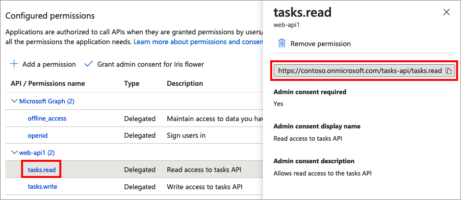

To grant your app (**App ID: 1**) permissions, follow these steps: 

1. Select **App registrations**, and then select the app that you created (**App ID: 1**).
1. Under **Manage**, select **API permissions**.
1. Under **Configured permissions**, select **Add a permission**.
1. Select the **My APIs** tab.
1. Select the API (**App ID: 2**) to which the web application should be granted access. For example, enter **my-api1**.
1. Under **Permission**, expand **tasks**, and then select the scopes that you defined earlier (for example, **tasks.read** and **tasks.write**).
1. Select **Add permissions**.
1. Select **Grant admin consent for \<*your tenant name*>**.
1. Select **Yes**.
1. Select **Refresh**, and then verify that **Granted for ...** appears under **Status** for both scopes.
1. From the **Configured permissions** list, select your scope, and then copy the scope full name. 

      