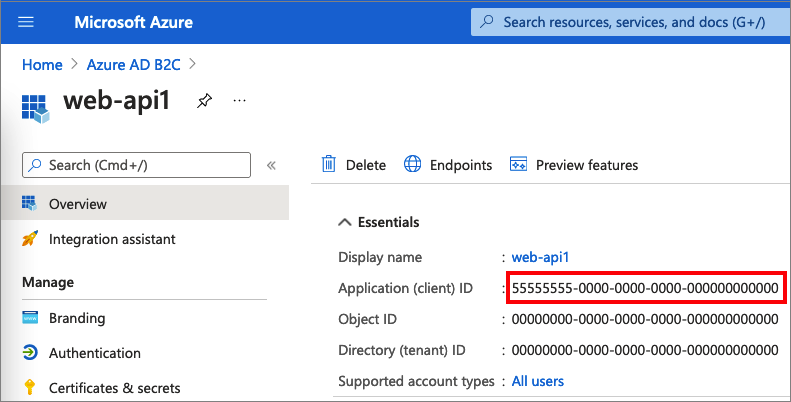

Follow these steps to create the web API app registration:

1. Sign in to the [Azure portal](https://portal.azure.com).
1. Select the **Directory + Subscription** icon in the portal toolbar, and then select the directory that contains your Azure AD B2C tenant.
1. In the Azure portal, search for and select **Azure AD B2C**.
1. Select **App registrations**, and then select **New registration**.
1. Enter a **Name** for the application. For example, *my-api1*. Leave the default values for **Redirect URI**. 
1. Select **Register**.
1. After the app registration is completed, select **Overview**.
1. Record the **Application (client) ID** for use in a later step when you configure the web application.

    