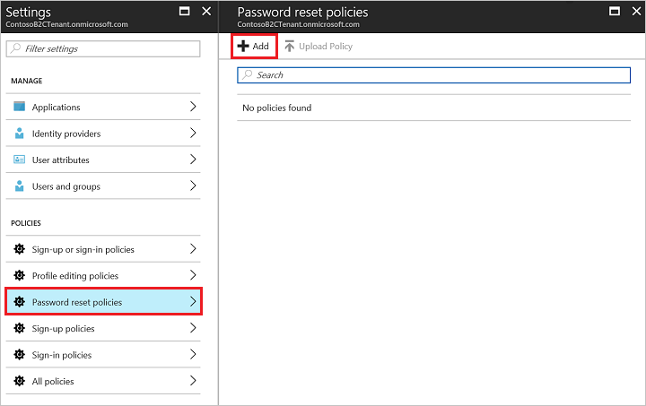
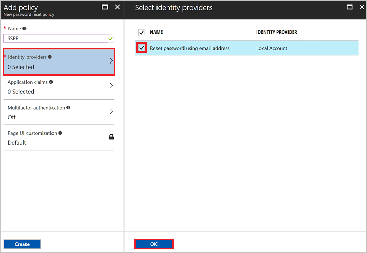
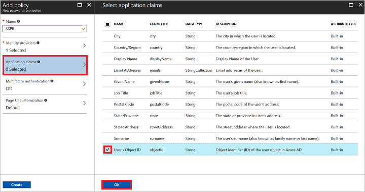
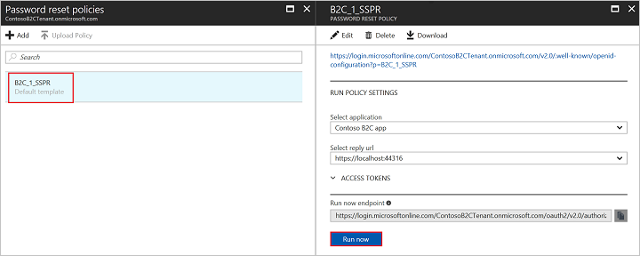

To enable fine-grained password reset on your application, you use a **password reset** policy. Note that the tenant-wide password reset option specified [here](../articles/active-directory-b2c/active-directory-b2c-reference-sspr.md). This policy describes the experiences that the customers will go through during password reset and the contents of tokens that the application will receive on successful completion.

[!INCLUDE [active-directory-b2c-portal-navigate-b2c-service](active-directory-b2c-portal-navigate-b2c-service.md)]

In the policies section of settings, select **Password reset policies** and click **+ Add**.

Enter a policy **Name** for your application to reference. For example, enter `SSPR`.

Select **Identity providers** and check **Reset password using email address**. Click **OK**.

Select **Application claims**. Choose claims you want returned in the authorization tokens sent back to your application after a successful password reset experience. For example, select **User's Object ID**.

Click **Create** to add the policy. The policy is listed as **B2C_1_SSPR**. The **B2C_1_** prefix is appended to the name.

Open the policy by selecting **B2C_1_SSPR**. Verify the settings specified in the table then click **Run now**.

| Setting      | Value  |
| ------------ | ------ |
| **Applications** | Contoso B2C app |
| **Select reply url** | `https://localhost:44316/` |

A new browser tab opens, and you can verify the password reset consumer experience in your application.

> [!NOTE]
> It takes up to a minute for policy creation and updates to take effect.
>
