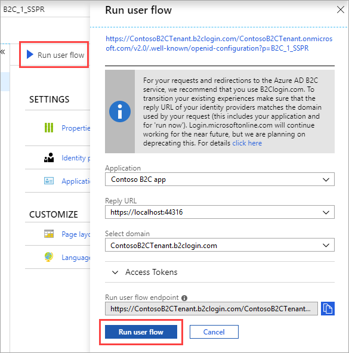

To enable fine-grained password reset on your application, you use a **password reset** user flow. Note that the tenant-wide password reset option is specified [here](../articles/active-directory-b2c/active-directory-b2c-reference-sspr.md). This user flow describes the experiences that the customers will go through during password reset and the contents of tokens that the application will receive on successful completion.

[!INCLUDE [active-directory-b2c-portal-navigate-b2c-service](active-directory-b2c-portal-navigate-b2c-service.md)]

Under **Manage**, select **User flows** and click +**New user flow**.

On the **Recommended** tab, select **Password reset**.

Enter a user flow **Name** for your application to reference. For example, enter `SSPR`.

Under **Identity providers**, check **Reset password using email address**.

Under **Application claims**, click **Show more** and choose claims you want returned in the authorization tokens sent back to your application after a successful password reset experience. For example, select **User's Object ID**.

Click **OK**.

Click **Create** to add the user flow. The user flow is listed as **B2C_1_SSPR**. The **B2C_1_** prefix is appended to the name.

Click **Run user flow**. Verify the settings specified in the table then click **Run user flow**.

| Setting      | Value  |
| ------------ | ------ |
| **Application** | Contoso B2C app |
| **Select reply url** | `https://localhost:44316/` |

A new browser tab opens, and you can verify the password reset consumer experience in your application.

> [!NOTE]
> It takes up to a minute for policy creation and updates to take effect.
>
