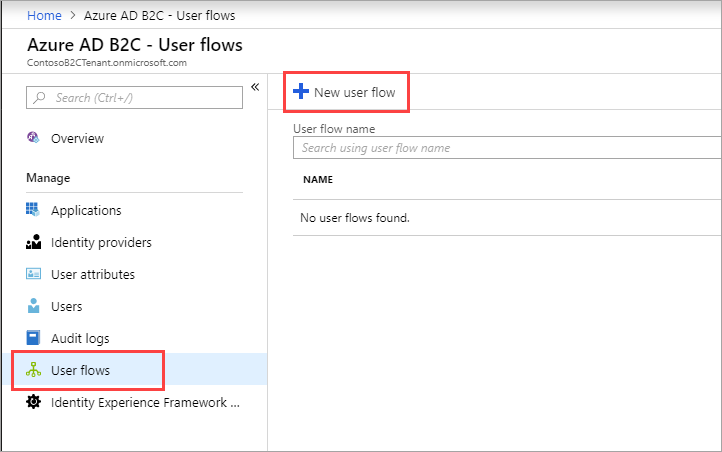
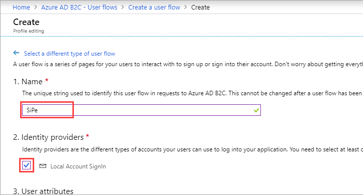
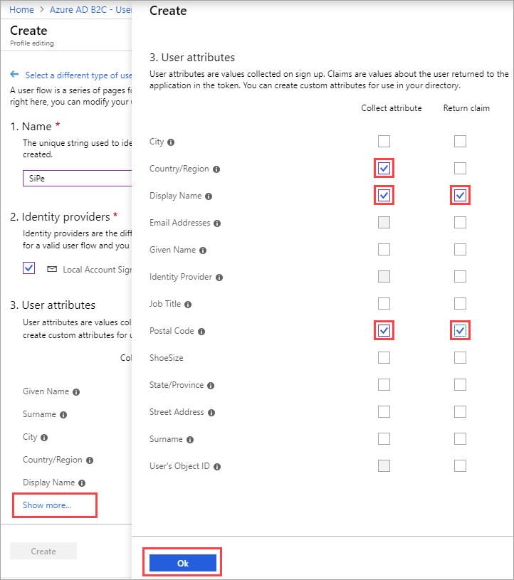
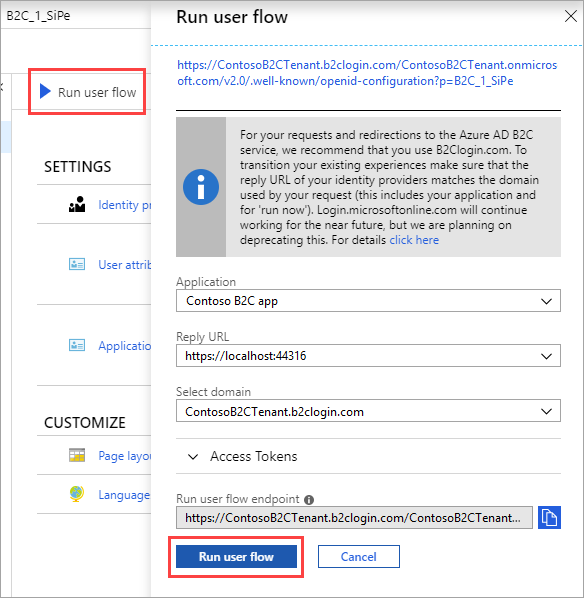

If you want to enable profile editing on your application, you use a **profile editing** user flow. This user flow describes the experiences that customers will go through during profile editing and the contents of tokens that the application will receive on successful completion.

[!INCLUDE [active-directory-b2c-portal-navigate-b2c-service](active-directory-b2c-portal-navigate-b2c-service.md)]

Under **Manage**, select **User flows** and click +**New user flow**.

On the **Recommended** tab, select **Profile editing**.

Enter a user flow **Name** for your application to reference. For example, enter `SiPe`.

Under **Identity providers**, check **Local Account Signin**. Optionally, you can also select social identity providers, if already configured.

Under **User attributes**, click **Show more**. In the **Collect attribute** column, choose attributes the consumer can view and edit in their profile. For example, check **Country/Region**, **Display Name**, and **Postal Code**.

In the **Return claim** column, choose claims you want returned in the authorization tokens sent back to your application after a successful profile editing experience. For example, select **Display Name**, **Postal Code**.

Click **OK**.

Click **Create** to add the user flow. The user flow is listed as **B2C_1_SiPe**. The **B2C_1_** prefix is appended to the name.

Select **Run user flow**. Verify the settings specified in the table then click **Run user flow**.

| Setting      | Value  |
| ------------ | ------ |
| **Application** | Contoso B2C app |
| **Reply URL** | `https://localhost:44316/` |

A new browser tab opens, and you can verify the profile editing consumer experience as configured.

> [!NOTE]
> It takes up to a minute for user flow creation and updates to take effect.
>