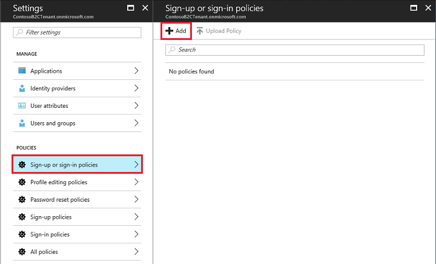
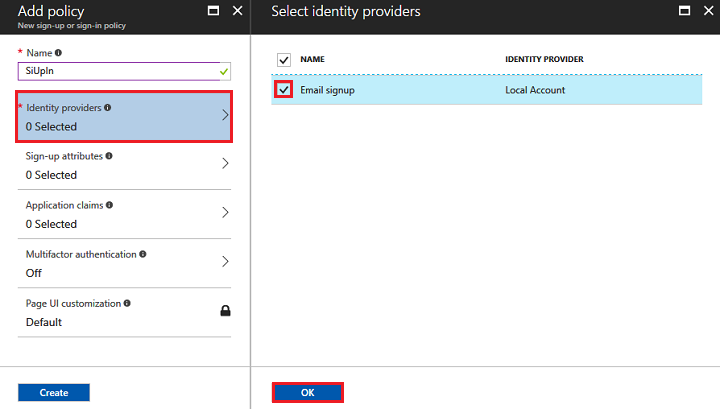
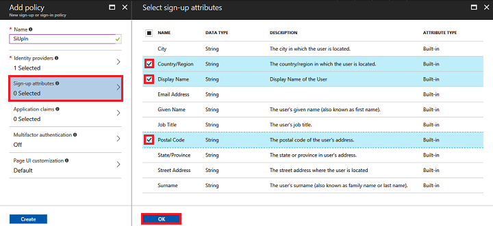
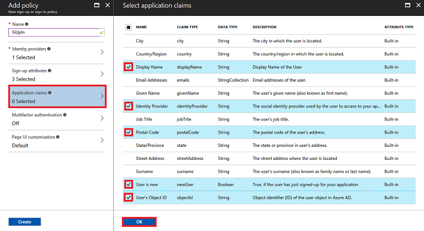
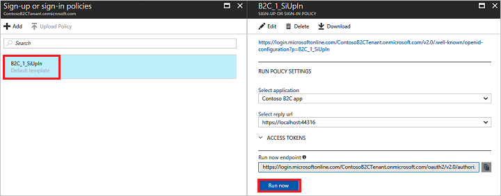

To enable sign-in on your application, you will need to create a sign-in policy. This policy describes the experiences that consumers will go through during sign-in and the contents of tokens that the application will receive on successful sign-ins.

[!INCLUDE [active-directory-b2c-portal-navigate-b2c-service](active-directory-b2c-portal-navigate-b2c-service.md)]

In the policies section of settings, select **Sign-up or sign-in policies** and click **+ Add**.

Enter a policy **Name** for your application to reference. For example, enter `SiUpIn`.

Select **Identity providers** and check **Email signup**. Optionally, you can also select social identity providers, if already configured. Click **OK**.

Select **Sign-up attributes**. Choose attributes you want to collect from the consumer during sign-up. For example, check **Country/Region**, **Display Name**, and **Postal Code**. Click **OK**.

Select **Application claims**. Choose claims you want returned in the authorization tokens sent back to your application after a successful sign-up or sign-in experience. For example, select **Display Name**, **Identity Provider**, **Postal Code**, **User is new** and **User's Object ID**.

Click **Create** to add the policy. The policy is listed as **B2C_1_SiUpIn**. The **B2C_1_** prefix is appended to the name.

Open the policy by selecting **B2C_1_SiUpIn**. Verify the settings specified in the table then click **Run now**.

| Setting      | Value  |
| ------------ | ------ |
| **Applications** | Contoso B2C app |
| **Select reply url** | `https://localhost:44316/` |

A new browser tab opens, and you can verify the sign-up or sign-in consumer experience as configured.

> [!NOTE]
> It takes up to a minute for policy creation and updates to take effect.
>