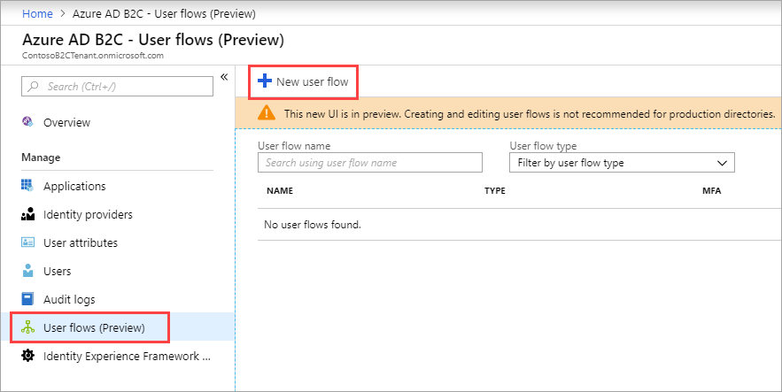
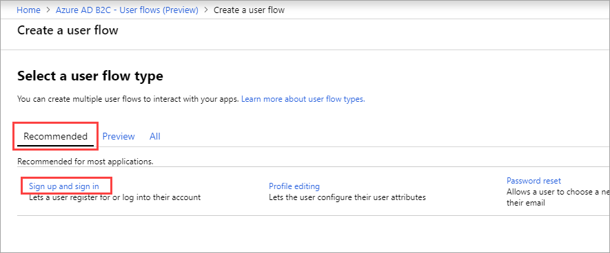
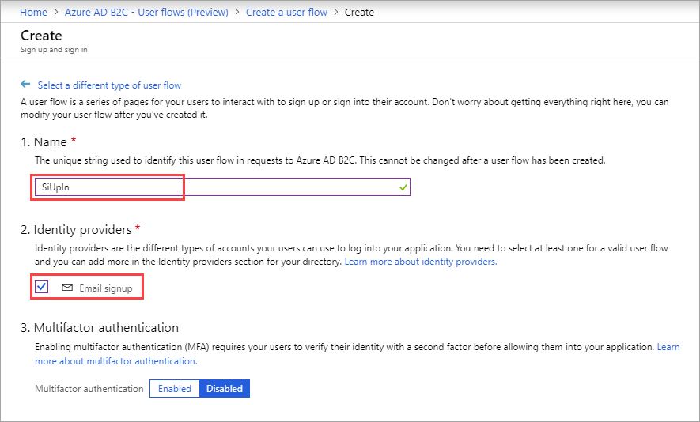
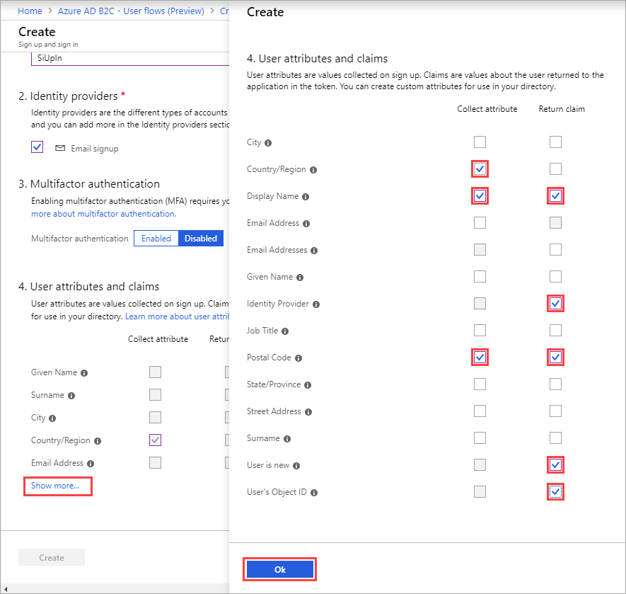
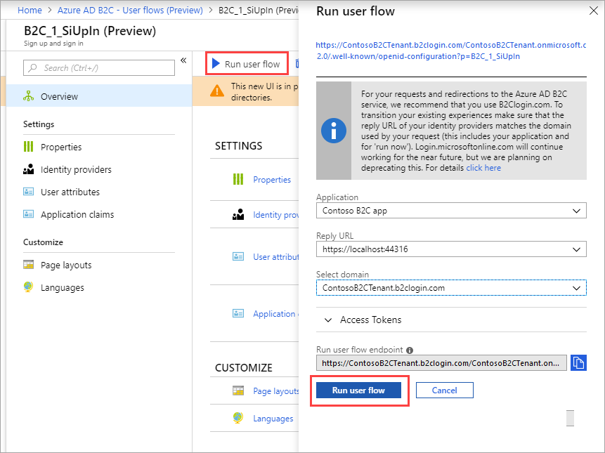

[!INCLUDE [active-directory-b2c-portal-navigate-b2c-service](active-directory-b2c-portal-navigate-b2c-service.md)]

Under **Manage**, select **User flows** and click +**New user flow**.

On the **Recommended** tab, select **Sign up and sign in**.

Enter a user flow **Name** for your application to reference. For example, enter `SiUpIn`.

Under **Identity providers** and check **Email signup**. Optionally, you can also select social identity providers, if already configured.

Under **Multifactor authentication**, choose either **Enabled** or **Disabled**.

Under **User attributes and claims**, select **Show more** to see the full list of attributes and claims you can choose from.

In the **Collect attribute** column, choose the attributes you want to collect from the consumer during sign-up. For example, check **Country/Region**, **Display Name**, and **Postal Code**.

In the **Return claim** column, choose the claims you want returned in the authorization tokens sent back to your application after a successful sign-up or sign-in experience. For example, select **Display Name**, **Identity Provider**, **Postal Code**, **User is new** and **User's Object ID**.

Click **OK**.

Click **Create** to add the user flow. The user flow is listed as **B2C_1_SiUpIn**. The **B2C_1_** prefix is appended to the name.

Select **Run user flow**. Verify the settings specified in the table then click **Run user flow**.

| Setting      | Value  |
| ------------ | ------ |
| **Application** | Contoso B2C app |
| **Reply URL** | `https://localhost:44316/` |

A new browser tab opens, and you can verify the sign-up or sign-in consumer experience as configured.

> [!NOTE]
> It takes up to a minute for user flow creation and updates to take effect.
>