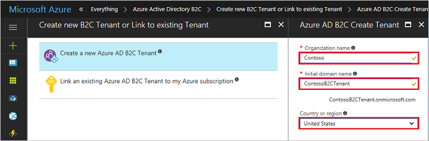

Click the **New** button. In the **Search the marketplace** field, enter `Azure Active Directory B2C`.

In the results list, select **Azure Active Directory B2C**.

Details about Azure Active Directory B2C are shown. To begin configuring your new Azure Active Directory B2C tenant, click the **Create** button.

Select **Create a new Azure AD B2C Tenant**. Then, use the settings specified in the table.

| Setting      | Sample value  | Description                                        |
| ------------ | ------- | -------------------------------------------------- |
| **Organization name** | Contoso | Name of the organization. | 
| **Initial domain name** |  ContosoB2CTenant | Domain name for the B2C tenant. By default, the initial domain name will include .microsoft.com. You can add a domain name your organization uses later. You cannot create a tenant with the same name as a previously deleted tenant. If this is a test tenant, choose a non-production name such as ContosoB2CTesting. |
| **Country or region** | United States | Choose the country or region for the directory. The directory will be created in this location and cannot be changed later.  |

Click the **Create** button to create your tenant. Creating the tenant may take a few minutes. You are alerted in your notifications when it is complete.