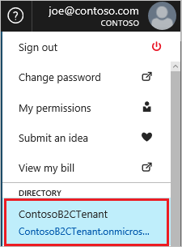
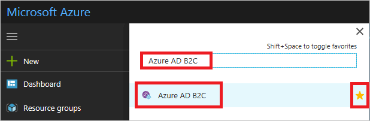

To switch to your Azure AD B2C tenant, select the B2C directory in the top-right corner of the portal.

[!INCLUDE [active-directory-b2c-portal-navigate-b2c-service](active-directory-b2c-portal-navigate-b2c-service.md)]

If Azure AD B2C isn't in the services list, expand **More services** below the navigation bar in the bottom-left side of the portal. Search for **Azure AD B2C** and select **Azure AD B2C** in the result list. You can also select the star icon to add Azure AD B2C it your favorite services list.

