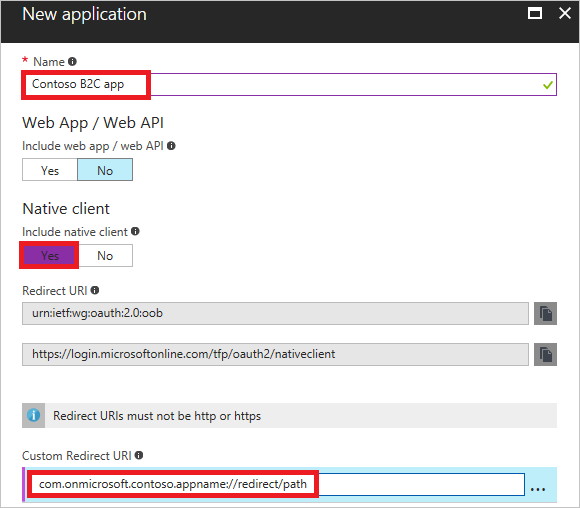
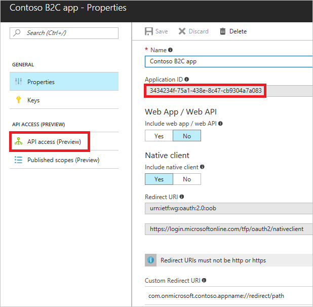

[!INCLUDE [active-directory-b2c-portal-add-application](active-directory-b2c-portal-add-application.md)]

To register your mobile or native application, use the settings specified in the table.

| Setting      | Sample value  | Description                                        |
| ------------ | ------- | -------------------------------------------------- |
| **Name** | Contoso B2C app | Enter a **Name** for the application that describes your application to consumers. |
| **Native client** | Yes | Select **Yes** for a mobile or native application. |
| **Custom Redirect URI** | `com.onmicrosoft.contoso.appname://redirect/path` | Enter a redirect URI with a custom scheme. Make sure you choose a [good redirect URI](../articles/active-directory-b2c/active-directory-b2c-app-registration.md#choosing-a-native-application-redirect-uri) and do not include special characters such as underscores. |

Click **Create** to register your application.

Your newly registered application is displayed in the applications list for the B2C tenant. Select your mobile or native app from the list. The application's property pane is displayed.

Make note of the globally unique **Application Client ID**. You use the ID in your application's code.

If your native application calls a web API secured by Azure AD B2C, perform these steps:
   1. Create an application secret by going to the **Keys** blade and clicking the **Generate Key** button. Make note of the **App key** value. You use the value as the application secret in your application's code.
   2. Click **API Access**, click **Add**, and select your web API and scopes (permissions).

> [!NOTE]
> An **Application Secret** is an important security credential, and should be secured appropriately.
> 
