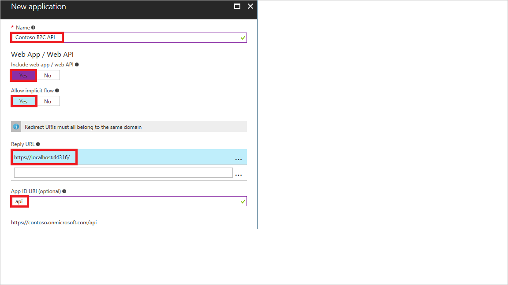
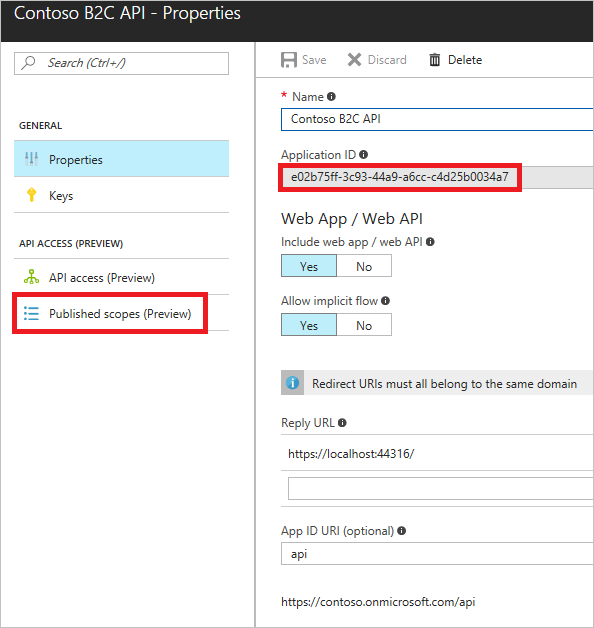

[!INCLUDE [active-directory-b2c-portal-add-application](active-directory-b2c-portal-add-application.md)]

To register your web API, use the settings specified in the table.

| Setting      | Sample value  | Description                                        |
| ------------ | ------- | -------------------------------------------------- |
| **Name** | Contoso B2C API | Enter a **Name** for the application that describes your API to consumers. | 
| **Include web app / web API** | Yes | Select **Yes** for a web API. |
| **Allow implicit flow** | Yes | Select **Yes** if your application uses [OpenID Connect sign-in](../articles/active-directory-b2c/active-directory-b2c-reference-oidc.md) |
| **Reply URL** | `https://localhost:44316/` | Reply URLs are endpoints where Azure AD B2C returns any tokens that your application requests. Enter [a proper](../articles/active-directory-b2c/active-directory-b2c-app-registration.md#choosing-a-web-app-or-api-reply-url) **Reply URL**. In this example, your web API is local and listening on port 44316. |
| **App ID URI** | api | The App ID URI is the identifier used for your web API. The full identifier URI including the domain is generated for you. |

Click **Create** to register your application.

Your newly registered application is displayed in the applications list for the B2C tenant. Select your web API from the list. The API's property pane is displayed.

Make note of the globally unique **Application Client ID**. You use the ID in your application's code.