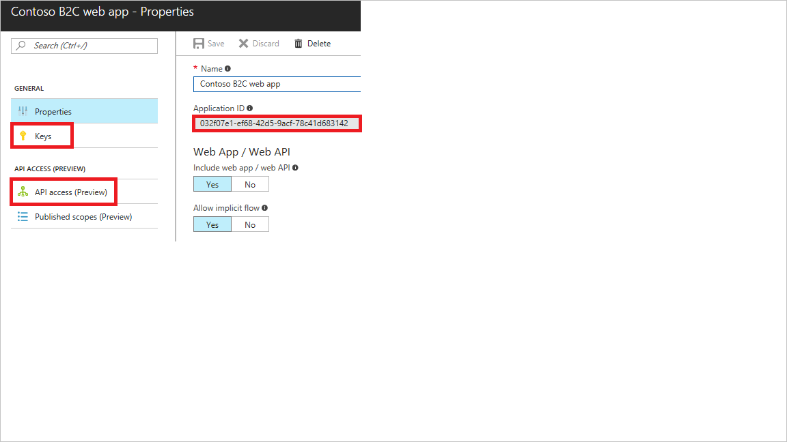

[!INCLUDE [active-directory-b2c-portal-add-application](active-directory-b2c-portal-add-application.md)]

To register your web application, use the settings specified in the table.

| Setting      | Sample value  | Description                                        |
| ------------ | ------- | -------------------------------------------------- |
| **Name** | Contoso B2C web app | Enter a **Name** for the application that describes your application to consumers. | 
| **Include web app / web API** | Yes | Select **Yes** for a web application. |
| **Allow implicit flow** | Yes | Select **Yes** if your application uses [OpenID Connect sign-in](../articles/active-directory-b2c/active-directory-b2c-reference-oidc.md) |
| **Reply URL** | `https://contoso.com/b2capp` | Reply URLs are endpoints where Azure AD B2C returns any tokens that your application requests. |

Click **Create** to register your application.

Your newly registered application is displayed in the applications list for the B2C tenant. Select your web app from the list. The web application's property pane is displayed.

Make note of the globally unique **Application Client ID**. You use the ID in your application's code.

If your web application calls a web API secured by Azure AD B2C, perform these steps:
   1. Create an application secret by going to the **Keys** blade and clicking the **Generate Key** button. Make note of the **App key** value. You use the value as the application secret in your application's code.
   2. Click **API Access**, click **Add**, and select your web API and scopes (permissions).

> [!NOTE]
> An **Application Secret** is an important security credential, and should be secured appropriately.
> 