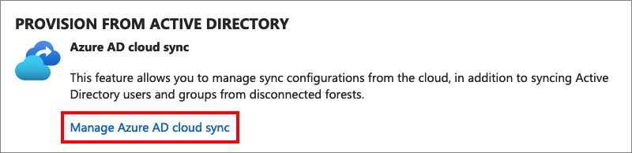
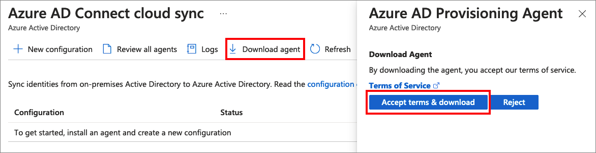
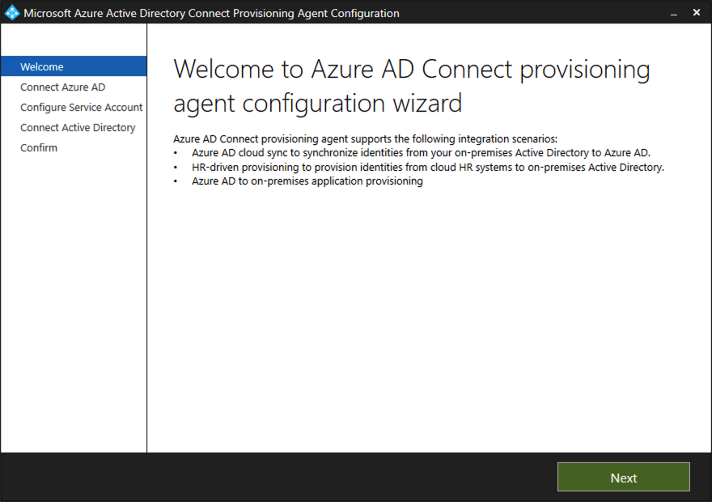
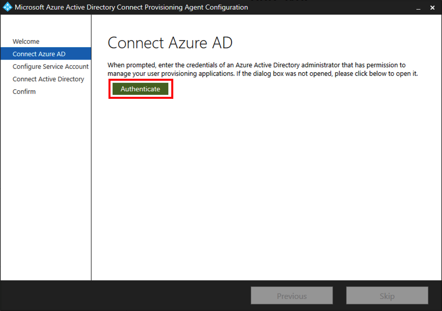
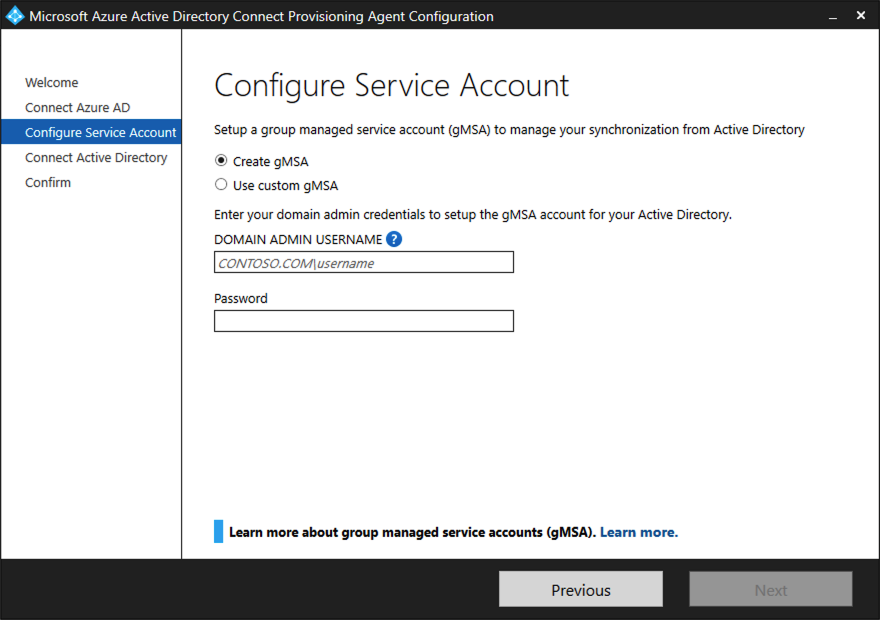
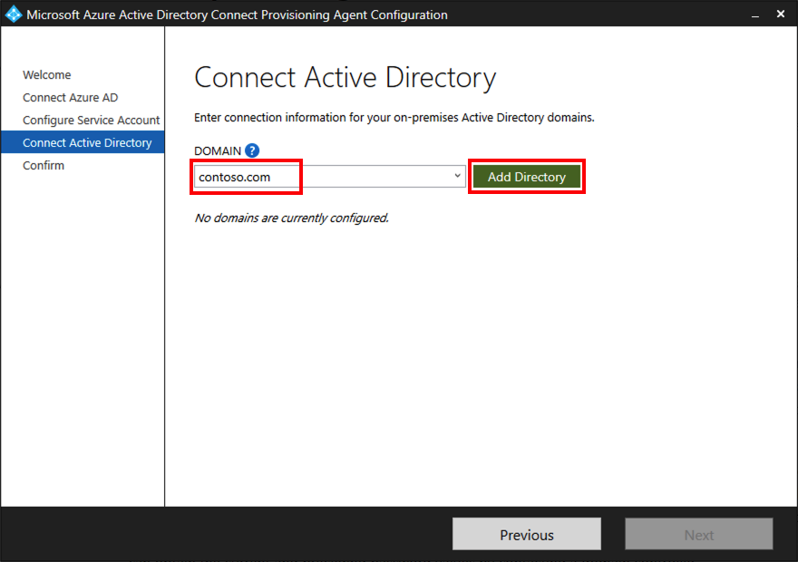
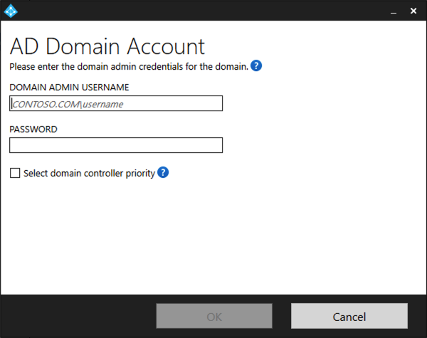
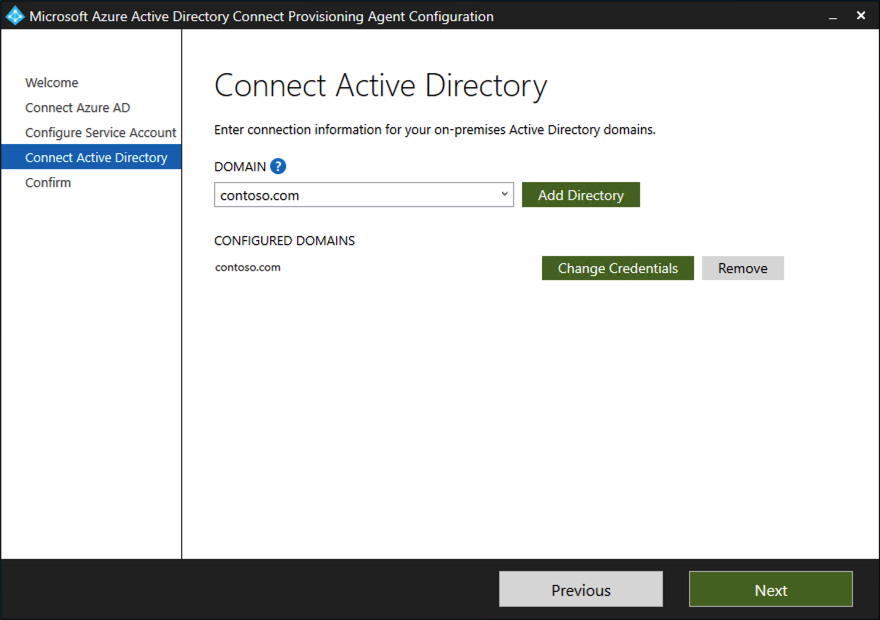

1. Sign in to the domain-joined server with enterprise admin permissions.
1. In a web browser, sign in to the [Azure portal](https://portal.azure.com) by using cloud-only global admin credentials.
1. On the left pane, select **Azure Active Directory**.
1. Select **Azure AD Connect**, and then select **Manage Azure AD cloud sync**.
    
    

1. Select **Download agent**, and then select **Accept terms & download**.

   

1. After the **Azure AD Connect Provisioning Agent Package** download is completed, run the *AADConnectProvisioningAgentSetup.exe* installation file from your *Downloads* folder.

1. On the splash screen, select **I agree to the license and conditions**, and then select **Install**.

    

    After the installation operation is completed, the configuration wizard opens. 
    
1. In the wizard, select **Next** to start the configuration.

    

1. Sign in with your Azure AD global administrator account.  

    If you have Internet Explorer enhanced security enabled, it will block the sign-in.  If the sign-in is blocked, close the installation, [disable Internet Explorer enhanced security](/troubleshoot/developer/browsers/security-privacy/enhanced-security-configuration-faq), and then restart the **Azure AD Connect Provisioning Agent Package**  installation.

   

1. On the **Configure Service Account** page, select a group Managed Service Account (gMSA). This account is used to run the agent service. If a Managed Service Account is already configured in your domain, you can skip this page. If prompted, select either of the following:

    - **Create gMSA** which lets the agent create the *provAgentgMSA$* Managed Service Account for you. The group Managed Service Account (for example, CONTOSO\provAgentgMSA$) will be created in the same Active Directory domain where the host server has joined. To use this option, enter the Active Directory domain administrator credentials. 
    - **Use custom gMSA**, and then provide the name of the Managed Service Account.
    
   

   To continue, select **Next**.

1. On the **Connect Active Directory** page, if your domain name appears under **Configured domains**, skip to the next step. If your domain name doesn't appear, type your Active Directory domain name, and then select **Add directory**.  

    

    Sign in with your Active Directory domain administrator account.  The domain administrator account shouldn't have password change requirements. If the password expires or changes, you'll need to reconfigure the agent with the new credentials. This operation will add your on-premises directory. Select **OK**, and then select **Next** to continue. 

    

    The following screenshot shows an example of a contoso.com configured domain. Select **Next** to continue.

    

1. On the **Configuration complete** page, select **Confirm**.  This operation registers and restarts the agent.

   

1. After this operation is completed, you should be notified that **Your agent configuration was successfully verified**.  Select **Exit**.

    

1. If you still get the initial splash screen, select **Close**.

