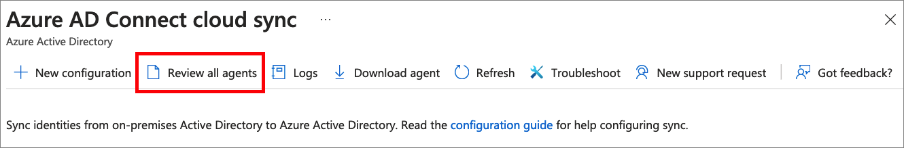
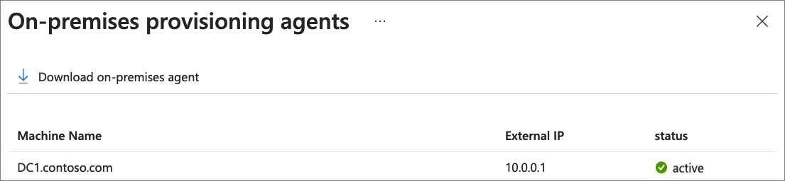

Agent verification occurs in the Azure portal and on the local server that is running the agent.

### Azure portal agent verification

To verify the agent is being registered by Azure AD, follow these steps:

1. Sign in to the [Azure portal](https://portal.azure.com).
1. On the left menu, select **Azure Active Directory**.
1. Select **Azure AD Connect** and then select **Manage Azure AD cloud sync**.

    
    

1. On the **Azure AD Connect cloud sync** screen, select 
**Review all agents**.
    
   
 
1. On the **On-premises provisioning agents screen**, you'll see the agents you've installed.  Verify that the agent in question is there and is marked **active**.

    

### On the local server

To verify that the agent is running, follow these steps:

1. Sign in the server with an administrator account

1. Open **Services** by either navigating to it or by going to Start/Run/Services.msc.

1. Under **Services**, make sure **Microsoft Azure AD Connect Agent Updater** and **Microsoft Azure AD Connect Provisioning Agent** are present and the status is **Running**.

    
