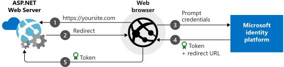

# Add sign-in with Microsoft to an ASP.NET web app

This guide demonstrates how to implement sign-in with Microsoft using an ASP.NET MVC solution with a traditional web browser-based application using OpenID Connect.

At the end of this guide, your application will be able to accept sign-ins of personal accounts, for example outlook.com, live.com, and others. These accounts also include work and school accounts from any company or organization that has integrated with Azure Active Directory.

> This guide requires Visual Studio 2019.  Don’t have it?  [Download Visual Studio 2019 for free](https://www.visualstudio.com/downloads/)

## How the sample app generated by this guide works

The sample application you create is based on the scenario where you use the browser to access an ASP.NET web site that requests a user to authenticate via a sign-in button. In this scenario, most of the work to render the web page occurs on the server side.

## Libraries

This guide uses the following libraries:

|Library|Description|
|---|---|
|[Microsoft.Owin.Security.OpenIdConnect](https://www.nuget.org/packages/Microsoft.Owin.Security.OpenIdConnect/)|Middleware that enables an application to use OpenIdConnect for authentication|
|[Microsoft.Owin.Security.Cookies](https://www.nuget.org/packages/Microsoft.Owin.Security.Cookies)|Middleware that enables an application to maintain user session using cookies|
|[Microsoft.Owin.Host.SystemWeb](https://www.nuget.org/packages/Microsoft.Owin.Host.SystemWeb)|Enables OWIN-based applications to run on IIS using the ASP.NET request pipeline|
