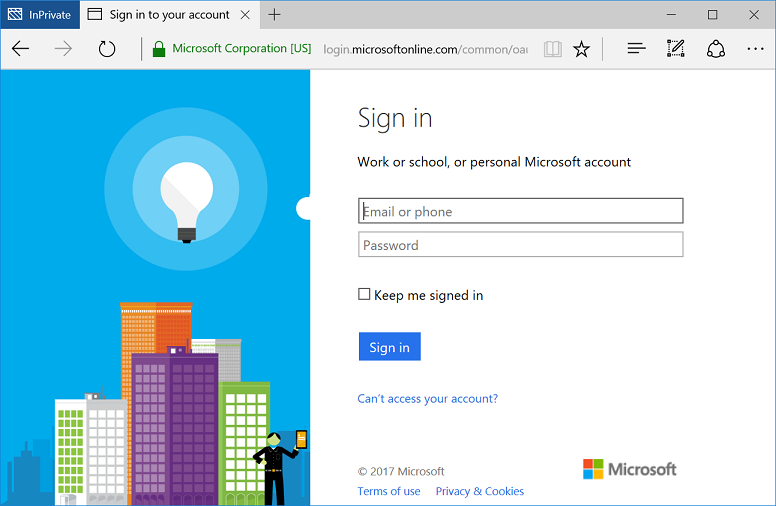

## Test your code

To test your application in Visual Studio, press **F5** to run your project. The browser opens to the http://<span></span>localhost:{port} location and you see the **Sign in with Microsoft** button. Select the button to start the sign-in process.

When you're ready to run your test, use a Microsoft Azure Active Directory (Azure AD) account (work or school account) or a personal Microsoft account (<span>live.</span>com or <span>outlook.</span>com) to sign in.


<br/><br/>


#### View application results
After you sign in, the user is redirected to the home page of your website. The home page is the HTTPS URL that is specified in your application registration information in the Microsoft Application Registration Portal. The home page includes a welcome message "Hello \<User>," a link to sign out, and a link to view the user’s claims. The link for the user's claims browses to the **Authorize** controller that you created earlier.

### Browse to see the user's claims
To see the user's claims, select the link to browse to the controller view that is available only to authenticated users.

#### View the claims results
After you browse to the controller view, you should see a table that contains the basic properties for the user:

|Property |Value |Description |
|---|---|---|
|**Name** |User's full name | The user’s first and last name.
|**Username** |user<span>@domain.com</span> | The username that is used to identify the user.
|**Subject** |Subject |A string that uniquely identifies the user across the web.|
|**Tenant ID** |Guid | A **guid** that uniquely represents the user’s Azure AD organization.|

In addition, you should see a table of all claims that are in the authentication request. For more information, see the [list of claims that are in an Azure AD ID Token](https://docs.microsoft.com/azure/active-directory/develop/active-directory-token-and-claims).


### Test access to a method that has an Authorize attribute (optional)
To test access to the **Authorize** controller for the user's claims as an anonymous user, follow these steps:
1. Select the link to sign out the user and complete the sign-out process.
2. In your browser, type http://<span></span>localhost:{port}/authenticated to access your controller that is protected with the **Authorize** attribute.

#### Expected results after access to a protected controller
You're prompted to authenticate to use the protected controller view.

## Additional information

<!--start-collapse-->
### Protect your entire website
To protect your entire website, in the **Global.asax** file, add the **AuthorizeAttribute** attribute to the **GlobalFilters** filter in the **Application_Start** method:

```csharp
GlobalFilters.Filters.Add(new AuthorizeAttribute());
```
<!--end-collapse-->

### Restrict sign-in access to your application
By default, personal accounts like outlook.com, live.com, and others can sign in to your application. Work or school accounts in organizations that are integrated with Azure AD can also sign in by default.

To restrict user sign-in access for your application, several options are available.

#### Restrict access to a single organization
You can restrict sign-in access for your application to only user accounts that are in a single Azure AD organization:
1. In the **web.config** file, change the value for the **Tenant** parameter. Change the value from **Common** to the tenant name of the organization, such as **contoso.onmicrosoft.com**.
2. In your **OWIN Startup** class, set the **ValidateIssuer** argument to **true**.

#### Restrict access to a list of organizations
You can restrict sign-in access to only user accounts that are in an Azure AD organization that is in the list of allowed organizations:
1. In the **web.config** file, in your **OWIN Startup** class, set the **ValidateIssuer** argument to **true**.
2. Set the value of the **ValidIssuers** parameter to the list of allowed organizations.

#### Use a custom method to validate issuers
You can implement a custom method to validate issuers by using the **IssuerValidator** parameter. For more information about how to use this parameter, read about the [TokenValidationParameters class](https://msdn.microsoft.com/library/system.identitymodel.tokens.tokenvalidationparameters.aspx) on MSDN.

[!INCLUDE [Help and support](./active-directory-develop-help-support-include.md)]
