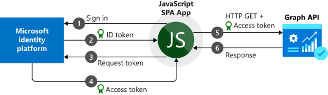

# Sign in users and call the Microsoft Graph API from a JavaScript single-page application (SPA)

This guide demonstrates how a JavaScript single-page application (SPA) can sign in personal, work and school accounts, get an access token, and call the Microsoft Graph API or other APIs that require access tokens from the Microsoft identity platform endpoint.

## How the sample app generated by this guide works

<!--start-collapse-->
### More Information

The sample application created by this guide enables a JavaScript SPA to query the Microsoft Graph API or a Web API that accepts tokens from Microsoft identity platform endpoint. For this scenario, after a user signs in, an access token is requested and added to HTTP requests through the authorization header. Token acquisition and renewal are handled by the Microsoft Authentication Library (MSAL).

<!--end-collapse-->

<!--start-collapse-->
### Libraries

This guide uses the following library:

|Library|Description|
|---|---|
|[msal.js](https://github.com/AzureAD/microsoft-authentication-library-for-js)|Microsoft Authentication Library for JavaScript Preview|

> [!NOTE]
> *msal.js* targets the *Microsoft identity platform endpoint* - which enables personal, school and work accounts to sign in and acquire tokens. The *Microsoft identity platform endpoint* has [some limitations](../articles/active-directory/develop/active-directory-v2-limitations.md).
> To understand differences between the v1.0 and v2.0 endpoints read the [Endpoint comparison guide](../articles/active-directory/develop/azure-ad-endpoint-comparison.md).

<!--end-collapse-->
