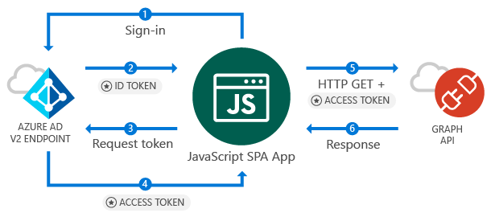

# Call the Microsoft Graph API from a JavaScript Single Page Application (SPA)

This guide demonstrates how a JavaScript Single Page Application (SPA) can sign in personal, work and school accounts, get an access token, and call the Microsoft Graph API or other APIs that require access tokens from the Azure Active Directory v2 endpoint.

### How this guide works

<!--start-collapse-->
### More Information

The sample application created by this guide enables a JavaScript SPA to query the Microsoft Graph API or a Web API that accepts tokens from Azure Active Directory v2 endpoint. For this scenario, after a user signs-in, an access token is requested and added to HTTP requests via the authorization header. Token acquisition and renewal are handled by the Microsoft Authentication Library (MSAL).

<!--end-collapse-->

<!--start-collapse-->
### Libraries

This guide uses the following library:

|Library|Description|
|---|---|
|[msal.js](https://github.com/AzureAD/microsoft-authentication-library-for-js)|Microsoft Authentication Library for JavaScript Preview|

> [!NOTE]
> *msal.js* targets the *Azure Active Directory v2 endpoint* - which enables personal, school and work accounts to sign in and acquire tokens. The *Azure Active Directory v2 endpoint* has [some limitations](..\articles\active-directory\develop\active-directory-v2-limitations.md). If you are interested only in school and work accounts, use *adal.js* and the *V1 endpoint*. 
> To understand differences between the v1 and v2 endpoints read the [v1-v2 comparison](..\articles\active-directory\develop\active-directory-v2-compare.md).

<!--end-collapse-->
