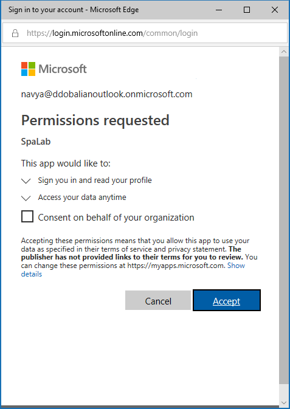
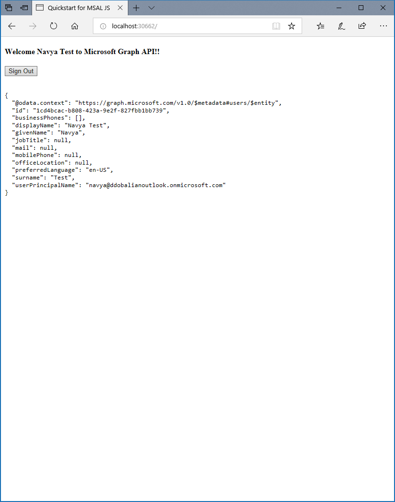

## Test your code

Test your code by using either of the following environments.

### Test with Node.js

If you're not using Visual Studio, make sure your web server is started.

1. Configure the server to listen to a TCP port that's based on the location of your *index.html* file. For Node.js, start the web server to listen to the port by running the following commands on a command-line prompt from the application folder:

    ```bash
    npm install
    node server.js
    ```
1. In your browser, enter **http://\<span>\</span>localhost:30662** or **http://\<span>\</span>localhost:{port}**, where *port* is the port that your web server is listening to. You should see the contents of your *index.html* file and the **Sign In** button.

### Test with Visual Studio

If you're using Visual Studio, select the project solution, and then select F5 to run your project. The browser opens to the http://<span></span>localhost:{port} location, and the **Sign In** button should be visible.

## Test your application

After the browser loads your *index.html* file, select **Sign In**. You're prompted to sign in with the Microsoft identity platform endpoint:


### Provide consent for application access

The first time that you sign in to your application, you're prompted to give it access to your profile and sign you in:



### View application results

After you sign in, your user profile information is returned in the Microsoft Graph API response that's displayed on the page.



<!--start-collapse-->
### More information about scopes and delegated permissions

The Microsoft Graph API requires the *user.read* scope to read a user's profile. This scope is automatically added by default in every application that's registered on the registration portal. Other APIs for Microsoft Graph, as well as custom APIs for your back-end server, might require additional scopes. For example, the Microsoft Graph API requires the *Calendars.Read* scope to list the user’s calendars.

To access the user’s calendars in the context of an application, add the *Calendars.Read* delegated permission to the application registration information. Then, add the *Calendars.Read* scope to the `acquireTokenSilent` call.

>[!NOTE]
>The user might be prompted for additional consents as you increase the number of scopes.

If a back-end API doesn't require a scope (not recommended), you can use the *clientId* as the scope in the calls to acquire tokens.

<!--end-collapse-->

[!INCLUDE [Help and support](./active-directory-develop-help-support-include.md)]
