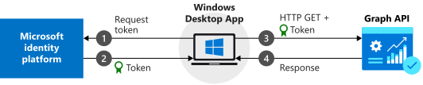

# Call the Microsoft Graph API from a Windows Desktop app

This guide demonstrates how a native Windows Desktop .NET (XAML) application uses an access token to call the Microsoft Graph API. The app can also access other APIs that require access tokens from a  Microsoft identity platform for developers v2.0 endpoint. This platform was formerly named Azure AD.

When you've completed the guide, your application will be able to call a protected API that uses personal accounts (including outlook.com, live.com, and others). The application will also use work and school accounts from any company or organization that uses Azure Active Directory.  

> [!NOTE]
> The guide requires Visual Studio 2015 Update 3, Visual Studio 2017, or Visual Studio 2019. Don’t have any of these versions? [Download Visual Studio 2019 for free](https://www.visualstudio.com/downloads/).

## How the sample app generated by this guide works

The sample application that you create with this guide enables a Windows Desktop application that queries the Microsoft Graph API or a Web API that accepts tokens from a Microsoft identity-platform endpoint. For this scenario, you add a token to HTTP requests via the Authorization header. Microsoft Authentication Library (MSAL) handles token acquisition and renewal.

## Handling token acquisition for accessing protected Web APIs

After the user is authenticated, the sample application receives a token you can use to query Microsoft Graph API or a Web API that's secured by Microsoft identity platform for developers.

APIs such as Microsoft Graph require a token to allow access to specific resources. For example, a token is required to read a user’s profile, access a user’s calendar, or send email. Your application can request an access token by using MSAL to access these resources by specifying API scopes. This access token is then added to the HTTP Authorization header for every call that's made against the protected resource.

MSAL manages caching and refreshing access tokens for you, so that your application doesn't need to.

## NuGet packages

This guide uses the following NuGet packages:

|Library|Description|
|---|---|
|[Microsoft.Identity.Client](https://www.nuget.org/packages/Microsoft.Identity.Client)|Microsoft Authentication Library (MSAL.NET)|
