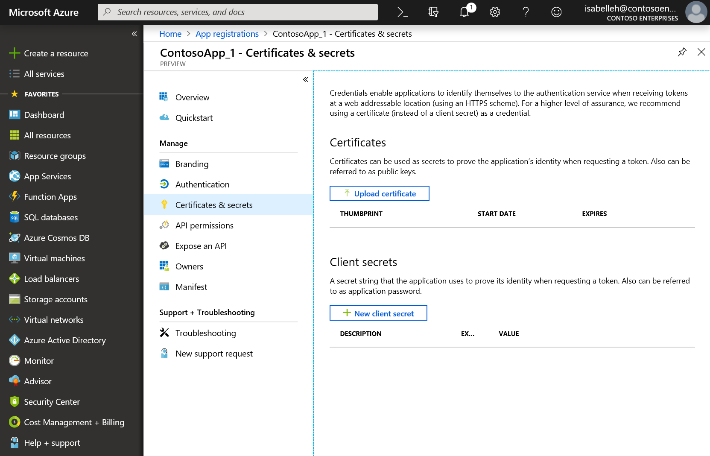

## Register secrets or certificates

As for any confidential client application, you need to register a secret or certificate. You can register your application secrets either through the interactive experience in the [Azure portal](https://portal.azure.com/#blade/Microsoft_AAD_IAM/ActiveDirectoryMenuBlade/RegisteredAppsPreview) or by using command-line tools (like PowerShell).

### Register client secrets by using the application registration portal

The management of client credentials happens on the **Certificates & secrets** page for an application:

- The application secret (also named the client secret) is generated by Azure AD during the registration of the confidential client application. This generation happens when you select **New client secret**. At that point, you must copy the secret string to the clipboard for use in your app, before you select **Save**. This string won't be presented any longer.
- During application registration, you use the **Upload certificate** button to upload the certificate. Azure AD supports only certificates that are directly registered on the application and don't follow certificate chains.

For details, see [Quickstart: Configure a client application to access web APIs | Add credentials to your application](../articles/active-directory/develop/quickstart-configure-app-access-web-apis.md#add-credentials-to-your-web-application).

### Register client secrets by using PowerShell

Alternatively, you can register your application with Azure AD by using command-line tools. The [active-directory-dotnetcore-daemon-v2](https://github.com/Azure-Samples/active-directory-dotnetcore-daemon-v2) sample shows how to register an application secret or certificate with an Azure AD application:

- For details on how to register an application secret, see [AppCreationScripts/Configure.ps1](https://github.com/Azure-Samples/active-directory-dotnetcore-daemon-v2/blob/5199032b352a912e7cc0fce143f81664ba1a8c26/AppCreationScripts/Configure.ps1#L190).
- For details on how to register a certificate with an application, see [AppCreationScripts-withCert/Configure.ps1](https://github.com/Azure-Samples/active-directory-dotnetcore-daemon-v2/blob/5199032b352a912e7cc0fce143f81664ba1a8c26/AppCreationScripts-withCert/Configure.ps1#L162-L178).
