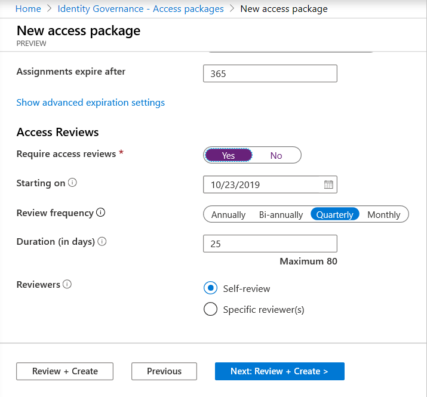
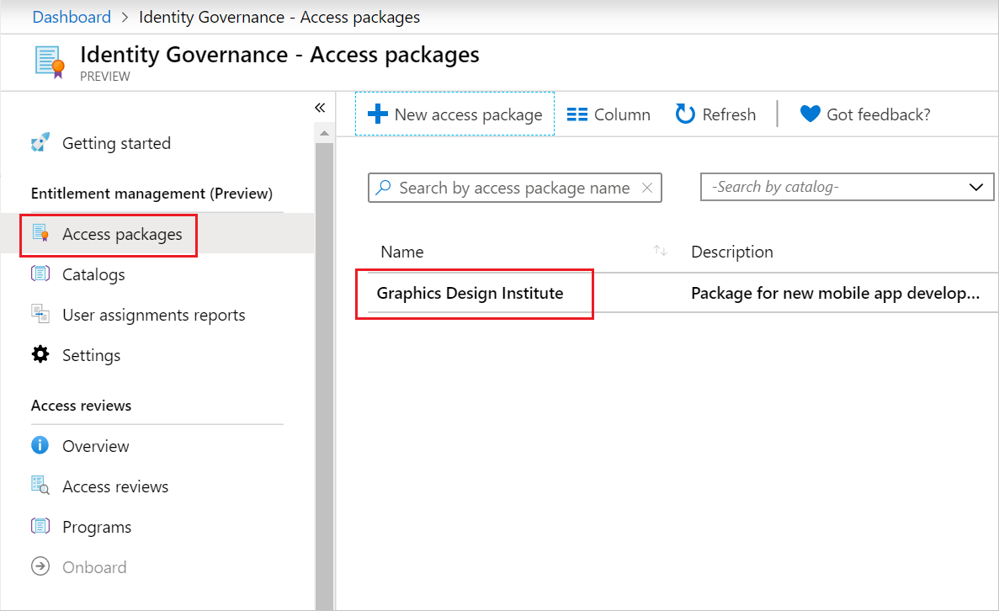
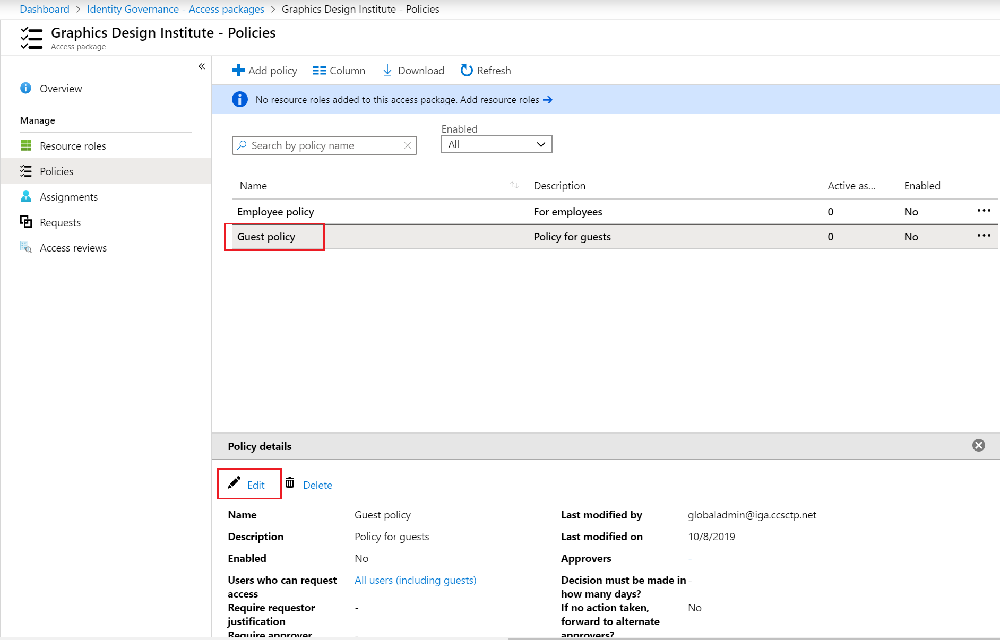

## Enable access reviews in an access package
1. Once you are in the **Lifecycle** section while creating a new policy, scroll down to **Access Reviews**.

1. Move the **Require access reviews** toggle to **Yes**. 

1. Specify the date the reviews will start next to **Starting on**. 

1. Next, set the **Review frequency** to **Annually**, **Bi-annually**, **Quarterly** or **Monthly**. 
This determines how often access reviews will occur.

1. Set the **Duration** to define how many days each review of the recurring series will be open for input from reviewers. For example, you might schedule an Annual review that starts on January 1 and is open for input for 30 days so that reviewers have until the end of the month to respond.

1. Next to **Reviewers**, select **Self-review** if you want users to perform their own access review or select **Specific reviewer(s)** if you want to designate a reviewer.

1. If you selected **Specific reviewer(s)**, specify which users will perform the access review:
    1. Select **Add reviewers**
    1. In the **Select reviewers** pane, search for and select the user(s) you want to be a reviewer.
    1. Once you have selected your reviewer(s), click the **Select** button.

## Enable access reviews in an existing access package

Follow these steps to enable access reviews to an existing access package:

1. Sign in to the Azure portal and open the **Identity Governance Blade**. 

1. In the left menu, click on **Access packages** under **Entitlement Management**. 

1. In the right pane, select the access package for which you would like to create an access review.
 
1. In the left menu, select **Policies**. 

1. Select the policy in which you want to create the access review. 

1. Click **Edit** under **Policy details**. 

1. Click on **Lifecycle**. 

1. Under **Access Reviews**, click **Yes** for Require access reviews. 

1. Set the **Starting on** date. The review will begin at the end of day on this date. For example, if you select the start date as July 15, 2020, the review will begin on July 15 at 11:59PM.

1. Set the **Review frequency** to **Annually**, **Bi-annually** (every 6 months), **Quarterly** (every 3 months), or **Monthly** (once per month).

1. Set the **Duration (in days)** to specify how many days long the access review will be.

1. Set the **Reviewers** to be:

    1. **Self-review** if you want the access package assignees to review their own access, or 
    1. Select **Specific reviewer(s)** if you want to choose one or more specific individuals to be the reviewers

1. Click on **Update** at the bottom of the page.
