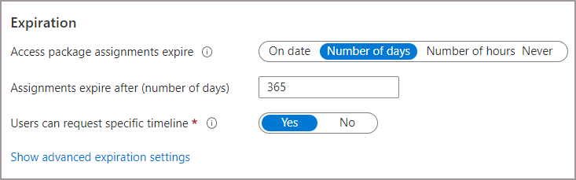

## Specify a lifecycle

On the **Lifecycle** tab, you specify when a user's assignment to the access package expires. You can also specify whether users can extend their assignments.

1. In the **Expiration** section, set **Access package assignments expire** to **On date**, **Number of days**, **Number of hours**, or **Never**.

    - For **On date**, select an expiration date in the future.
    - For **Number of days**, specify a number from 0 to 3660 days.
    - For **Number of hours**, specify how many hours.

    Based on your selection, a user's assignment to the access package expires on a certain date, some days after they're approved, or never.

1. If you want the user to request a specific start and end date for their access, select **Yes** for the **Users can request specific timeline** toggle.

1. Select **Show advanced expiration settings** to show more settings.

    

1. To allow the user to extend their assignments, set **Allow users to extend access** to **Yes**.

    If extensions are allowed in the policy, the user receives an email 14 days before, and then one day before, their access package assignment is set to expire. The email prompts the user to extend the assignment. The user must still be in the scope of the policy at the time that they request an extension.

    Also, if the policy has an explicit end date for assignments, and a user submits a request to extend access, the extension date in the request must be at or before when assignments expire. The policy that you used to grant the user access to the access package defines whether the extension date is at or before the assignment expiration. For example, if the policy indicates that assignments are set to expire on June 30, the maximum extension that a user can request is June 30.

    If a user's access is extended, they won't be able to request the access package after the specified extension date (the date set in the time zone of the user who created the policy).

1. To require approval to grant an extension, set **Require approval to grant extension** to **Yes**.

    This approval will use the same approval settings that you specified on the **Requests** tab.

1. Select **Next** or **Update**.
