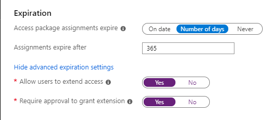

## Lifecycle

On the **Lifecycle** tab, you specify when a user's assignment to the access package expires. You can also specify whether users can extend their assignments.

1. In the **Expiration** section, set **Access package assignments expires** to **On date**, **Number of days**, or **Never**.

    For **On date**, select an expiration date in the future.

    For **Number of days**, specify a number between 0 and 3660 days.

    Based on your selection, a user's assignment to the access package expires on a certain date, a certain number of days after they are approved, or never.

1. Click **Show advanced expiration settings** to show additional settings.

    

1. To allow user to extend their assignments, set **Allow users to extend access** to **Yes**.

    If extensions are allowed in the policy, the user will receive an email 14 days and also 1 day before their access package assignment is set to expire prompting them to extend the assignment. If the user submits a request to extend access, the extension date must be at or before assignments expire as defined in the policy that was used to grant the user access to the access package. For example, if the policy indicates that assignments are set to expire on June 30, the maximum extension a user can request is June 30.

    If a user's access is extended, they will not be able to request the access package after the specified extension date (date set in the time zone of the user who created the policy).

1. To require approval to grant an extension, set **Require approval to grant extension** to **Yes**.

    The same approval settings that were specified on the **Requests** tab will be used.

1. Click **Next** or **Update**.
