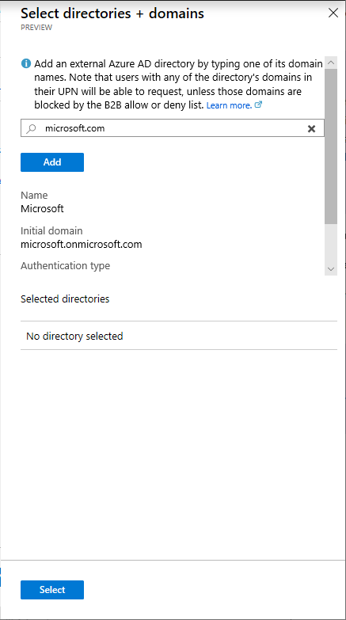
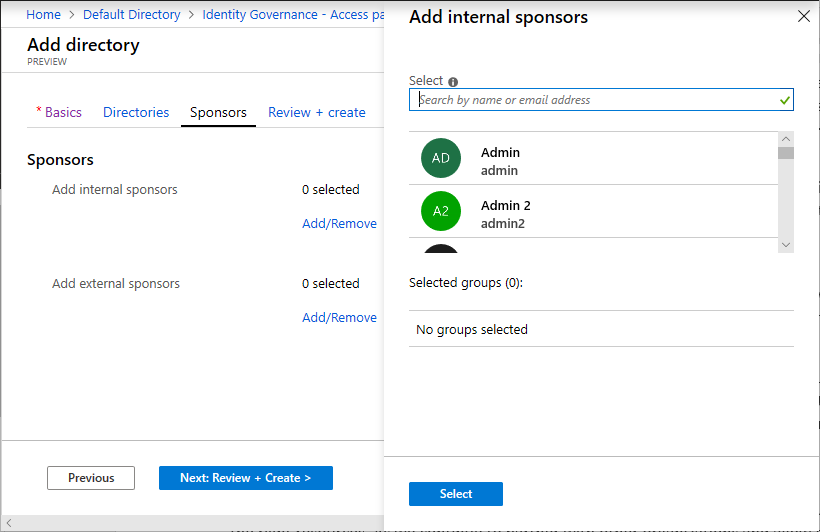
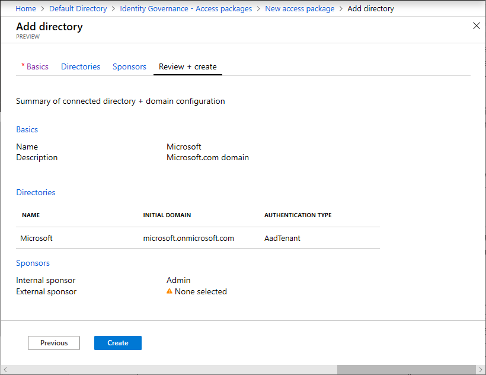

### Policy: For users in your directory

Follow these steps if you want your policy to be for users in your directory to be able to request this access package. When defining the policy, you can specify individual users, or more commonly groups of users. For example, your organization may already have a group such as **All employees**.  If that group is added in the policy for users who can request access, then any member of that group can then request access.

1. In the **Users who can request access** section, select **For users in your directory**.

    When you select this option, new options appear to further refine who in your directory can request this access package. You can select specific users and groups, all member users (excluding guests), and all users (including guests). Guest users refer to external users that have been invited into your directory with [Azure AD B2B](../articles/active-directory/b2b/what-is-b2b.md). For information about the differences between member users and guest users, see [What are the default user permissions in Azure Active Directory?](../articles/active-directory/fundamentals/users-default-permissions.md).

    

1. If you click **Specific users and groups**, click **Add users and groups**.

1. In the Select users and groups pane, select the users and groups you want to add.

    

1. Click **Select** to add the users and groups.

1. Skip down to the [Policy: Request](#policy-request) section.

### Policy: For users not in your directory

Follow these steps if you want your policy to be for users not in your directory to be able to request this access package. The **users not in your directory** refers to users who are in another Azure AD directory or domain, and may not have yet been invited into your directory. Azure AD directories must be configured to allow invitations in the **Collaboration restrictions** section of the [External collaboration settings](../articles/active-directory/b2b/allow-deny-list.md).

> [!NOTE]
> If a user is not yet in your directory and their request to this access package is approved (or auto-approved), a guest user account will be created in your directory. The guest will be invited, but will not receive an invite email. Instead, they will receive an email when their access package assignment is delivered. By default, later when that guest user no longer has any access package assignments, because their last assignment has expired or been cancelled, that guest user account will be blocked from sign in and subsequently removed. If you want to have guest users remain in your directory indefinitely, even if they have no access package assignments, you can change the settings for your entitlement management configuration. For more information about the guest user object, see [Properties of an Azure Active Directory B2B collaboration user](../articles/active-directory/b2b/user-properties.md).

1. In the **Users who can request access** section, select **For users not in your directory**.

    When you select this option, new options appear. You can select specific connected organizations or you can select all your connected organizations. A connected organization is an external Azure AD directory or domain that you frequently collaborate with.

    

1. Click **Specific connected organizations** or **All connected organizations**.

1. If you selected **Specific connected organizations**, click **Add directories** to select from a list of your current connected organizations.

    

1. If the organization you want to collaborate with is not in the list, you can add it as a [connected organization](#policy-add-a-connected-organization) as described in the next section.

1. Once you have added all your connected organizations you'd like to include in the policy, click **Select**.

1. Skip down to the [Policy: Request](#policy-request) section.

### Policy: Add a connected organization

If you frequently collaborate with users in an external Azure AD directory or domain, you can add them as a connected organization. Follow these steps to add an external Azure AD directory or a domain as a connected organization.

1. In the **Users who can request access** section, click **Specific connected organizations** and then click **Add organizations**.

1. In the Add organizations pane, click **Add connected organization**.

    This opens a new page where you can add a connected organization.

1. On the **Basics** tab, enter a display name and description for the organization.

    

1. On the **Directories** tab, click **Add connected organization**.

1. Enter a domain name to search for the Azure AD directory or domain.

1. Verify it is the correct organization by the provided directory name and initial domain.

    > [!NOTE]
    > All users from the organization will be able to request this access package. This includes users from all subdomains associated with the organization, not just the domain used in the search.

1. Click **Add** to add the organization.

1. Once you have added all the Azure AD directories and domains you'd like to include in the policy, click **Select**.

    

    The organization appears in the list of connected organizations.

    

1. On the **Sponsors** tab, add optional sponsors for this connected organization.

    Sponsors are internal or external users already in your directory that are the point of contact for the relationship with this connected organization. Internal sponsors are member users in your directory. External sponsors are guest users from the connected organization that were previously invited and are already in your directory. Sponsors can be utilized as approvers when users in this connected organization request access to this access package. For information about how to invite a guest user to your directory, see [Add Azure Active Directory B2B collaboration users in the Azure portal](../articles/active-directory/b2b/add-users-administrator.md).

    

1. On the **Review + create** tab, review your organization settings and then click **Create**.

    

1. Skip down to the [Policy: Expiration](#policy-expiration) section.

### Policy: Any user

Follow these steps if you want to allow any user in the world to request access to this access package.

1. In the **Users who can request access** section, select **Any user**.

    > [!NOTE]
    > You should only use this option for specific scenarios such as allowing any user to submit a bid for work.

1. Skip down to the [Policy: Expiration](#policy-expiration) section.

### Policy: None (administrator direct assignments only)

Follow these steps if you want your policy to bypass access requests and allow administrators to directly assign specific users to this access package. Users won't have to request this access package. You can still set expiration settings, but there are no request settings.

1. In the **Users who can request access** section, select **None (administrator direct assignments only**.

    After you create the access package, you can directly assign specific internal and external users to the access package. If you specify an external user, a guest user account will be created in your directory.

1. Skip down to the [Policy: Expiration](#policy-expiration) section.

### Policy: Request

In the Request section, you specify approval settings when users request the access package.

1. To require approval for requests from the selected users, set the **Require approval** toggle to **Yes**. To have requests automatically approved, set the toggle to **No**.

1. If you require approval, in the **Select approvers** section, click **Add approvers**.

1. In the Select approvers pane, select one or more users and/or groups to be approvers.

    Only one of the selected approvers needs to approve a request. Approval from all approvers is not required. The approval decision is based on whichever approver reviews the request first.

    

1. Click **Select** to add the approvers.

1. Click **Show advanced request settings** to show additional settings.

    

1. To require users to provide a justification to request the access package, set **Require justification** to **Yes**.

1. To require the approver to provide a justification to approve a request for the access package, set **Require approver justification** to **Yes**.

1. In the **Approval request timeout (days)** box, specify the amount of time the approvers have to review a request. If no  approvers review it in this number of days, the request expires and the user will have to submit another request for the access package.

### Policy: Expiration

In the Expiration section, you specify when a user's assignment to the access package expires.

1. In the **Expiration** section, set **Access package expires** to **On date**, **Number of days**, or **Never**.

    For **On date**, select an expiration date in the future.

    For **Number of days**, specify a number between 0 and 3660 days.

    Based on your selection, a user's assignment to the access package expires on a certain date, a certain number of days after they are approved, or never.

1. Click **Show advanced expiration settings** to show additional settings.

1. To allow user to extend their assignments, set **Allow users to extend access** to **Yes**.

    If extensions are allowed in the policy, the user will receive an email 14 days and also 1 day before their access package assignment is set to expire prompting them to extend the assignment.

    

### Policy: Enable policy

1. If you want the access package to be made immediately available to the users in the policy, click **Yes** to enable the policy.

    You can always enable it in the future after you have finished creating the access package.

    

1. Click **Next** or **Create**.
