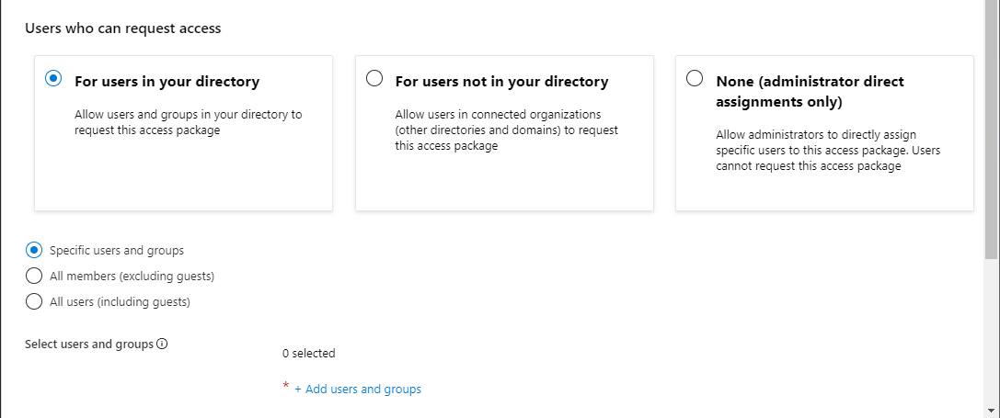
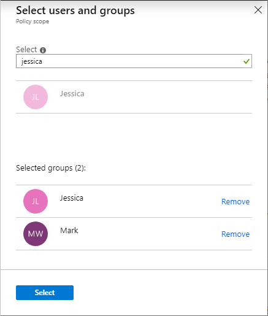
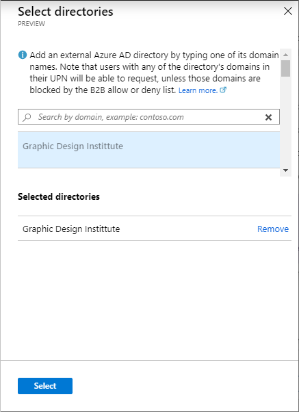
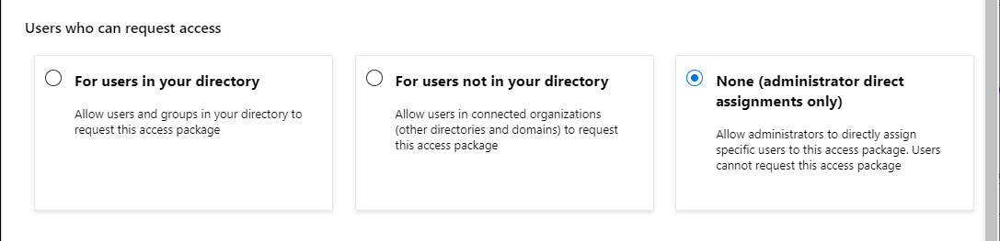
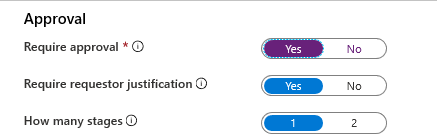
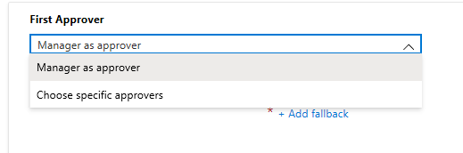
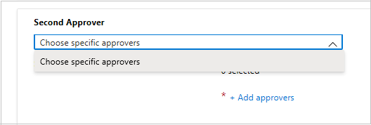
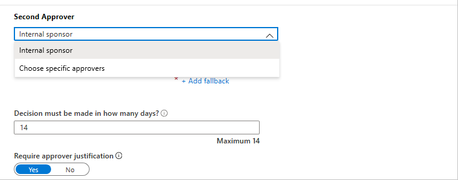
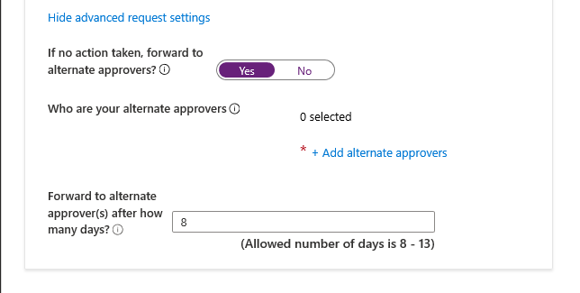

## For users in your directory

Follow these steps if you want to allow users in your directory to be able to request this access package. When defining the request policy, you can specify individual users, or more commonly groups of users. For example, your organization may already have a group such as **All employees**.  If that group is added in the policy for users who can request access, then any member of that group can then request access.

1. In the **Users who can request access** section, click **For users in your directory**.

    When you select this option, new options appear to further refine who in your directory can request this access package.

    

1. Select one of the following options:

    |  |  |
    | --- | --- |
    | **Specific users and groups** | Choose this option if you want only the users and groups in your directory that you specify to be able to request this access package. |
    | **All members (excluding guests)** | Choose this option if you want all member users in your directory to be able to request this access package. This option doesn't include any guest users you might have invited into your directory. |
    | **All users (including guests)** | Choose this option if you want all member users and guest users in your directory to be able to request this access package. |

    Guest users refer to external users that have been invited into your directory with [Azure AD B2B](../articles/active-directory/b2b/what-is-b2b.md). For more information about the differences between member users and guest users, see [What are the default user permissions in Azure Active Directory?](../articles/active-directory/fundamentals/users-default-permissions.md).

1. If you selected **Specific users and groups**, click **Add users and groups**.

1. In the Select users and groups pane, select the users and groups you want to add.

    

1. Click **Select** to add the users and groups.

1. Skip down to the [Approval](#approval) section.

## For users not in your directory

 **Users not in your directory** refers to users who are in another Azure AD directory or domain. These users may not have yet been invited into your directory. Azure AD directories must be configured to be allow invitations in **Collaboration restrictions**. For more information, see [Enable B2B external collaboration and manage who can invite guests](../articles/active-directory/b2b/delegate-invitations.md).

> [!NOTE]
> A guest user account will be created for a user not yet in your directory whose request is approved or auto-approved. The guest will be invited, but will not receive an invite email. Instead, they will receive an email when their access package assignment is delivered. By default, later when that guest user no longer has any access package assignments, because their last assignment has expired or been cancelled, that guest user account will be blocked from sign in and subsequently deleted. If you want to have guest users remain in your directory indefinitely, even if they have no access package assignments, you can change the settings for your entitlement management configuration. For more information about the guest user object, see [Properties of an Azure Active Directory B2B collaboration user](../articles/active-directory/b2b/user-properties.md).

Follow these steps if you want to allow users not in your directory to request this access package:

1. In the **Users who can request access** section, click **For users not in your directory**.

    When you select this option, new options appear.

    

1. Select one of the following options:

    |  |  |
    | --- | --- |
    | **Specific connected organizations** | Choose this option if you want to select from a list of organizations that your administrator previously added. All users from the selected organizations can request this access package. |
    | **All connected organizations** | Choose this option if all users from all your connected organizations can request this access package. |
    | **All users (All connected organizations + any new external users)** | Choose this option if all users from all your connected organizations can request this access package and that the B2B allow or deny list settings should take precedence for any new external user. |

    A connected organization is an external Azure AD directory or domain that you have a relationship with.

1. If you selected **Specific connected organizations**, click **Add directories** to select from a list of connected organizations that your administrator previously added.

1. Type the name or domain name to search for a previously connected organization.

    

    If the organization you want to collaborate with isn't in the list, you can ask your administrator to add it as a connected organization. For more information, see [Add a connected organization](../articles/active-directory/governance/entitlement-management-organization.md).

1. Once you've selected all your connected organizations, click **Select**.

    > [!NOTE]
    > All users from the selected connected organizations will be able to request this access package. This includes users in Azure AD from all subdomains associated with the organization, unless those domains are blocked by the Azure B2B allow or deny list. For more information, see [Allow or block invitations to B2B users from specific organizations](../articles/active-directory/b2b/allow-deny-list.md).

1. Skip down to the [Approval](#approval) section.

## None (administrator direct assignments only)

Follow these steps if you want to bypass access requests and allow administrators to directly assign specific users to this access package. Users won't have to request the access package. You can still set lifecycle settings, but there are no request settings.

1. In the **Users who can request access** section, click **None (administrator direct assignments only**.

    

    After you create the access package, you can directly assign specific internal and external users to the access package. If you specify an external user, a guest user account will be created in your directory. For information about directly assigning a user, see [View, add, and remove assignments for an access package](../articles/active-directory/governance/entitlement-management-access-package-assignments.md).

1. Skip down to the [Enable requests](#enable-requests) section.

## Approval

In the Approval section, you specify whether an approval is required when users request this access package. The approval settings work in the following way:

- Only one of the selected approvers or fallback approvers needs to approve a request for single-stage approval. 
- Only one of the selected approvers from each stage needs to approve a request for 2-stage approval.
- The approver can be a Manager, Internal sponsor, or External sponsor depending on who the policy is governing access.
- Approval from every selected approver isn't required for single or 2-stage approval.
- The approval decision is based on whichever approver reviews the request first.

For a demonstration of how to add approvers to a request policy, watch the following video:

>[!VIDEO https://www.microsoft.com/videoplayer/embed/RE4cZfg]

For a demonstration of how to add a multi-stage approval to a request policy, watch the following video:

>[!VIDEO https://www.microsoft.com/videoplayer/embed/RE4d1Jw]

Follow these steps to specify the approval settings for requests for the access package:

1. To require approval for requests from the selected users, set the **Require approval** toggle to **Yes**. Or, to have requests automatically approved, set the toggle to **No**.

1. To require users to provide a justification to request the access package, set the **Require requestor justification** toggle to **Yes**.
    
1. Now determine if requests will require single or 2-stage approval. Set the **How many stages** toggle to **1** for single stage approval or set the toggle to **2** for 2-stage approval.

    

Use the following steps to add approvers after selecting how many stages you require: 

### Single-stage approval

1. Add the **First Approver**:
    
    If the policy is set to govern access for users in your directory, you can select **Manager as approver**. Or, add a specific user by clicking **Add approvers** after selecting Choose specific approvers from the dropdown menu.
    
    

    If this policy is set to govern access for users not in your directory, you can select **External sponsor** or **Internal sponsor**. Or, add a specific user by clicking **Add approvers** or groups under Choose specific approvers.
    
    
    
1. If you selected **Manager** as the first approver, click **Add fallback** to select one or more users or groups in your directory to be a fallback approver. Fallback approvers receive the request if entitlement management can't find the manager for the user requesting access.

    The manager is found by entitlement management using the **Manager** attribute. The attribute is in the user's profile in Azure AD. For more information, see [Add or update a user's profile information using Azure Active Directory](../articles/active-directory/fundamentals/active-directory-users-profile-azure-portal.md).

1. If you selected **Choose specific approvers**, click **Add approvers** to select one or more users or groups in your directory to be approvers.

1. In the box under **Decision must be made in how many days?**, specify the number of days that an approver has to review a request for this access package.

    If a request isn't approved within this time period, it will be automatically denied. The user will have to submit another request for the access package.

1. To require approvers to provide a justification for their decision, set Require approver justification to **Yes**.

    The justification is visible to other approvers and the requestor.

### 2-stage approval

If you selected a 2-stage approval, you'll need to add a second approver.

1. Add the **Second Approver**: 
    
    If the users are in your directory, add a specific user as the second approver by clicking **Add approvers** under Choose specific approvers.

    

    If the users aren't in your directory, select **Internal sponsor** or **External sponsor** as the second approver. After selecting the approver, add the fallback approvers.

     

1. Specify the number of days the second approver has to approve the request in the box under **Decision must be made in how many days?**. 

1. Set the Require approver justification toggle to **Yes** or **No**.

### Alternate approvers

You can specify alternate approvers, similar to specifying the first and second approvers who can approve requests. Having alternate approvers will help ensure that the requests are approved or denied before they expire (timeout). You can list alternate approvers the first approver and second approver for 2-stage approval. 

By specifying alternate approvers, in the event that the first or second approvers were unable to approve or deny the request, the pending request gets forwarded to the alternate approvers, per the forwarding schedule you specified during policy setup. They receive an email to approve or deny the pending request.

After the request is forwarded to the alternate approvers, the first or second approvers can still approve or deny the request. Alternate approvers use the same My Access site to approve or deny the pending request.

We can list people or groups of people to be approvers and alternate approvers. Please ensure that you list different sets of people to be the first, second, and alternate approvers.
For example, if you listed Alice and Bob as the First Approver(s), list Carol and Dave as the alternate approvers. Use the following steps to add alternate approvers to an access package:

1. Under the First Approver, Second Approver, or both, click **Show advanced request settings**.

    

1. Set **If no action taken, forward to alternate approvers?** toggle to **Yes**.

1. Click **Add alternate approvers** and select the alternate approver(s) from the list.

    

1. In the **Forward to alternate approver(s) after how many days** box, put in the number of days the approvers have to approve or deny a request. If no approvers have approved or denied the request before the request duration, the request expires (timeout), and the user will have to submit another request for the access package. 

    Requests can only be forwarded to alternate approvers a day after the request duration reaches half-life. In this example, the duration of the request is 14 days. So, the request duration reaches half-life at day 7. So the request can't be forwarded earlier than day 8. Also, requests can't be forwarded on the last day of the request duration. So in the example, the latest the request can be forwarded is day 13.

## Enable requests

1. If you want the access package to be made immediately available for users in the request policy to request, move the Enable toggle to **Yes**.

    You can always enable it in the future after you have finished creating the access package.

    If you selected **None (administrator direct assignments only)** and you set enable to **No**, then administrators can't directly assign this access package.

    

1. Click **Next**.
