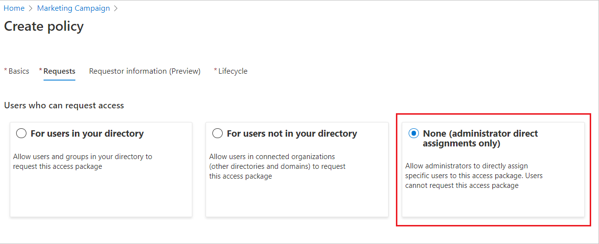
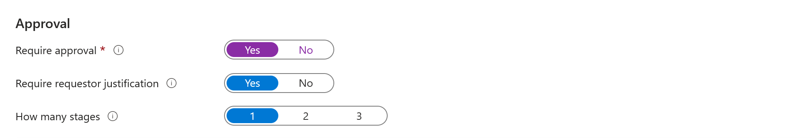
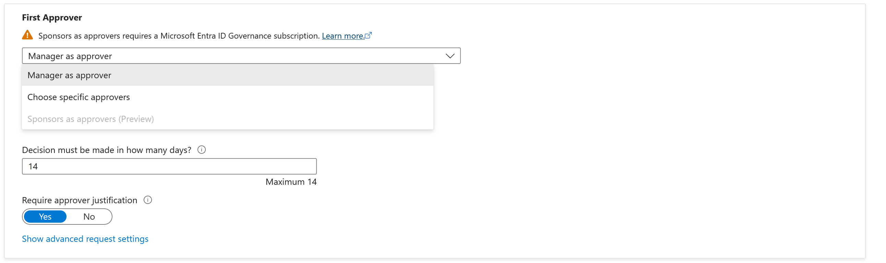
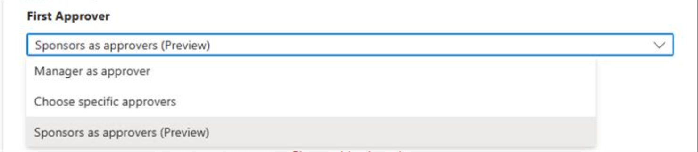
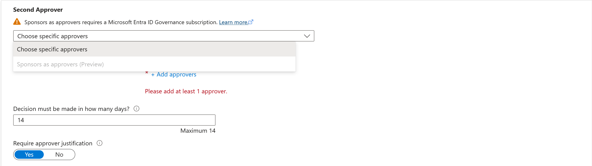
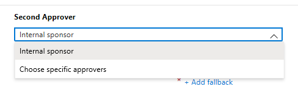
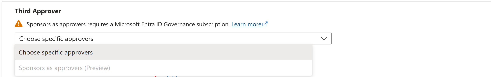
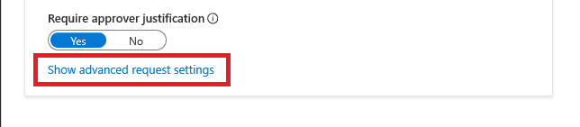
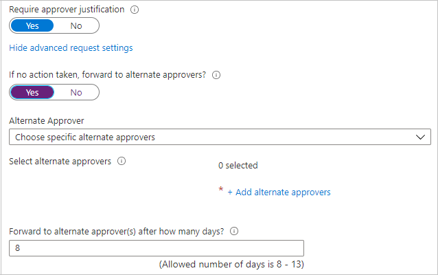
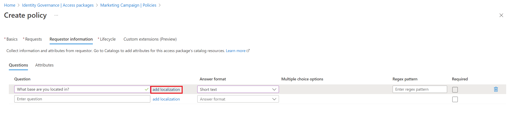

## Allow users in your directory to request the access package

Use the following steps if you want to allow users in your directory to be able to request this access package. When you're defining the request policy, you can specify individual users or (more commonly) groups of users. For example, your organization might already have a group such as **All employees**. If that group is added in the policy for users who can request access, any member of that group can then request access.

1. In the **Users who can request access** section, select **For users in your directory**.

    When you select this option, new options appear so you can refine who in your directory can request this access package.

    

1. Select one of the following options:

    | Option | Description |
    | --- | --- |
    | **Specific users and groups** | Choose this option if you want only the users and groups in your directory that you specify to be able to request this access package. |
    | **All members (excluding guests)** | Choose this option if you want all member users in your directory to be able to request this access package. This option doesn't include any guest users you might have invited into your directory. |
    | **All users (including guests)** | Choose this option if you want all member users and guest users in your directory to be able to request this access package. |

    Guest users are external users who have been invited into your directory via [Microsoft Entra B2B](../articles/active-directory/external-identities/what-is-b2b.md). For more information about the differences between member users and guest users, see [What are the default user permissions in Microsoft Entra ID?](../articles/active-directory/fundamentals/users-default-permissions.md).

1. If you selected **Specific users and groups**, select **Add users and groups**.

1. On the **Select users and groups** pane, select the users and groups that you want to add.

    

1. Choose **Select** to add the users and groups.

1. Skip down to the [Specify approval settings](#specify-approval-settings) section.

## Allow users not in your directory to request the access package

Users who are in another Microsoft Entra directory or domain might not have been invited into your directory yet. Microsoft Entra directories must be configured to allow invitations in **Collaboration restrictions**. For more information, see [Configure external collaboration settings](../articles/active-directory/external-identities/external-collaboration-settings-configure.md).

A guest user account will be created for a user not yet in your directory whose request is approved or does not need approval. The guest will be invited but won't receive an invite email. Instead, they'll receive an email when their access package assignment is delivered. Later, when that guest user no longer has any access package assignments because the last assignment expired or was canceled, the account will be blocked from sign-in and subsequently deleted. The blocking and deletion happen by default.

If you want guest users to remain in your directory indefinitely, even if they have no access package assignments, you can change the settings for your entitlement management configuration. For more information about the guest user object, see [Properties of a Microsoft Entra B2B collaboration user](../articles/active-directory/external-identities/user-properties.md).

Follow these steps if you want to allow users not in your directory to request the access package:

1. In the **Users who can request access** section, select **For users not in your directory**.

    When you select this option, new options appear.

    

1. Select one of the following options:

    | Option | Description |
    | --- | --- |
    | **Specific connected organizations** | Choose this option if you want to select from a list of organizations that your administrator previously added. All users from the selected organizations can request this access package. |
    | **All connected organizations** | Choose this option if all users from all your configured connected organizations can request this access package. |
    | **All users (All connected organizations + any new external users)** | Choose this option if any users can request this access package and the B2B allowlist or blocklist settings should take precedence for any new external user. |

    A connected organization is an external Microsoft Entra directory or domain that you have a relationship with.

1. If you selected **Specific connected organizations**, select **Add directories** to select from a list of connected organizations that your administrator previously added.

1. Enter the name or domain name to search for a previously connected organization.

    

    If the organization that you want to collaborate with isn't in the list, you can ask your administrator to add it as a connected organization. For more information, see [Add a connected organization](../articles/active-directory/governance/entitlement-management-organization.md).

1. If you selected **All connected organizations**, then you should confirm with your global administrator the list of connected organizations that are currently configured and planned to be in scope.

1. If you selected **All users**, then you will need to configure approvals in the approvals section, as this scope would allow any identity on the Internet to request access.

1. After you select all your connected organizations, choose **Select**.

    All users from the selected connected organizations will be able to request this access package. This includes users in Microsoft Entra ID from all subdomains associated with the organization, unless the Azure B2B allowlist or blocklist blocks those domains. If you specify a social identity provider domain, such as **live.com**, then any user from the social identity provider will be able to request this access package. For more information, see [Allow or block invitations to B2B users from specific organizations](../articles/active-directory/external-identities/allow-deny-list.md).

1. Skip down to the [Specify approval settings](#specify-approval-settings) section.

## Allow administrator direct assignments only

Follow these steps if you want to bypass access requests and allow administrators to directly assign specific users to this access package. Users won't have to request the access package. You can still set lifecycle settings, but there are no request settings.

1. In the **Users who can request access** section, select **None (administrator direct assignments only)**.

    

    After you create the access package, you can directly assign specific internal and external users to it. If you specify an external user, a guest user account is created in your directory. For information about directly assigning a user, see [View, add, and remove assignments for an access package](../articles/active-directory/governance/entitlement-management-access-package-assignments.md).

1. Skip down to the [Enable requests](#enable-requests) section.

## Specify approval settings

In the **Approval** section, you specify whether an approval is required when users request this access package. The approval settings work in the following way:

- Only one of the selected approvers or fallback approvers needs to approve a request for single-stage approval.
- Only one of the selected approvers from each stage needs to approve a request for two-stage approval.
- An approver can be a manager, a sponsor of a user, an internal sponsor, or an external sponsor, depending on access governance for the policy.
- Approval from every selected approver isn't required for single-stage or two-stage approval.
- The approval decision is based on whichever approver reviews the request first.

For a demonstration of how to add approvers to a request policy, watch the following video:

>[!VIDEO https://www.microsoft.com/videoplayer/embed/RE4cZfg]

For a demonstration of how to add a multiple-stage approval to a request policy, watch the following video:

>[!VIDEO https://www.microsoft.com/videoplayer/embed/RE4d1Jw]

Follow these steps to specify the approval settings for requests for the access package:

1. To require approval for requests from the selected users, set the **Require approval** toggle to **Yes**. Or, to have requests automatically approved, set the toggle to **No**.  If the policy allows external users from outside your organization to request access, you should require approval, so there is oversight on who is being added to your organization's directory.

1. To require users to provide a justification to request the access package, set the **Require requestor justification** toggle to **Yes**.

1. Determine if requests require single-stage or two-stage approval. Set the **How many stages** toggle to **1** for single-stage approval, **2** for two-stage approval, or **3** for three-stage approval.

    

Use the following steps to add approvers after you select the number of stages.

### Single-stage approval

1. Add the **First Approver** information:

   - If the policy is set to **For users in your directory**, you can select either **Manager as approver** or **Sponsors as approvers (Preview)**. Or, you can add a specific user by selecting **Choose specific approvers**, and then selecting **Add approvers**.

     To use **Sponsors as approvers (Preview)** for **Approval**, you must have a Microsoft Entra ID Governance license. For more information, see [Compare generally available features of Microsoft Entra ID](https://www.microsoft.com/security/business/identity-access/microsoft-entra-id-governance?rtc=1).

     

   - If the policy is set to **For users not in your directory**, you can select either **External sponsor** or **Internal sponsor**. Or, you can add a specific user by selecting **Choose specific approvers**, and then selecting **Add approvers**.

     

1. If you selected **Manager** as the first approver, select **Add fallback** to select one or more users or groups in your directory to be a fallback approver. Fallback approvers receive the request if entitlement management can't find the manager for the user who's requesting access.

    Entitlement management finds the manager by using the **Manager** attribute. The attribute is in the user's profile in Microsoft Entra ID. For more information, see [Add or update a user's profile information and settings](../articles/active-directory/fundamentals/active-directory-users-profile-azure-portal.md).

1. If you selected **Sponsors** as the first approver, select **Add fallback** to select one or more users or groups in your directory to be a fallback approver. Fallback approvers receive the request if entitlement management can't find the sponsor for the user who's requesting access.

    Entitlement management finds sponsors by using the **Sponsors** attribute. The attribute is in the user's profile in Microsoft Entra ID. For more information, see [Add or update a user's profile information and settings](../articles/active-directory/fundamentals/active-directory-users-profile-azure-portal.md).

1. If you selected **Choose specific approvers**, select **Add approvers** to select one or more users or groups in your directory to be approvers.

1. In **Decision must be made in how many days?** box, specify the number of days that an approver has to review a request for this access package.

    If a request isn't approved within this time period, it's automatically denied. The user must then submit another request for the access package.

1. To require approvers to provide a justification for their decision, set **Require approver justification** to **Yes**.

    The justification is visible to other approvers and the requestor.

### Two-stage approval

If you selected a two-stage approval, you need to add a second approver:

1. Add the **Second Approver** information:

   - If the users are in your directory, you can select **Sponsors as approvers (Preview)**. Or, add a specific user by selecting **Choose specific approvers** from the dropdown menu, and then selecting **Add approvers**.

     

   - If the users aren't in your directory, select **Internal sponsor** or **External sponsor** as the second approver. After you select the approver, add the fallback approvers.

     

1. In the **Decision must be made in how many days?** box, specify the number of days the second approver has to approve the request.

1. Set the **Require approver justification** toggle to **Yes** or **No**.

### Three-stage approval

If you selected a three-stage approval, you need to add a third approver:

1. Add the **Third Approver** information:

    If the users are in your directory, add a specific user as the third approver by selecting **Choose specific approvers** > **Add approvers**.

    

1. In the **Decision must be made in how many days?** box, specify the number of days the second approver has to approve the request.

1. Set the **Require approver justification** toggle to **Yes** or **No**.

### Alternate approvers

You can specify alternate approvers, similar to specifying the first and second approvers who can approve requests. Having alternate approvers helps ensure that the requests are approved or denied before they expire (time out). You can list alternate approvers for the first approver and the second approver for two-stage approval.

When you specify alternate approvers, if the first or second approvers can't approve or deny the request, the pending request is forwarded to the alternate approvers. The request is sent according to the forwarding schedule that you specified during policy setup. The approvers receive an email to approve or deny the pending request.

After the request is forwarded to the alternate approvers, the first or second approvers can still approve or deny the request. Alternate approvers use the same **My Access** site to approve or deny the pending request.

You can list people or groups of people to be approvers and alternate approvers. Ensure that you list different sets of people to be the first, second, and alternate approvers. For example, if you listed Alice and Bob as the first approvers, list Carol and Dave as the alternate approvers.

Use the following steps to add alternate approvers to an access package:

1. Under **First Approver**, **Second Approver**, or both, select **Show advanced request settings**.

    

1. Set the **If no action taken, forward to alternate approvers?** toggle to **Yes**.

1. Select **Add alternate approvers**, and then select the alternate approvers from the list.

    

    If you select **Manager** as the first approver, an extra option appears in the **Alternate Approver** box: **Second level manager as alternate approver**. If you select this option, you need to add a fallback approver to forward the request to, in case the system can't find the second-level manager.

1. In the **Forward to alternate approver(s) after how many days** box, enter the number of days the approvers have to approve or deny a request. If no approvers approve or deny the request before the request duration, the request expires (times out). The user must then submit another request for the access package.

Requests can only be forwarded to alternate approvers a day after the request duration reaches half-life. The decision of the main approvers must time out after at least four days. If the request time-out is less or equal than three days, there isn't enough time to forward the request to alternate approvers.

In this example, the duration of the request is 14 days. The request duration reaches half-life at day 7. So, the request can't be forwarded earlier than day 8.

Also, requests can't be forwarded on the last day of the request duration. So in the example, the latest the request can be forwarded is day 13.

## Enable requests

1. If you want the access package to be made immediately available for users in the request policy to request, move the **Enable new requests and assignments** toggle to **Yes**.

    You can always enable it in the future, after you finish creating the access package.

    If you select **None (administrator direct assignments only)** and you set **Enable new requests and assignments** to **No**, administrators can't directly assign this access package.

    

1. Go to the [next section](#add-a-verified-id-requirement-preview) to learn how to add a verified ID requirement to your access package. Otherwise, select **Next**.

## Add a verified ID requirement (preview)

Use the following steps if you want to add a verified ID requirement to your access package policy. Users who want access to the access package need to present the required verified IDs before successfully submitting their request. To learn how to configure your tenant with the Microsoft Entra Verified ID service, see [Introduction to Microsoft Entra Verified ID](../articles/active-directory/verifiable-credentials/decentralized-identifier-overview.md).

You need a global administrator role to add verified ID requirements to an access package. An Identity Governance administrator, user administrator, catalog owner, or access package manager can't yet add verified ID requirements.

1. Select **+ Add issuer**, and then select an issuer from the Microsoft Entra Verified ID network. If you want to issue your own credentials to users, you can find instructions in [Issue Microsoft Entra Verified ID credentials from an application](../articles/active-directory/verifiable-credentials/verifiable-credentials-configure-issuer.md).

    :::image type="content" source="media/entitlement-management-request-policy/access-package-select-issuer.png" alt-text="Screenshot that shows the pane for selecting an issuer for an access package.":::

1. Select the credential types that you want users to present during the request process.

    :::image type="content" source="media/entitlement-management-request-policy/access-package-select-credential.png" alt-text="Screenshot that shows the area for selecting credential types for an access package.":::

    If you select multiple credential types from one issuer, users will be required to present credentials of all selected types. Similarly, if you include multiple issuers, users will be required to present credentials from each of the issuers that you include in the policy. To give users the option of presenting different credentials from various issuers, configure separate policies for each issuer or credential type you'll accept.

1. Select **Add** to add the verified ID requirement to the access package policy.

## Add requestor information to an access package

1. Go to the **Requestor information** tab, and then select the **Questions** tab.

1. In the **Question** box, enter a question that you want to ask the requestor. This question is also known as the display string.

1. If you want to add your own localization options, select **add localization**.

    

    On the **Add localizations for question** pane:

    1. For **Language code**, select the language code for the language in which you're localizing the question.
    1. In the **Localized Text** box, enter the question in the language that you configured.
    1. When you finish adding all the localizations that you need, select **Save**.

    

1. For **Answer format**, select the format in which you want requestors to answer. Answer formats include **Short text**, **Multiple choice**, and **Long text**.

1. If you selected multiple choice, select the **Edit and localize** button to configure the answer options.

    

    On the **View/edit question** pane:

    1. In the **Answer values** boxes, enter the response options that you want to give when the requestor is answering the question.
    1. In the **Language** boxes, select the language for the response options. You can localize response options if you choose extra languages.
    1. Select **Save**.

    
  
1. To require requestors to answer this question when they're requesting access to an access package, select the **Required** checkbox.

1. Select the **Attributes** tab to view attributes associated with resources that you added to the access package.

    > [!NOTE]
    > To add or update attributes for an access package's resources, go to **Catalogs** and find the catalog associated with the access package. To learn more about how to edit the attributes list for a specific catalog resource and the prerequisite roles, read [Add resource attributes in the catalog](../articles/active-directory/governance/entitlement-management-catalog-create.md#add-resource-attributes-in-the-catalog).

1. Select **Next**.
