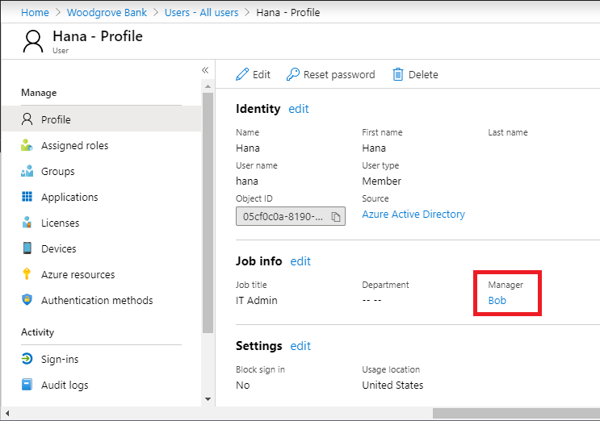

## For users in your directory

Follow these steps if you want to allow users in your directory to be able to request this access package. When defining the request policy, you can specify individual users, or more commonly groups of users. For example, your organization may already have a group such as **All employees**.  If that group is added in the policy for users who can request access, then any member of that group can then request access.

1. In the **Users who can request access** section, click **For users in your directory**.

    When you select this option, new options appear to further refine who in your directory can request this access package.

    

1. Select one of the following options:

    |  |  |
    | --- | --- |
    | **Specific users and groups** | Choose this option if you want only the users and groups in your directory that you specify to be able to request this access package. |
    | **All members (excluding guests)** | Choose this option if you want all member users in your directory to be able to request this access package. This option does not include any guest users you might have invited into your directory. |
    | **All users (including guests)** | Choose this option if you want all member users and guest users in your directory to be able to request this access package. |

    Guest users refer to external users that have been invited into your directory with [Azure AD B2B](../articles/active-directory/b2b/what-is-b2b.md). For information about the differences between member users and guest users, see [What are the default user permissions in Azure Active Directory?](../articles/active-directory/fundamentals/users-default-permissions.md).

1. If you selected **Specific users and groups**, click **Add users and groups**.

1. In the Select users and groups pane, select the users and groups you want to add.

    

1. Click **Select** to add the users and groups.

1. Skip down to the [Approval](#approval) section.

## For users not in your directory

Follow these steps if you want to allow users not in your directory to be able to request this access package. The **users not in your directory** refers to users who are in another Azure AD directory or domain, and may not have yet been invited into your directory. Azure AD directories must be configured to be allow invitations in **Collaboration restrictions**. For more information, see [Enable B2B external collaboration and manage who can invite guests](../articles/active-directory/b2b/delegate-invitations.md).

> [!NOTE]
> A guest user account will be created for a user not yet in your directory whose request is approved or auto-approved. The guest will be invited, but will not receive an invite email. Instead, they will receive an email when their access package assignment is delivered. By default, later when that guest user no longer has any access package assignments, because their last assignment has expired or been cancelled, that guest user account will be blocked from sign in and subsequently deleted. If you want to have guest users remain in your directory indefinitely, even if they have no access package assignments, you can change the settings for your entitlement management configuration. For more information about the guest user object, see [Properties of an Azure Active Directory B2B collaboration user](../articles/active-directory/b2b/user-properties.md).

1. In the **Users who can request access** section, click **For users not in your directory**.

    When you select this option, new options appear.

    

1. Select one of the following options:

    |  |  |
    | --- | --- |
    | **Specific connected organizations** | Choose this option if you want to select from a list of organizations that your administrator previously added. All users from the selected organizations will be able to request this access package. |
    | **All connected organizations** | Choose this option if you want all users from all your connected organizations to be able to request this access package. |

    A connected organization is an external Azure AD directory or domain that you have a relationship with.

1. If you selected **Specific connected organizations**, click **Add directories** to select from a list of connected organizations that your administrator previously added.

1. Type the name or domain name to search for a previously connected organization.

    

    If the organization you want to collaborate with is not in the list, you can ask your administrator to add it as a connected organization. For more information, see [Add a connected organization](../articles/active-directory/governance/entitlement-management-organization.md).

1. Once you have selected all your connected organizations, click **Select**.

    > [!NOTE]
    > All users from the selected connected organizations will be able to request this access package. This includes users in Azure AD from all subdomains associated with the organization, unless those domains are blocked by the Azure B2B allow or deny list. For more information, see [Allow or block invitations to B2B users from specific organizations](../articles/active-directory/b2b/allow-deny-list.md).

1. Skip down to the [Approval](#approval) section.

## None (administrator direct assignments only)

Follow these steps if you want to bypass access requests and allow administrators to directly assign specific users to this access package. Users won't have to request the access package. You can still set lifecycle settings, but there are no request settings.

1. In the **Users who can request access** section, click **None (administrator direct assignments only**.

    

    After you create the access package, you can directly assign specific internal and external users to the access package. If you specify an external user, a guest user account will be created in your directory. For information about directly assigning a user, see [View, add, and remove assignments for an access package](../articles/active-directory/governance/entitlement-management-access-package-assignments.md).

1. Skip down to the [Enable requests](#enable-requests) section.

## Approval

In the Approval section, you specify whether an approval is required when users request this access package. The approval settings work in the following way:

- Only one of the selected approvers or fallback approvers needs to approve a request. Approval from all approvers is not required.
- The approval decision is based on whichever approver reviews the request first.

Follow these steps to specify the approval settings for the users you previously selected.

1. To require approval for requests from the selected users, set the **Require approval** toggle to **Yes**. To have requests automatically approved, set the toggle to **No**.

    

1. To require users to provide a justification to request the access package, set the **Require requestor justification** toggle to **Yes**.

1. Determine if the request will require a single or multi-stage approval. Set the **How many stages** toggle to **1** for single-stage.

1. For approvers, select **Manager as approver** or **Choose specific approvers**.

    The manager is determined by the **Manager** attribute in the user's profile of Azure AD. For more information, see [Add or update a user's profile information using Azure Active Directory](../articles/active-directory/fundamentals/active-directory-users-profile-azure-portal.md).

    

1. If you selected Manager as approver, click **Add fallback** to select one or more users or groups in your directory to be a fallback approver in case entitlement management cannot find the manager.

1. If you selected Choose specific approvers, click **Add approvers** to select one or more users or groups in your directory to be approvers.

1. In **Decision must be made in how many days?**, specify the number of days that an approver has to review a request for this access package.

    If a request is not approved within this time period, it will be automatically denied. The user will have to submit another request for the access package.

1. To require users to provide a justification to request the access package, set **Require justification** to **Yes**.

    A justification is visible to other approvers and the requestor.

## Enable requests

1. If you want the access package to be made immediately available for users in the request policy to request, click **Yes** to enable.

    You can always enable it in the future after you have finished creating the access package.

    If you selected **None (administrator direct assignments only)** and you set enable to **No**, administrators will not be able to directly assign this access package.

    

1. Click **Next**.
