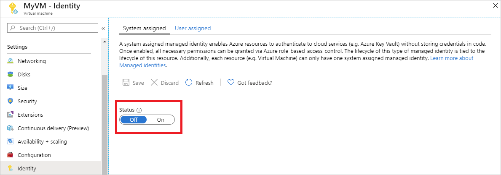

Enabling a system-assigned managed identity is a one-click experience. You can either enable it during the creation of a VM or in the properties of an existing VM.

**To enable a system-assigned managed identity on a new VM:** 

1. Sign in to the [Azure portal](https://portal.azure.com)

2. [Create a virtual machine with system-assigned identity enabled](../articles/active-directory/managed-identities-azure-resources/qs-configure-portal-windows-vm.md#system-assigned-managed-identity)
