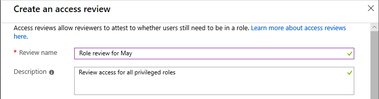
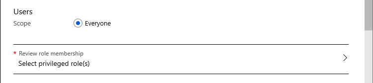
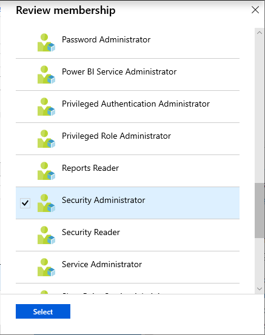
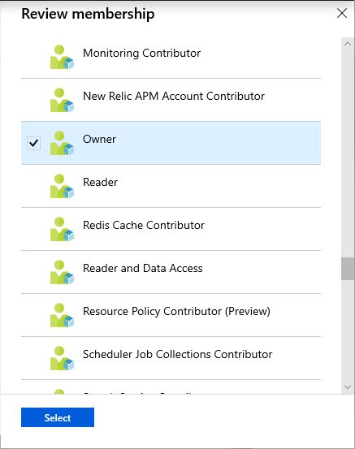
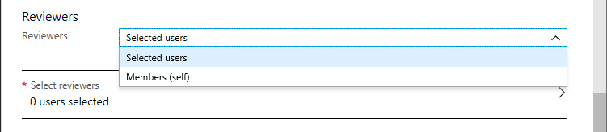
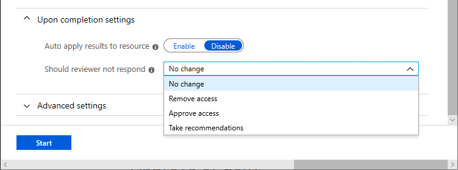
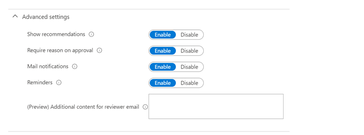

## Create one or more access reviews

1. Click **New** to create a new access review.

1. Name the access review. Optionally, give the review a description. The name and description are shown to the reviewers.

    

1. Set the **Start date**. By default, an access review occurs once, starts the same time it's created, and it ends in one month. You can change the start and end dates to have an access review start in the future and last however many days you want.

    

1. To make the access review recurring, change the **Frequency** setting from **One time** to **Weekly**, **Monthly**, **Quarterly**, **Annually**, or **Semi-annually**. Use the **Duration** slider or text box to define how many days each review of the recurring series will be open for input from reviewers. For example, the maximum duration that you can set for a monthly review is 27 days, to avoid overlapping reviews.

1. Use the **End** setting to specify how to end the recurring access review series. The series can end in three ways: it runs continuously to start reviews indefinitely, until a specific date, or after a defined number of occurrences has been completed. You, another User administrator, or another Global administrator can stop the series after creation by changing the date in **Settings**, so that it ends on that date.

1. In the **Users** section, select one or more roles that you want to review membership of.

    

    > [!NOTE]
    > - Roles selected here include both [permanent and eligible roles](../articles/active-directory/privileged-identity-management/pim-how-to-add-role-to-user.md).
    > - Selecting more than one role will create multiple access reviews. For example, selecting five roles will create five separate access reviews.

    If you are creating an access review of **Azure AD roles**, the following shows an example of the Review membership list.

    

    If you are creating an access review of **Azure resource roles**, the following image shows an example of the Review membership list.

    

1. In the **Reviewers** section, select one or more people to review all the users. Or you can select to have the members review their own access.

    

    - **Selected users** - Use this option when you don't know who needs access. With this option, you can assign the review to a resource owner or group manager to complete.
    - **Members (self)** - Use this option to have the users review their own role assignments.

### Upon completion settings

1. To specify what happens after a review completes, expand the **Upon completion settings** section.

    

1. If you want to automatically remove access for users that were denied, set **Auto apply results to resource** to **Enable**. If you want to manually apply the results when the review completes, set the switch to **Disable**.

1. Use the **Should reviewer not respond** list to specify what happens for users that are not reviewed by the reviewer within the review period. This setting does not impact users who have been reviewed by the reviewers manually. If the final reviewer's decision is Deny, then the user's access will be removed.

    - **No change** - Leave user's access unchanged
    - **Remove access** - Remove user's access
    - **Approve access** - Approve user's access
    - **Take recommendations** - Take the system's recommendation on denying or approving the user's continued access

### Advanced settings

1. To specify additional settings, expand the **Advanced settings** section.

    

1. Set **Show recommendations** to **Enable** to show the reviewers the system recommendations based the user's access information.

1. Set **Require reason on approval** to **Enable** to require the reviewer to supply a reason for approval.

1. Set **Mail notifications** to **Enable** to have Azure AD send email notifications to reviewers when an access review starts, and to administrators when a review completes.

1. Set **Reminders** to **Enable** to have Azure AD send reminders of access reviews in progress to reviewers who have not completed their review.
