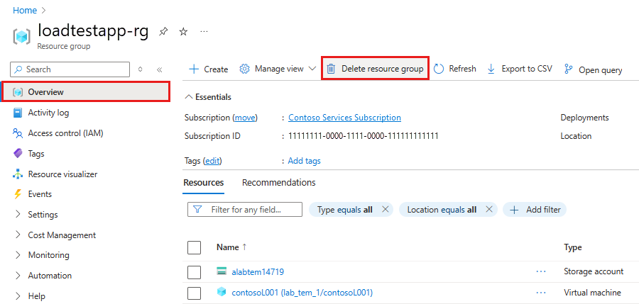

>[!IMPORTANT]
>You can reuse the Azure Load Testing resource that you created for other Azure Load Testing tutorials and how-to articles. 

If you don't plan to use any of the resources that you created, delete them so you don't incur any further charges. If you've deployed the sample application in a different resource group, you might want to repeat the following steps.

To delete resources by using the Azure portal:

1. Select the menu button in the upper-left corner, and then select **Resource groups**.
 
1. From the list, select the resource group that you created.

1. Select **Delete resource group**.
   

1. Enter the resource group name. Then select **Delete**.

To delete resources by using the Azure CLI, enter the following command:
   
```azurecli
az group delete --name <yourresourcegroup>
```
Remember, deleting the resource group deletes all of the resources within it. 
