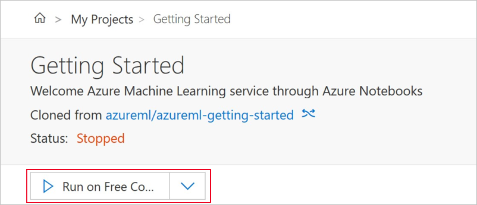

1. Complete the [Azure Machine Learning portal quickstart](../articles/machine-learning/service/quickstart-get-started.md) to create a workspace and launch Azure Notebooks. Feel free to skip the **Use the notebook** section if you wish.
1. If you've already completed the [quickstart](../articles/machine-learning/service/quickstart-get-started.md), sign back into [Azure Notebooks](https://notebooks.azure.com/) and open the  **Getting Started** project.  
1. Remember to start the project if its status is stopped.
    
